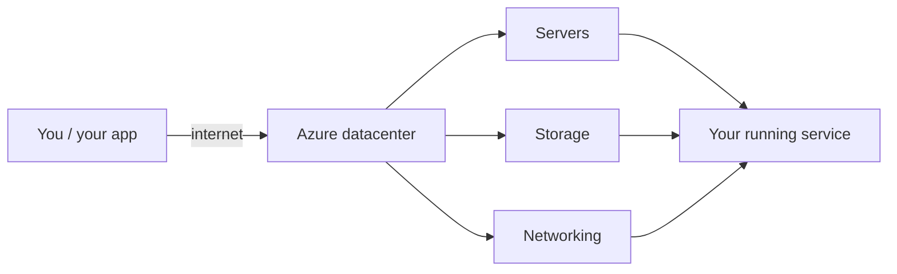
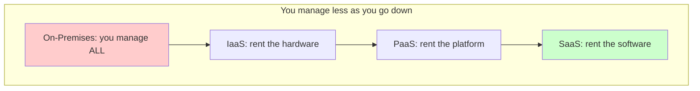
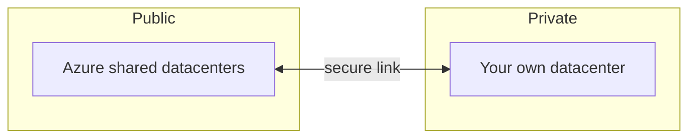
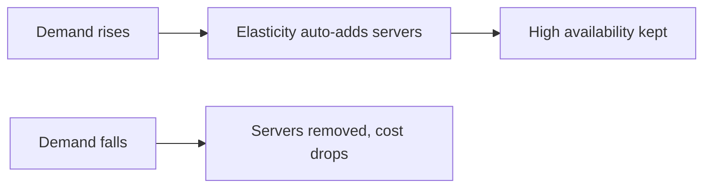
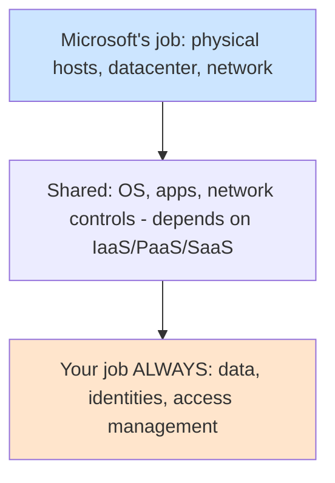

# Part A — Cloud Computing Basics

> Section goal: Understand what "the cloud" actually is, the different ways it's sold (IaaS/PaaS/SaaS), how it's deployed (public/private/hybrid), and *why* organisations move to it. This is the bedrock every later Part stands on.

Covers index items: foundations of cloud before we touch any specific Azure service.

---

## 1. What is "the cloud"?

In one sentence: **the cloud is renting someone else's computers over the internet, instead of buying and running your own.**

When you use Azure, your app, website, or data physically lives on powerful computers (called **servers**) inside giant warehouses (**datacenters**) owned by Microsoft. You reach them over the internet and pay only for what you use.

### 🔍 Plain-English deep-dive: the jargon, demystified
- **Server** — *a computer designed to run continuously and serve many users at once.* **Analogy:** a restaurant kitchen — one kitchen cooks for hundreds of diners, instead of every diner having their own stove. **Why it matters:** almost everything in Azure ultimately runs on servers.
- **Datacenter** — *a building full of thousands of servers, with power, cooling, and security.* **Analogy:** a giant electricity power station, but for computing. **Why it matters:** Azure is really a global network of datacenters you borrow from.
- **Cloud provider** — *the company that owns the datacenters and rents them out (Microsoft Azure, Amazon AWS, Google Cloud).* **Analogy:** a landlord who owns apartments and rents rooms. **Why it matters:** you're the tenant; the provider handles the building.
- **Provision** — *the act of creating/turning on a cloud resource.* **Analogy:** ordering a pizza — it didn't exist a minute ago, now it's yours on demand. **Why it matters:** in the cloud you provision a server in minutes, not weeks.

> 💡 **Mental model:** Old way = you *own a car* (buy it, insure it, fix it, it sits idle most of the day). Cloud = you *use a taxi/Uber* (it shows up when needed, you pay per ride, someone else maintains it).

---

## 2. The big reason: CapEx vs OpEx

This is one of the most important ideas in cloud — and a very common exam point.

- **CapEx (Capital Expenditure)** — *big money spent upfront to buy physical assets you own.* **Analogy:** buying a house with a large down payment. Example: spending £50,000 to buy servers before you've served a single customer.
- **OpEx (Operational Expenditure)** — *ongoing pay-as-you-go spending for a service.* **Analogy:** renting an apartment — smaller, regular payments, no huge upfront cost. Example: paying Azure £200 this month for exactly the computing you used.

The cloud shifts you from **CapEx → OpEx**.

| | CapEx (own datacenter) | OpEx (cloud) |
|---|---|---|
| Upfront cost | Huge (buy hardware) | ~Zero |
| Payment style | Pay once, big | Pay monthly, per use |
| If you need more | Buy & wait weeks | Click, ready in minutes |
| If you need less | Hardware sits wasted | Turn it off, stop paying |
| Maintenance | You do it | Provider does it |

> 💡 **Why leaders love this:** no guessing how many servers to buy years ahead. You match spending to actual demand.

---

## 3. The three service models: IaaS, PaaS, SaaS

This is *the* classic cloud framework. The difference is **how much the provider manages vs how much you manage.**

A great analogy is **pizza** 🍕:

| Model | Analogy | You manage | Provider manages | Azure example |
|-------|---------|-----------|------------------|---------------|
| **On-premises** | Make pizza at home from scratch | Everything | Nothing | Your own servers in your office |
| **IaaS** | Buy frozen pizza, bake at home | OS, apps, data | Hardware, datacenter | Azure **Virtual Machines** |
| **PaaS** | Pizza delivery to your house | Just your app & data | OS, runtime, hardware | Azure **App Service**, Azure SQL Database |
| **SaaS** | Eat at the restaurant | Nothing (just use it) | Everything | **Microsoft 365**, Outlook, Teams |

### 🔍 Plain-English deep-dive
- **IaaS (Infrastructure as a Service)** — *you rent raw computers and build everything on top.* You get the most control but also the most responsibility (you patch the operating system, install software, etc.). **Memory hook:** *"I"* = *Infrastructure* = *I do the most.*
- **PaaS (Platform as a Service)** — *the provider gives you a ready platform; you just deploy your code.* No worrying about the underlying OS or servers. **Memory hook:** *"P"* = *Platform* = *Provider handles plumbing.*
- **SaaS (Software as a Service)** — *fully finished software you just log into and use.* **Memory hook:** *"S"* = *Software* = *Simply sign in.*

> 💡 **The trade-off in one line:** more control (IaaS) ⇄ less responsibility (SaaS). You pick based on how much you want to manage.

---

## 4. Cloud deployment models: public, private, hybrid

This is about **where** the cloud lives and **who** can use it.

- **Public cloud** — *shared infrastructure owned by a provider, used by the general public over the internet.* **Analogy:** a public gym — shared equipment, you pay a membership, you don't own it. Example: standard Azure.
- **Private cloud** — *cloud infrastructure used by a single organisation only, often in their own datacenter.* **Analogy:** a private home gym — only your household uses it, full control, but you pay for and maintain it all. Example: a bank running cloud tech inside its own walls for strict control.
- **Hybrid cloud** — *a mix of public and private, connected so they work together.* **Analogy:** working partly from a home office and partly from a downtown office, with a secure link between them. Example: keep sensitive data private, burst to public Azure when busy.

| | Public | Private | Hybrid |
|---|--------|---------|--------|
| Cost | Lowest (shared) | Highest (you own it) | Medium |
| Control | Least | Most | Flexible |
| Best for | Most workloads, scale | Strict regulation/control | Mix of both needs |

> 💡 **Multicloud** (bonus term): using more than one provider at once (e.g. Azure *and* AWS). Different from hybrid, which mixes public + private.

---

## 5. Why move to the cloud? The benefits

These benefit words come up constantly — learn them with their plain meaning.

- **Scalability** — *the ability to add or remove capacity to match demand.* **Analogy:** a stretchy waistband that adjusts to the meal. Two flavours:
  - *Vertical scaling (scale up/down)* = make one server bigger/smaller. **Analogy:** swapping a small car engine for a bigger one.
  - *Horizontal scaling (scale out/in)* = add or remove more servers. **Analogy:** adding more checkout tills when the queue grows.
- **Elasticity** — *automatic scaling that reacts to demand in real time.* **Analogy:** a thermostat that turns heating up/down by itself.
- **High availability** — *the system stays up and reachable a very high % of the time.* **Analogy:** a 24/7 convenience store that's basically always open. **Why:** achieved by having backups so one failure doesn't take you down.
- **Reliability** — *the system recovers from failures and keeps working correctly.* **Analogy:** a car with a spare tyre — a puncture doesn't end the journey.
- **Disaster recovery** — *the ability to restore service after a major outage (fire, flood, region failure).* **Analogy:** keeping copies of your photos in a second house in case the first burns down.
- **Agility** — *speed to build and change things.* Provision in minutes, experiment cheaply.
- **Global reach** — *deploy close to users anywhere in the world* so your app feels fast for them.

> 💡 **One-liner to remember the difference:** *Scalability* = you *can* grow. *Elasticity* = it grows *itself*. *Availability* = it's *up*. *Reliability* = it *recovers*.

---

## 6. The shared responsibility model

A crucial security idea: **in the cloud, security is a shared job between you and the provider.** Who does what depends on the service model.

- **Microsoft always handles:** the physical datacenter, physical servers, and physical network.
- **You always handle:** your data, your accounts/identities, and how access is granted.
- **The middle (OS, apps, network controls)** shifts depending on IaaS vs PaaS vs SaaS — the more managed the service, the more Microsoft takes on.

> 💡 **Never forget:** *Your data and identities are always your responsibility,* no matter which cloud service you use.

---

## ✅ Quick Self-Check

Try answering before peeking.

**Q1. In one sentence, what is cloud computing?**
> Renting computing resources (servers, storage, networking) over the internet from a provider, paying only for what you use, instead of buying and running your own hardware.

**Q2. What's the difference between CapEx and OpEx, and which does cloud favour?**
> CapEx = large upfront purchase of assets you own; OpEx = ongoing pay-as-you-go spending. Cloud favours **OpEx** — no big upfront cost, you pay per use.

**Q3. Map IaaS, PaaS, SaaS to "who manages what."**
> IaaS: you manage OS/apps/data, provider manages hardware. PaaS: you manage just app/data, provider manages the platform. SaaS: provider manages everything, you just use the software.

**Q4. What's the difference between public, private, and hybrid cloud?**
> Public = shared provider infrastructure over the internet. Private = dedicated to one organisation, more control/cost. Hybrid = a connected mix of both.

**Q5. What's the difference between scalability and elasticity?**
> Scalability = the *ability* to add/remove capacity. Elasticity = capacity that adjusts *automatically* in real time to match demand.

**Q6. Under the shared responsibility model, what is *always* your responsibility?**
> Your data, your identities/accounts, and managing who has access — regardless of service model.

**Q7. What's the difference between vertical and horizontal scaling?**
> Vertical (scale up/down) = resize a single server to be more/less powerful. Horizontal (scale out/in) = add/remove more servers.

---

## 🧠 30-Second Memory Hooks
- **Cloud** = renting computers over the internet, pay-per-use.
- **CapEx → OpEx** = buy upfront ➡️ rent monthly (own a car ➡️ take an Uber).
- **IaaS / PaaS / SaaS** = pizza: bake frozen / delivery / dine-out.
- **Public / Private / Hybrid** = public gym / home gym / both.
- **Scalability = you *can* grow · Elasticity = it grows *itself*.**
- **HA = it's *up* · Reliability = it *recovers* · DR = restore after disaster.**
- **Shared responsibility:** *your data + identities are always yours to protect.*

---

*Next suggested section:* **[Part B — Azure Global Architecture](Part-B-azure-architecture.md)** (now that you know what the cloud is, see how Azure physically organises its global datacenters and how you organise your resources inside it).
