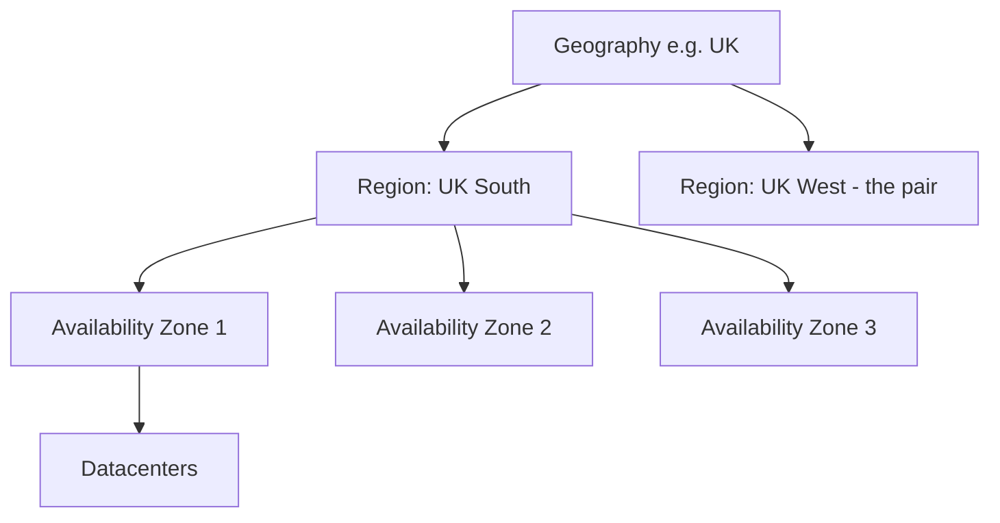
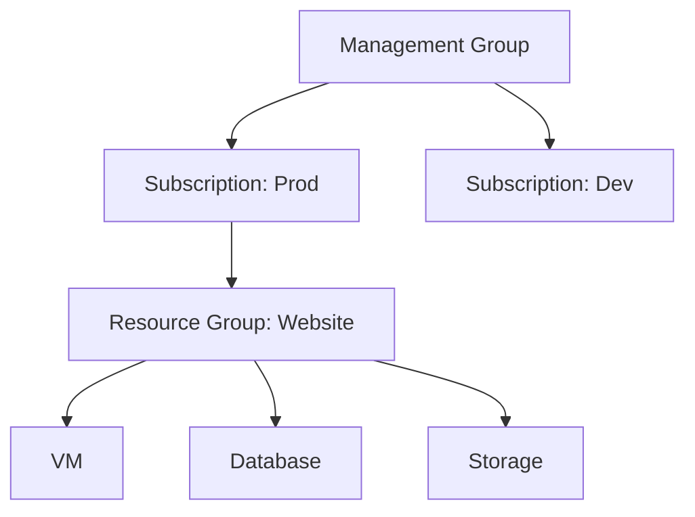
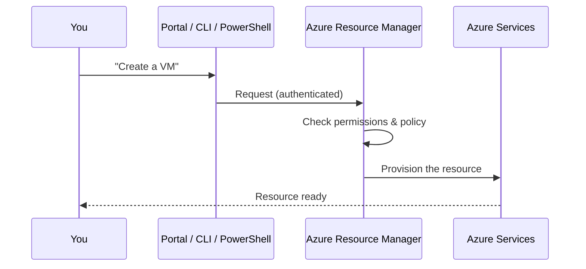

# Part B — Azure Global Architecture

> Section goal: Understand how Azure is physically laid out across the world (regions, zones, datacenters) and how you logically organise your own stuff inside it (management groups, subscriptions, resource groups, resources). This vocabulary underpins every other service.

Covers index items: the structural "map" of Azure.

---

## 1. The physical hierarchy: where Azure lives

Azure is a worldwide network of datacenters, grouped into layers.

### 🔍 Plain-English deep-dive
- **Datacenter** — *one building full of servers.* **Analogy:** a single warehouse store. You never pick a datacenter directly.
- **Region** — *a group of datacenters in one geographic area, close enough to act as one location (e.g. "UK South", "East US").* **Analogy:** a city with several warehouses — you choose the *city*, not the building. **Why it matters:** you deploy resources *to a region*, usually one near your users for speed and to meet data-residency laws.
- **Availability Zone (AZ)** — *physically separate datacenters within one region, each with its own power, cooling, and network.* **Analogy:** three separate buildings across town — if one floods, the others keep running. **Why it matters:** spread your app across zones so a single building failure doesn't take you down.
- **Region pair** — *each region is paired with another region in the same geography (often hundreds of miles apart) for disaster recovery.* **Analogy:** keeping a backup of your house keys at a relative's home in another city. **Why it matters:** if an entire region fails, the pair can take over; Microsoft updates pairs one at a time.
- **Geography** — *a discrete market (often a country) containing one or more regions, respecting data-residency and compliance boundaries.* **Analogy:** a country's borders for your data.

| Term | Size | Protects against | Pick it for |
|------|------|------------------|-------------|
| Datacenter | 1 building | — | (you don't pick directly) |
| Availability Zone | Few buildings | One building failing | High availability within a region |
| Region | A metro area | — | Closeness to users, compliance |
| Region pair | Two regions | A whole region failing | Disaster recovery |

> 💡 **Why this matters for resilience:** put copies of your app in multiple **zones** for everyday reliability, and use the **region pair** for catastrophe recovery.

---

## 2. The logical hierarchy: how YOU organise resources

Separate from the physical world, Azure gives you a tidy tree to organise and govern what you create.

### 🔍 Plain-English deep-dive (top to bottom)
- **Resource** — *a single thing you create (a VM, a database, a storage account).* **Analogy:** one item in your shopping cart.
- **Resource group** — *a folder that holds related resources, managed as a unit.* **Analogy:** a project folder on your desktop. **Why it matters:** delete the group → delete everything in it; apply permissions/tags at the folder level. A resource lives in exactly one group.
- **Subscription** — *a billing and access boundary that holds resource groups.* **Analogy:** a single utility account that gets one bill. **Why it matters:** costs and limits are tracked per subscription; big orgs use several (e.g. "Dev", "Prod").
- **Management group** — *a container above subscriptions to apply policies/access across many at once.* **Analogy:** head office setting rules for all branch accounts. **Why it matters:** govern dozens of subscriptions consistently.

> 💡 **Mental model:** Management group → Subscription → Resource group → Resource is like Country → Bank account → Folder → File.

---

## 3. Azure Resource Manager (ARM): the control layer

Everything you do in Azure goes through one front door.

- **Azure Resource Manager (ARM)** — *the deployment and management service that handles every create/update/delete request, whether it comes from the portal, CLI, PowerShell, or a template.* **Analogy:** the reception desk of a building — every visitor (request) checks in here, gets verified, and is directed correctly. **Why it matters:** it enforces permissions, applies your settings consistently, and lets you deploy groups of resources together.
- **ARM template / Bicep** — *a text file describing the resources you want, so you can recreate them identically (Infrastructure as Code).* **Analogy:** a recipe — follow it and you get the same dish every time. (More in Part H.)

> 💡 **Key insight:** no matter which tool you use, they *all* talk to ARM. Learn ARM's model once and every tool makes sense.

---

## ✅ Quick Self-Check

**Q1. What is an Azure region?**
> A group of datacenters in one geographic area that you deploy resources into; you pick a region for proximity to users and for compliance.

**Q2. What's the difference between an Availability Zone and a region pair?**
> AZs are physically separate datacenters *within one region* (protect against a single datacenter failure). A region pair is a *second region* in the same geography (protects against an entire region failing — used for disaster recovery).

**Q3. List the logical hierarchy from smallest to largest.**
> Resource → Resource group → Subscription → Management group.

**Q4. What does a resource group do, and what happens when you delete it?**
> It's a folder grouping related resources for shared management/permissions/tags; deleting it deletes all resources inside it.

**Q5. What is Azure Resource Manager?**
> The central service that receives and processes all management requests (from any tool), enforcing authentication, permissions, and policy before provisioning resources.

**Q6. Why deploy across multiple Availability Zones?**
> So a failure in one datacenter doesn't take your application down — the copies in other zones keep serving.

---

## 🧠 30-Second Memory Hooks
- **Region** = a *city* of datacenters you deploy to. **Zone** = separate *buildings* in that city.
- **Region pair** = a backup city for disaster recovery.
- **Resource → Group → Subscription → Management group** = File → Folder → Account → Head office.
- **Resource group** = a folder; delete it and everything inside goes too.
- **ARM** = the reception desk every request passes through.

---

*Next suggested section:* **[Part C — Compute Services](Part-C-compute.md)** (now you know the map — next, the engines that actually run your code).
