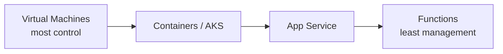
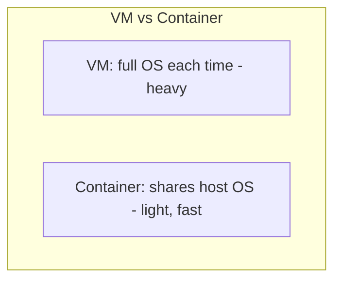
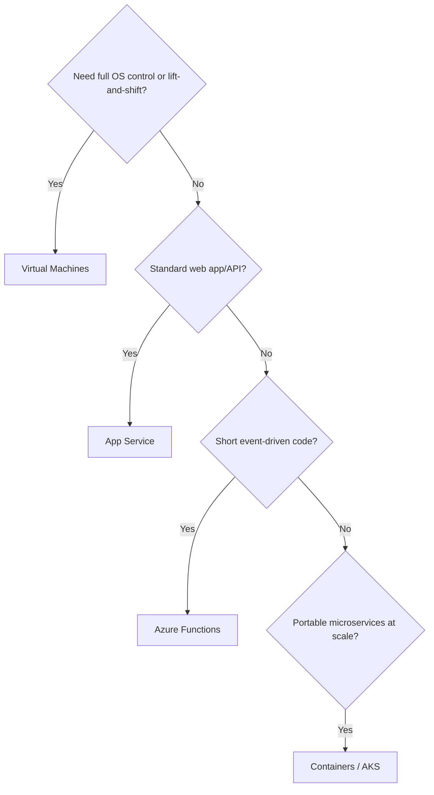

# Part C — Compute Services

> Section goal: Learn the main ways Azure runs your code and applications — from full virtual machines you control, to serverless functions where you write only code — and how to choose between them.

Covers index items: the "compute" pillar of Azure.

---

## 1. What is "compute"?

**Compute** = *the processing power that actually runs your software.* **Analogy:** the engine of a car — storage is the boot, networking is the roads, compute is what moves you. Azure offers several "engines," differing in **how much you manage vs how much Azure manages** (remember IaaS→PaaS→serverless from Part A).

---

## 2. Virtual Machines (VMs) — IaaS

- **Virtual Machine** — *a software-based computer running on Azure's physical servers, with its own operating system you fully control.* **Analogy:** renting an empty apartment — you bring furniture (install software), and you're responsible for cleaning (patching, updates). **Why it matters:** maximum control and flexibility; good for legacy apps or when you need a specific OS setup.
- **Virtual Machine Scale Set** — *a group of identical VMs that automatically grows or shrinks with demand.* **Analogy:** a fleet of identical taxis you add/remove as the queue changes. **Why:** automatic horizontal scaling.
- **Availability Set** — *a way to spread VMs across separate hardware so maintenance or a fault doesn't take them all down at once.*

> 💡 **Use a VM when** you need full control of the OS, are migrating an existing server "as-is" (lift-and-shift), or run specialised software.

---

## 3. Azure App Service — PaaS

- **App Service** — *a managed platform to host web apps, REST APIs, and mobile backends without managing the servers or OS.* **Analogy:** a serviced office — you just move your desk in; the building handles power, cleaning, security. **Why it matters:** you deploy your code and Azure handles patching, scaling, and load balancing. Supports .NET, Java, Node.js, Python, PHP.

> 💡 **Use App Service when** you have a standard web app/API and want to skip server management.

---

## 4. Containers: ACI and AKS

- **Container** — *a lightweight package holding an app plus everything it needs to run, isolated from others, sharing the host OS.* **Analogy:** a shipping container — standardised, so it runs the same on any ship (any machine). Lighter and faster to start than a full VM. **Why it matters:** consistent "runs anywhere," efficient density.
- **Azure Container Instances (ACI)** — *the simplest way to run a single container with no server management.* **Analogy:** renting one shipping container for a quick job.
- **Azure Kubernetes Service (AKS)** — *a managed service to run and orchestrate many containers at scale.* **Kubernetes** is the "traffic controller" that schedules, scales, heals, and connects containers. **Analogy:** a port authority coordinating thousands of containers — loading, moving, replacing damaged ones automatically.

| | Virtual Machine | Container |
|---|---|---|
| Contains | Full OS + app | Just app + dependencies |
| Startup | Minutes | Seconds |
| Size | Large (GBs) | Small (MBs) |
| Isolation | Strong (own OS) | Lighter (shared OS) |

> 💡 **Use containers when** you want portability, fast scaling, and microservices; use **AKS** when you have many containers to coordinate.

---

## 5. Azure Functions — Serverless

- **Serverless** — *you write only the code; Azure runs it on demand and you pay only while it runs (down to zero when idle).* **Analogy:** a motion-sensor light — it switches on only when someone walks by, costing nothing the rest of the time. (Servers still exist — you just don't manage them.)
- **Azure Functions** — *small pieces of code that run in response to a trigger (an HTTP request, a timer, a new file, a message).* **Analogy:** a vending machine — insert a coin (trigger), get a snack (result), then it waits idle. **Why it matters:** perfect for event-driven tasks; cheap and auto-scaling.

> 💡 **Use Functions when** work is short, event-triggered, and spiky (e.g. "resize an image whenever one is uploaded").

---

## 6. Integration & messaging glue

These connect your compute pieces together (event-driven architectures).

- **Logic Apps** — *a low-code/no-code way to automate workflows by connecting services visually.* **Analogy:** an assembly line you design by dragging blocks ("when an email arrives → save attachment → notify Teams").
- **Azure Service Bus** — *reliable message queuing between applications.* **Analogy:** a post office that holds letters until the recipient is ready. **Why:** decouples senders from receivers.
- **Event Grid** — *routes events ("something happened") to subscribers in near real time.* **Analogy:** a newsroom dispatching breaking news to interested readers.
- **Event Hubs** — *ingests massive streams of events/telemetry (millions/sec).* **Analogy:** a stadium turnstile counting a flood of entries.

---

## 7. Other compute options

- **Azure Virtual Desktop (AVD)** — *Windows desktops/apps hosted in Azure, accessed from anywhere.* **Analogy:** your office PC living in the cloud, reachable from any device.
- **Azure Arc** — *manage servers, Kubernetes, and services running outside Azure (on-prem or other clouds) as if they were in Azure.* **Analogy:** one remote control for all your TVs in different rooms/houses.

---

## 8. Choosing the right compute — decision guide

| Need | Best fit |
|------|----------|
| Full control, custom OS | Virtual Machines |
| Host a web app, minimal ops | App Service |
| Portable microservices at scale | AKS / containers |
| Run code only on events, pay-per-run | Functions |
| Cloud desktops | Azure Virtual Desktop |
| Manage non-Azure resources | Azure Arc |

---

## ✅ Quick Self-Check

**Q1. VM vs container — key difference?**
> A VM packages a full OS (heavier, slower to start); a container packages just the app + dependencies and shares the host OS (lighter, starts in seconds, portable).

**Q2. What is "serverless," and does it mean there are no servers?**
> It means you don't manage the servers and pay only while your code runs. Servers still exist — Azure manages and scales them for you.

**Q3. When would you use Azure Functions over App Service?**
> For short, event-triggered, spiky workloads where you want pay-per-execution and automatic scaling to zero.

**Q4. What does Azure Kubernetes Service do?**
> It orchestrates many containers — scheduling, scaling, healing, and networking them — as a managed service.

**Q5. What problem does a VM Scale Set solve?**
> It automatically adds/removes identical VMs to match demand (horizontal scaling), keeping performance up and costs down.

**Q6. What is Azure Arc for?**
> Managing and governing resources that live outside Azure (on-premises or other clouds) through Azure's control plane.

---

## 🧠 30-Second Memory Hooks
- **VM** = rent an empty apartment (you furnish & maintain). **App Service** = serviced office (just move in).
- **Container** = shipping container — runs the same anywhere; **AKS** = the port authority coordinating thousands.
- **Functions / serverless** = motion-sensor light — runs only when triggered, costs nothing idle.
- **Scale Set** = a fleet of identical taxis that grows with the queue.
- **Arc** = one remote for TVs in every room (manage non-Azure too).

---

*Next suggested section:* **[Part D — Networking](Part-D-networking.md)** (now that your code can run, learn the roads that connect it).
