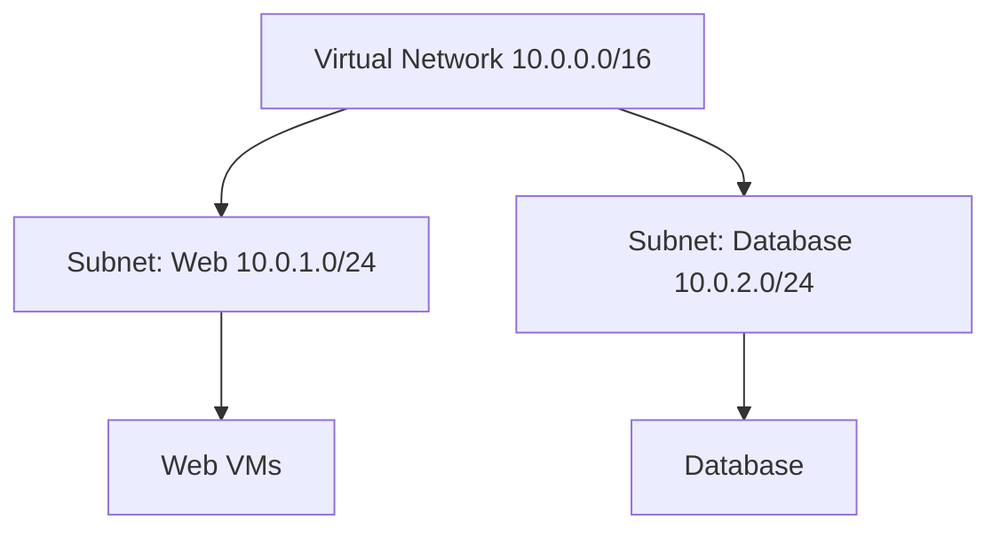
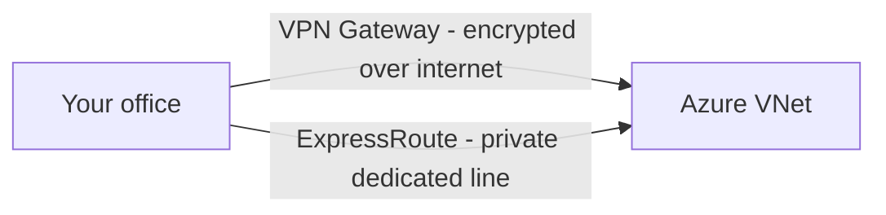
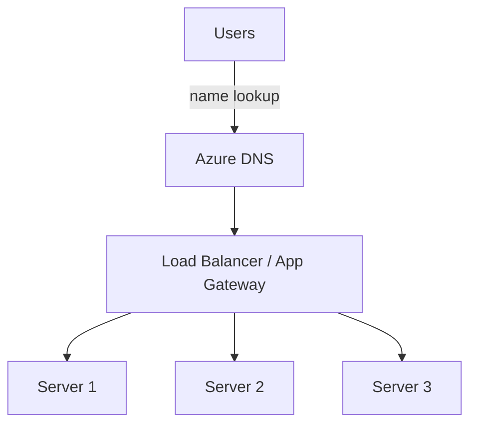

# Part D — Networking

> Section goal: Understand how Azure resources talk to each other and to the outside world — the virtual "roads," addresses, gateways, and traffic controllers that connect everything safely.

Covers index items: the networking pillar of Azure.

---

## 1. The foundation: Virtual Network (VNet)

- **Virtual Network (VNet)** — *your own private, isolated network inside Azure where your resources live and communicate.* **Analogy:** a gated housing estate — only the houses (resources) inside can freely talk on the internal roads, and you control the gates to the outside. **Why it matters:** it's the basic building block of Azure networking; VMs, databases, etc. get placed into it.
- **Subnet** — *a smaller section within a VNet used to group and isolate resources.* **Analogy:** separate streets within the estate (e.g. a "web street" and a quieter "database street"). **Why:** organise and secure tiers of an app separately.
- **IP address** — *the unique number that identifies a resource on the network.* **Analogy:** a house's postal address. *Private IP* = inside the estate; *Public IP* = visible on the internet.

> 💡 **Mental model:** VNet = the estate, subnets = streets, IP = house number.

---

## 2. Connecting networks together

Often you must link your VNet to other VNets or to your own office/datacenter.

### 🔍 Plain-English deep-dive
- **VNet peering** — *directly connects two VNets so resources communicate as if on one network.* **Analogy:** building a private bridge between two estates. **Why:** fast, private VNet-to-VNet traffic.
- **VPN Gateway** — *an encrypted tunnel over the public internet linking your on-premises network to Azure.* **VPN = Virtual Private Network.** **Analogy:** an armoured courier van using public roads but with a locked, secure box. **Why:** secure hybrid connectivity at lower cost; speed varies with the internet.
- **ExpressRoute** — *a private, dedicated connection from your datacenter to Azure that does NOT touch the public internet.* **Analogy:** a private railway line built just for you — faster, more reliable, more secure than public roads. **Why:** high bandwidth, consistent low latency, for serious enterprise/hybrid needs.

| | VPN Gateway | ExpressRoute |
|---|---|---|
| Path | Public internet (encrypted) | Private dedicated line |
| Speed/reliability | Good, variable | High, consistent |
| Cost | Lower | Higher |
| Use for | Smaller/hybrid links | Mission-critical enterprise |

---

## 3. Distributing and directing traffic

How incoming requests get spread across your servers and routed smartly.

- **Load Balancer** — *spreads incoming network traffic across multiple servers so none is overwhelmed.* **Analogy:** a host at a restaurant seating guests evenly across waiters. Works at the network level (fast, simple). **Why:** scalability + availability.
- **Application Gateway** — *a smarter, web-aware load balancer that can route based on the URL and includes a Web Application Firewall.* **Analogy:** a concierge who reads where you want to go and directs you to the right floor, while screening for trouble. **Why:** advanced web traffic routing + protection.
- **Azure DNS** — *translates human names (www.example.com) into IP addresses.* **DNS = Domain Name System.** **Analogy:** the phone book / contacts app that turns a name into a number. **Why:** users type names, not numbers.
- **Content Delivery Network (CDN)** — *caches copies of your content in many locations worldwide so users download from a nearby server.* **Analogy:** local distribution warehouses so parcels arrive faster. **Why:** speed for global audiences.

> 💡 **Quick distinction:** *Load Balancer* = fast, basic (any traffic). *Application Gateway* = web-smart (reads URLs, adds firewall).

---

## ✅ Quick Self-Check

**Q1. What is a VNet and a subnet?**
> A VNet is your private isolated network in Azure where resources live; a subnet is a subdivision within it used to group/isolate resources (e.g. a web tier vs a database tier).

**Q2. VPN Gateway vs ExpressRoute?**
> VPN Gateway connects on-premises to Azure with an encrypted tunnel *over the public internet* (cheaper, variable). ExpressRoute is a *private dedicated line* that bypasses the internet (faster, more reliable, more expensive).

**Q3. What does a load balancer do?**
> Distributes incoming traffic across multiple servers to prevent overload and improve availability and scalability.

**Q4. Load Balancer vs Application Gateway?**
> Load Balancer works at the network level (fast, any traffic). Application Gateway is web-aware — routes by URL and includes a Web Application Firewall.

**Q5. What is Azure DNS for?**
> Translating human-friendly domain names into the IP addresses computers use to connect.

**Q6. What problem does a CDN solve?**
> It caches content in locations near users worldwide, reducing latency so pages and files load faster globally.

---

## 🧠 30-Second Memory Hooks
- **VNet** = a gated estate; **subnet** = a street; **IP** = a house number.
- **Peering** = a private bridge between estates.
- **VPN** = armoured van on public roads; **ExpressRoute** = your own private railway.
- **Load Balancer** = restaurant host seating guests evenly; **App Gateway** = web-smart concierge + bouncer.
- **DNS** = the phone book (name → number); **CDN** = local warehouses for faster delivery.

---

*Next suggested section:* **[Part E — Storage](Part-E-storage.md)** (with networking in place, learn where your data actually lives).
