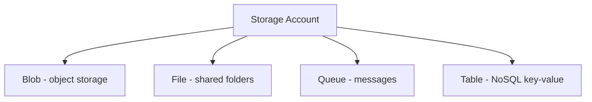
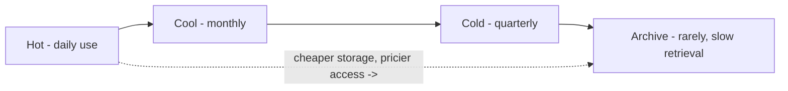
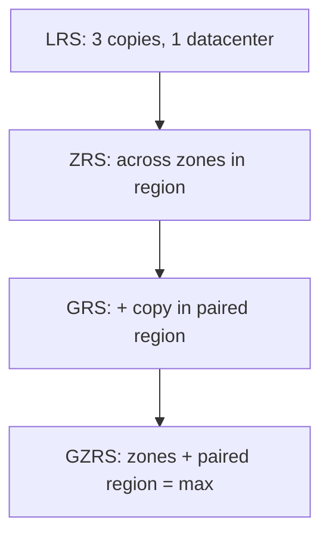

# Part E — Storage

> Section goal: Learn the different ways Azure stores data (files, blobs, queues, tables, disks), how it keeps multiple copies safe (redundancy), how access tiers save money, and the tools to move data in.

Covers index items: the storage pillar of Azure.

---

## 1. The container: Storage Account

- **Storage Account** — *the top-level container that holds your Azure storage services and gives them a unique name and address.* **Analogy:** a bank account that can hold different types of holdings (cash, savings, bonds). **Why it matters:** you create a storage account first, then put blobs, files, queues, and tables inside it.

---

## 2. The four storage services

### 🔍 Plain-English deep-dive
- **Blob storage** — *stores massive amounts of unstructured data: images, videos, backups, documents — anything that isn't a neat table.* **Blob = Binary Large Object.** **Analogy:** a giant storage locker for any object, any shape. **Why it matters:** the workhorse for files, media, backups, and data lakes.
- **File storage (Azure Files)** — *fully managed file shares you can mount like a network drive, accessible by many machines at once.* **Analogy:** a shared office drive (the "S: drive") everyone maps to. **Why:** lift-and-shift apps that expect a file share.
- **Queue storage** — *stores messages to pass between app components, so they work independently.* **Analogy:** a ticket queue at a deli — orders wait until a worker is free. **Why:** decouples and buffers work (ties to Functions/Service Bus from Part C).
- **Table storage** — *a simple NoSQL store for structured but non-relational key-value data.* **Analogy:** a giant spreadsheet/address book with no enforced relationships. **Why:** cheap, fast lookups for large semi-structured datasets.

| Service | Stores | Real-world use |
|---------|--------|----------------|
| Blob | Any unstructured object | Images, video, backups, logs |
| File | Mountable file shares | Shared drives for apps |
| Queue | Messages | Decoupling app parts |
| Table | Key-value NoSQL rows | Large, simple structured data |

> 💡 **Plus: Managed Disks** — *virtual hard drives attached to VMs* (the VM's "hard drive"). **Analogy:** the internal drive of your computer.

---

## 3. Access tiers — paying the right price for how often you use data

The less often you need data, the cheaper you can store it.

- **Hot tier** — *frequently accessed data; higher storage cost, lowest access cost.* **Analogy:** items on your kitchen counter — instantly reachable.
- **Cool tier** — *infrequently accessed (kept ≥30 days); lower storage cost, higher access cost.* **Analogy:** the garage — a bit of effort to fetch.
- **Cold tier** — *rarely accessed (kept ≥90 days); even cheaper storage.* 
- **Archive tier** — *rarely accessed long-term data; cheapest storage but retrieval takes hours.* **Analogy:** a deep self-storage unit across town — cheap to keep, slow to retrieve.

> 💡 **Lifecycle management** can move blobs automatically (e.g. Hot → Cool after 30 days) to cut costs.

---

## 4. Redundancy — how Azure keeps copies safe

Azure always stores multiple copies of your data so a failure never loses it. The options differ by *how far apart* the copies are.

### 🔍 Plain-English deep-dive
- **LRS (Locally Redundant Storage)** — *3 copies within a single datacenter.* **Analogy:** three photocopies in one office. Protects against disk/server failure, **not** a datacenter disaster.
- **ZRS (Zone-Redundant Storage)** — *copies spread across availability zones in one region.* **Analogy:** copies in three different buildings across town. Survives one datacenter failing.
- **GRS (Geo-Redundant Storage)** — *copies in your region PLUS a copy in the paired region hundreds of miles away.* **Analogy:** a backup kept in another city. Survives a whole region disaster.
- **GZRS (Geo-Zone-Redundant)** — *combines ZRS (zones) + geo (paired region)* — the most resilient.

| Option | Copies survive… | Protects against |
|--------|-----------------|------------------|
| LRS | Hardware failure | Disk/server fault |
| ZRS | A datacenter failing | Zone outage |
| GRS | A region disaster | Whole-region loss |
| GZRS | Both | Everything above |

> 💡 **Rule of thumb:** the further apart the copies, the more you're protected — and the more it costs.

---

## 5. Getting data into Azure (migration tools)

- **AzCopy** — *a command-line tool to copy data to/from Blob storage quickly.* **Analogy:** a bulk file-transfer truck.
- **Azure Storage Explorer** — *a free desktop app to browse and manage storage visually.* **Analogy:** File Explorer for the cloud.
- **Azure Data Box** — *a physical rugged device Microsoft ships to you; you fill it with data and mail it back* (for huge datasets where internet upload is too slow). **Analogy:** posting a hard drive instead of uploading for weeks.
- **Azure File Sync** — *keeps on-premises file servers in sync with Azure Files.*

---

## 6. Protecting data: Backup & recovery (intro)

- **Azure Backup** — *managed backups of VMs, files, and databases you can restore later.* **Analogy:** an automatic time-machine for your data.
- **Azure Site Recovery (ASR)** — *replicates whole workloads to another region and fails over during a disaster.* **Analogy:** a fully furnished backup house ready to move into if yours burns down. **Why:** business continuity / disaster recovery.

---

## ✅ Quick Self-Check

**Q1. Name the four services in a storage account and one use of each.**
> Blob (unstructured objects — images/backups), File (mountable shares — app drives), Queue (messages — decoupling components), Table (key-value NoSQL — large simple data).

**Q2. What is blob storage best for?**
> Storing large amounts of unstructured data such as images, video, documents, logs, and backups.

**Q3. Order the access tiers by access frequency and cost.**
> Hot (frequent, dearest storage) → Cool (monthly) → Cold (quarterly) → Archive (rarely; cheapest storage but slow, hours-long retrieval).

**Q4. LRS vs GRS?**
> LRS keeps 3 copies in a single datacenter (protects against hardware failure). GRS also copies to a paired region hundreds of miles away (protects against a whole-region disaster).

**Q5. Which redundancy survives a single datacenter failing within a region?**
> ZRS (zone-redundant) — copies are spread across availability zones.

**Q6. When would you use Azure Data Box?**
> When you have a very large dataset that would take too long to upload over the internet — you load it onto a shipped physical device and mail it back.

---

## 🧠 30-Second Memory Hooks
- **Storage account** = a bank account holding different storage types.
- **Blob / File / Queue / Table** = locker / shared drive / deli ticket line / address-book spreadsheet.
- **Tiers:** Hot = counter, Cool = garage, Archive = far storage unit (cheap, slow).
- **LRS → ZRS → GRS → GZRS** = same office → across town → another city → both (more spread = more safety + cost).
- **Data Box** = post a hard drive instead of uploading for weeks.

---

*Next suggested section:* **[Part F — Databases & Big Data](Part-F-databases.md)** (raw storage covered — now the structured databases and analytics built on top).
