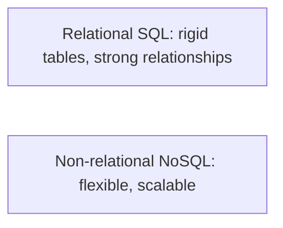
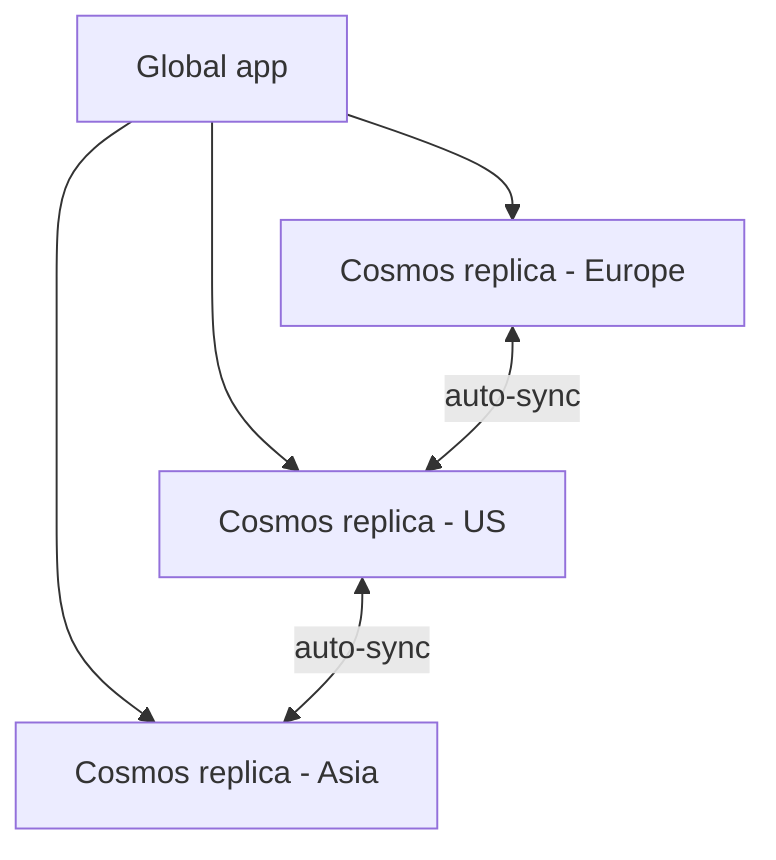
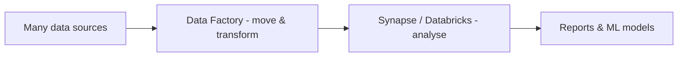

# Part F — Databases & Big Data

> Section goal: Understand the difference between relational and non-relational databases, Azure's managed database services, and the big-data/analytics tools used to process and learn from large datasets (the bridge toward AI).

Covers index items: Azure data platform + analytics + IoT.

---

## 1. Relational vs non-relational — the core split

- **Database** — *an organised, queryable store of data.* **Analogy:** a well-indexed library rather than a pile of books.
- **Relational (SQL) database** — *data in tables with rows and columns, with strict, predefined structure and relationships between tables.* **Analogy:** a spreadsheet workbook where sheets reference each other (Customers ↔ Orders). **Why:** consistency and complex queries; ideal when structure is known and must stay accurate.
- **Non-relational (NoSQL) database** — *flexible data that doesn't need a fixed table shape (documents, key-value, graphs).* **Analogy:** a box of differently shaped folders — each item can have its own fields. **Why:** scale and flexibility for varied, fast-changing, or huge data.

| | Relational (SQL) | Non-relational (NoSQL) |
|---|---|---|
| Shape | Fixed tables/columns | Flexible (docs, key-value, graph) |
| Best when | Structure known, accuracy vital | Varied data, massive scale |
| Example | Banking, orders | Product catalogs, IoT, social |

---

## 2. Azure relational database services

- **Azure SQL Database** — *a fully managed (PaaS) relational database based on Microsoft SQL Server.* **Analogy:** SQL Server with a live-in housekeeper — patching, backups, and scaling handled for you. **Why:** the go-to managed relational DB on Azure.
- **Azure SQL Managed Instance** — *closer to a full SQL Server, easing migration of existing on-prem databases* with minimal changes.
- **Azure Database for MySQL / PostgreSQL / MariaDB** — *managed versions of these popular open-source databases.* **Analogy:** the same engines you know, with Azure doing the maintenance.

> 💡 **"Managed" recurring theme:** Azure handles patching, backups, high availability — you focus on the data.

---

## 3. Azure Cosmos DB — global non-relational

- **Azure Cosmos DB** — *a globally distributed, multi-model NoSQL database offering very low latency and elastic scale worldwide.* **Analogy:** a chain of identical shops in every city — customers everywhere get fast local service, and stock stays in sync. **Why it matters:** for apps needing global reach, massive scale, and millisecond responses (IoT, gaming, retail). Supports multiple APIs (document, key-value, graph, etc.).

> 💡 **Pick Cosmos DB when** you need worldwide distribution, flexible schema, and guaranteed fast responses at any scale.

---

## 4. Big data & analytics — turning data into insight

Once data is huge, you need tools to process and analyse it. This is the launchpad for AI.

### 🔍 Plain-English deep-dive
- **Azure Synapse Analytics** — *an analytics service that combines big-data warehousing and querying in one place.* **Analogy:** a giant research lab that ingests mountains of data and produces reports. **Why:** analyse terabytes for business intelligence.
- **Azure Databricks** — *an Apache Spark-based platform for big-data processing and machine learning, popular with data scientists.* **Analogy:** an industrial kitchen for cooking raw data into insights and ML models at scale.
- **Azure HDInsight** — *managed open-source big-data frameworks (Hadoop, Spark, Kafka, etc.).* **Analogy:** renting a fully-equipped big-data workshop.
- **Azure Data Factory** — *a cloud service to build data pipelines that move and transform data between sources (ETL).* **ETL = Extract, Transform, Load.** **Analogy:** a conveyor-and-sorting system pulling raw materials from many suppliers, cleaning them, and delivering them ready to use. **Why:** automate getting data from A to B in the right shape.

---

## 5. Internet of Things (IoT)

- **IoT (Internet of Things)** — *everyday physical devices (sensors, machines, cars) connected to the internet, sending data.* **Analogy:** giving your appliances a voice to phone home with readings.
- **Azure IoT Hub** — *a central messaging hub for secure two-way communication with millions of IoT devices.* **Analogy:** a switchboard receiving calls from every device and sending instructions back.
- **Azure IoT Central** — *a ready-made, low-code IoT app platform built on IoT Hub.* **Analogy:** a pre-furnished IoT control room — faster to start, less to build.

> 💡 **Flow:** devices → IoT Hub → analytics (Synapse/Databricks) → AI insights. IoT is a major *source* of the big data that feeds AI.

---

## ✅ Quick Self-Check

**Q1. Relational vs non-relational — when to use each?**
> Relational (fixed tables, strong relationships) when structure is known and accuracy is critical (banking, orders). Non-relational (flexible, scalable) for varied, fast-changing, or massive data (catalogs, IoT, social).

**Q2. What is Azure SQL Database?**
> A fully managed PaaS relational database based on SQL Server — Azure handles patching, backups, and scaling.

**Q3. What makes Cosmos DB special?**
> It's globally distributed, multi-model NoSQL with very low latency and elastic scale — great for worldwide apps needing fast, flexible, massive-scale data.

**Q4. What does Azure Data Factory do, and what is ETL?**
> It builds pipelines that move and transform data between sources. ETL = Extract (pull data), Transform (clean/reshape), Load (deliver it).

**Q5. Synapse vs Databricks (one line)?**
> Both analyse big data; Synapse is an integrated analytics/warehouse service, Databricks is a Spark-based platform especially favored for data science and ML.

**Q6. What is IoT Hub for?**
> Secure, two-way communication and management for large fleets of IoT devices, feeding their data into Azure for analytics and AI.

---

## 🧠 30-Second Memory Hooks
- **Relational** = rigid spreadsheet with relationships; **NoSQL** = flexible folders.
- **Azure SQL DB** = managed SQL Server (housekeeper included).
- **Cosmos DB** = a shop in every city — fast, global, flexible.
- **Data Factory** = conveyor belt (ETL: extract → transform → load).
- **Synapse/Databricks** = labs that turn data mountains into insight.
- **IoT Hub** = switchboard for millions of devices.

---

*Next suggested section:* **[Part G — Identity (Microsoft Entra ID)](Part-G-identity.md)** (data secured at rest — next, controlling *who* can access any of it).
