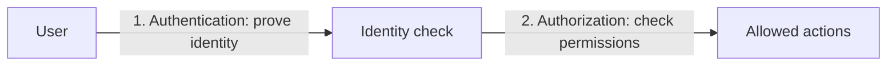
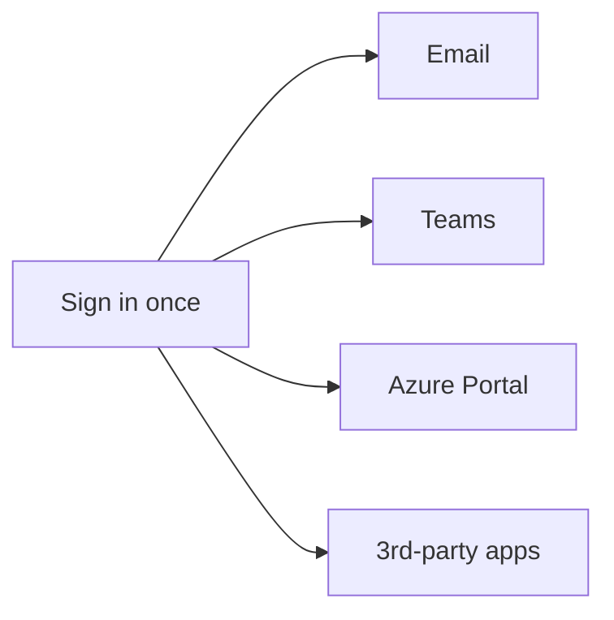
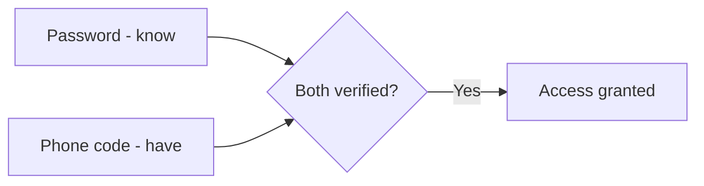
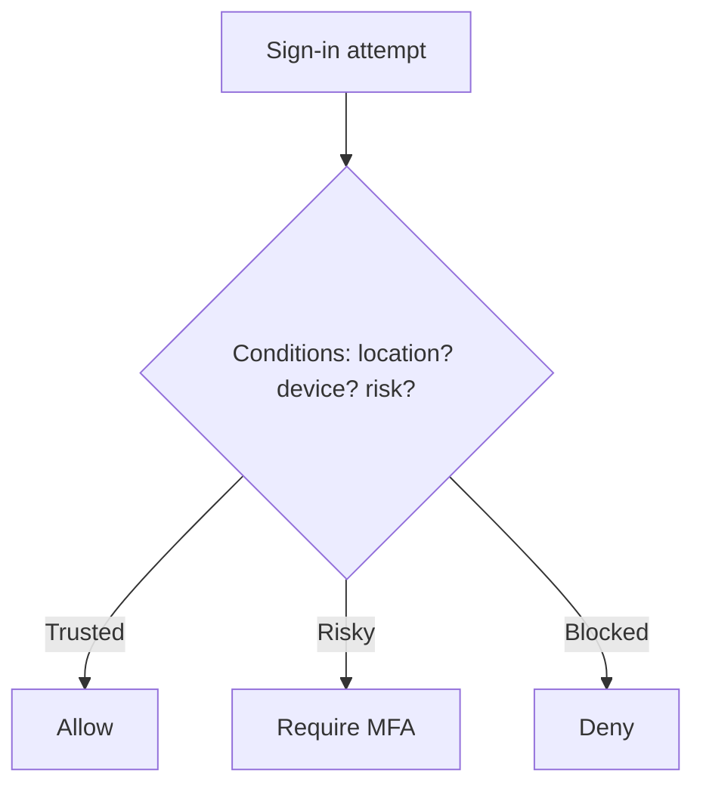

# Part G — Identity (Microsoft Entra ID)

> Section goal: Understand how Azure decides *who you are* and *what you're allowed to do* — the foundation of all cloud security. Identity is "the new perimeter."

Covers index items: authentication, authorization, Microsoft Entra ID, RBAC, MFA, conditional access, SSO.

---

## 1. The two big words: authentication vs authorization

These sound alike but mean different things — a classic exam trap.

- **Authentication (AuthN)** — *proving who you are.* **Analogy:** showing your passport at airport check-in. **Memory hook:** *Authe**N**tication = who you are (**N**ame).*
- **Authorization (AuthZ)** — *deciding what you're allowed to do once you're known.* **Analogy:** your boarding pass says which flight/seat you can access. **Memory hook:** *Authori**Z**ation = what you can do (**Z**one access).*

> 💡 **Order matters:** authenticate first (who), then authorize (what).

---

## 2. Microsoft Entra ID (formerly Azure Active Directory)

- **Microsoft Entra ID** — *Azure's cloud identity service that stores users, groups, and apps and handles signing them in.* **Analogy:** the security desk + employee directory of a building — it knows everyone's badge and decides who gets in. **Why it matters:** every Azure and Microsoft 365 sign-in goes through it; it's the heart of cloud identity.
  - *(Note: it was renamed from "Azure Active Directory / Azure AD" — you'll see both names.)*
- **Tenant** — *a dedicated, isolated instance of Entra ID for one organisation.* **Analogy:** your company's own private wing of the security system.

> 💡 **Not the same as on-prem AD:** traditional Active Directory manages on-premises Windows networks; Entra ID is cloud-first and works over the internet for cloud apps.

---

## 3. Single Sign-On (SSO)

- **Single Sign-On (SSO)** — *log in once and access many connected apps without re-entering credentials.* **Analogy:** a wristband at a theme park — scan once, ride everything all day. **Why:** fewer passwords = better security and user experience.

---

## 4. Multi-Factor Authentication (MFA)

- **Multi-Factor Authentication (MFA)** — *requiring two or more proofs of identity from different categories.* The three factor types:
  1. **Something you know** — a password or PIN.
  2. **Something you have** — a phone, app code, or hardware token.
  3. **Something you are** — a fingerprint or face (biometrics).
  
  **Analogy:** a bank withdrawal needing both your card (have) and your PIN (know). **Why it matters:** even if a password is stolen, the attacker still lacks the second factor — hugely reduces account takeover.

> 💡 **Key point:** the factors must be *different categories*. Two passwords ≠ MFA.

---

## 5. Conditional Access

- **Conditional Access** — *rules that grant or block access based on conditions (who, where, what device, how risky).* **Analogy:** a smart bouncer who lets regulars in easily but demands extra ID if you arrive at 3am from an unusual place. **Why:** balances security and convenience — e.g. "require MFA only when signing in from outside the office."

---

## 6. Role-Based Access Control (RBAC)

- **RBAC (Role-Based Access Control)** — *granting permissions by assigning roles, so people get exactly the access their job needs.* **Analogy:** job-title keycards — a cleaner's badge opens cleaning closets, a manager's opens offices. **Why it matters:** implements *least privilege* (only the access you need) and scales better than per-person rules.
  - A role assignment = **who** (user/group) + **what role** (e.g. Reader, Contributor, Owner) + **scope** (subscription / resource group / resource).

| Common role | Can do |
|-------------|--------|
| Reader | View only |
| Contributor | Create/manage resources, but not grant access |
| Owner | Full control, including granting access |

> 💡 **Least privilege principle:** give the minimum access needed — a recurring security theme (see Part I).

---

## ✅ Quick Self-Check

**Q1. Authentication vs authorization?**
> Authentication = proving who you are (passport). Authorization = what you're allowed to do once identified (boarding pass/seat).

**Q2. What is Microsoft Entra ID?**
> Azure's cloud identity service (formerly Azure Active Directory) that manages users, groups, and apps and handles sign-in across Azure and Microsoft 365.

**Q3. What is MFA and why is it strong?**
> Requiring two+ proofs from different categories (know/have/are). Even a stolen password isn't enough without the second factor, drastically cutting account compromise.

**Q4. What does Single Sign-On give you?**
> One login that grants access to many connected apps without re-entering credentials — fewer passwords, better UX and security.

**Q5. What is Conditional Access?**
> Policies that allow, challenge (e.g. require MFA), or block sign-ins based on conditions like location, device, and risk.

**Q6. Explain RBAC and least privilege.**
> RBAC grants permissions via roles (Reader/Contributor/Owner) at a scope. Least privilege means assigning only the access a person needs to do their job.

---

## 🧠 30-Second Memory Hooks
- **Authe*N*tication = *N*ame (who)** · **Authori*Z*ation = *Z*one (what you can do).**
- **Entra ID** = the building's security desk + directory (was "Azure AD").
- **SSO** = one theme-park wristband for all rides.
- **MFA** = card + PIN; factors must be *different types* (know / have / are).
- **Conditional Access** = a smart bouncer judging the situation.
- **RBAC** = job-title keycards; give the *least* access needed.

---

*Next suggested section:* **[Part H — Management & Monitoring Tools](Part-H-management-tools.md)** (you can secure identities — now learn the tools to build, manage, and watch it all).
