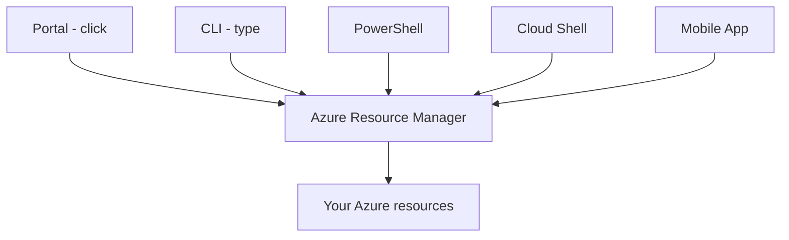
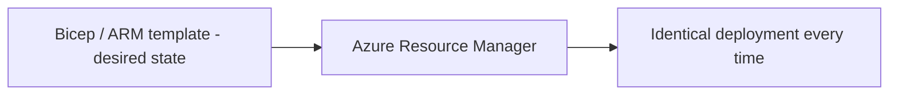
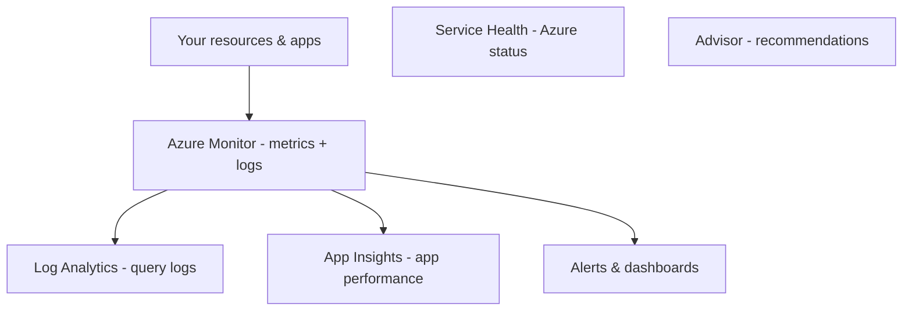

# Part H — Management & Monitoring Tools

> Section goal: Learn the tools you use to *create, manage, and watch* Azure resources — the consoles and command lines for building things, the "infrastructure as code" approach, and the services that monitor health and performance.

Covers index items: management interfaces + monitoring stack.

---

## 1. Ways to manage Azure

You can interact with Azure (which always goes through ARM — Part B) in several ways, suited to different people and tasks.

### 🔍 Plain-English deep-dive
- **Azure Portal** — *a web-based graphical dashboard for managing everything by clicking.* **Analogy:** the dashboard of a car — buttons and dials for everything. **Why:** best for learning, exploring, and one-off tasks.
- **Azure CLI (Command-Line Interface)** — *type text commands to manage Azure (cross-platform, e.g. `az vm create`).* **Analogy:** texting precise instructions instead of clicking. **Why:** scripting and automation; works on Linux/Mac/Windows.
- **Azure PowerShell** — *manage Azure using PowerShell commands (cmdlets).* **Analogy:** the same idea as CLI but in PowerShell's language, popular with Windows admins.
- **Azure Cloud Shell** — *a browser-based terminal (CLI or PowerShell) with tools preinstalled — no setup.* **Analogy:** a ready-to-use workshop in the cloud you open from any browser.
- **Azure Mobile App** — *manage and monitor Azure from your phone.* **Analogy:** a car's companion app to check status on the go.

| Tool | Style | Best for |
|------|-------|----------|
| Portal | Graphical | Learning, one-off tasks |
| CLI | Text commands | Automation (cross-platform) |
| PowerShell | Cmdlets | Windows-centric automation |
| Cloud Shell | Browser terminal | Quick access, no install |
| Mobile App | Phone | On-the-go monitoring |

---

## 2. Infrastructure as Code (IaC): ARM templates & Bicep

- **Infrastructure as Code (IaC)** — *defining your resources in text files so you can deploy them automatically and identically every time.* **Analogy:** a recipe card — anyone following it produces the same dish, repeatedly, no guesswork. **Why it matters:** consistency, repeatability, version control, no manual clicking.
- **ARM template** — *a JSON file describing the resources to deploy.* **JSON** is just a structured text format.
- **Bicep** — *a simpler, cleaner language that compiles to ARM templates.* **Analogy:** an easier-to-read version of the same recipe. **Why:** less verbose, friendlier than raw JSON.
- **Declarative** — *you describe the desired end state ("I want 3 VMs"), and Azure figures out how to make it so* — rather than scripting each step.

> 💡 **Declarative vs imperative:** *declarative* = describe the result (a recipe's finished dish). *Imperative* = list every step in order (do this, then this).

---

## 3. Monitoring: knowing how things are doing

Once resources run, you must watch their health, performance, and cost.

### 🔍 Plain-English deep-dive
- **Azure Monitor** — *the central service collecting metrics and logs from all your resources.* **Analogy:** the dashboard gauges of a car (speed, fuel, temperature) for your whole estate. **Why:** one place to see performance and set alerts.
- **Log Analytics** — *a tool within Azure Monitor to query and analyse collected log data.* **Analogy:** a detective searching through CCTV footage with smart filters. **Why:** dig into *why* something happened.
- **Application Insights** — *monitors the performance and usage of your applications (response times, failures, user flows).* **Analogy:** a fitness tracker for your app — heart rate, errors, slow spots. **Why:** find and fix app problems.
- **Azure Service Health** — *tells you about Azure-side issues (outages, planned maintenance) affecting your services.* **Analogy:** the transit authority's service-status board ("delays on this line today"). **Why:** know if a problem is Azure's, not yours.
- **Azure Advisor** — *a free personalised recommendation engine for cost, security, reliability, and performance.* **Analogy:** a financial + safety advisor reviewing your setup and suggesting improvements. **Why:** continuously optimise.

| Tool | Answers the question |
|------|----------------------|
| Azure Monitor | "How is everything performing?" |
| Log Analytics | "Why did this happen?" (deep log queries) |
| App Insights | "How healthy is my app?" |
| Service Health | "Is the problem Azure's side?" |
| Advisor | "How can I improve cost/security/reliability/perf?" |

---

## ✅ Quick Self-Check

**Q1. Name three ways to manage Azure and when you'd use each.**
> Portal (graphical, for learning/one-off tasks), CLI/PowerShell (text commands, for automation), Cloud Shell (browser terminal, no setup). All route through ARM.

**Q2. What is Infrastructure as Code, and why use it?**
> Defining resources in text files (ARM templates/Bicep) for automated, repeatable, identical deployments — giving consistency, version control, and no manual error.

**Q3. ARM template vs Bicep?**
> Both define infrastructure declaratively; ARM templates are JSON, Bicep is a simpler, cleaner language that compiles down to ARM templates.

**Q4. What does Azure Monitor do?**
> Centrally collects metrics and logs from your resources so you can see performance, build dashboards, and trigger alerts.

**Q5. App Insights vs Service Health?**
> App Insights monitors *your application's* performance and errors. Service Health reports *Azure's own* status — outages and maintenance affecting you.

**Q6. What is Azure Advisor?**
> A free service giving personalised recommendations across cost, security, reliability, and performance to optimise your environment.

---

## 🧠 30-Second Memory Hooks
- **Portal/CLI/PowerShell/Cloud Shell** = click / text / Windows-text / browser terminal — all hit **ARM**.
- **IaC (ARM/Bicep)** = a recipe → identical deployment every time; *declarative* = describe the dish, not the steps.
- **Azure Monitor** = the dashboard gauges; **Log Analytics** = CCTV detective.
- **App Insights** = fitness tracker for your app; **Service Health** = "is it Azure's fault?"
- **Advisor** = your optimisation consultant (cost/security/reliability/perf).

---

*Next suggested section:* **[Part I — Security](Part-I-security.md)** (you can build and watch — now protect it all in depth).
