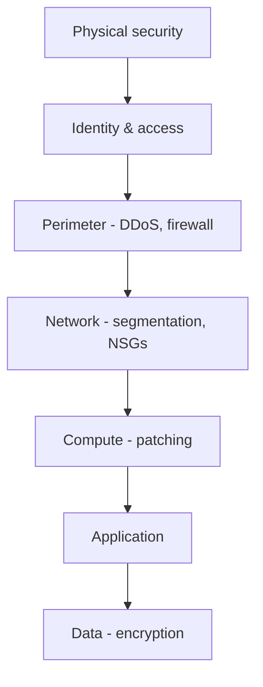
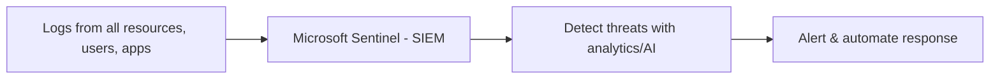
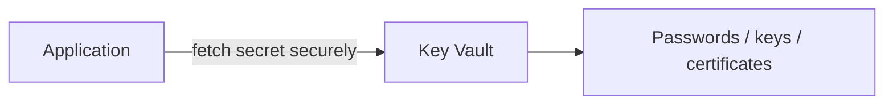

# Part I — Security

> Section goal: Learn how Azure protects your resources in layers — the core philosophies (defense in depth, Zero Trust) and the specific services that guard identity, networks, secrets, and data.

Covers index items: the security pillar of Azure.

---

## 1. Two guiding philosophies

### Defense in depth
- **Defense in depth** — *layering multiple security measures so if one fails, others still protect you.* **Analogy:** a medieval castle — moat, walls, gates, guards, and a locked keep. An attacker must beat every layer. **Why it matters:** no single control is perfect; layers reduce risk.

### Zero Trust
- **Zero Trust** — *"never trust, always verify" — treat every request as potentially hostile, even from inside the network.* **Analogy:** a high-security building where your badge is checked at *every* door, not just the front entrance. **Why:** old "trust everything inside the walls" models fail once an attacker gets in. Three principles: verify explicitly, use least privilege, assume breach.

> 💡 **Contrast:** old model = hard shell, soft inside. Zero Trust = verify continuously everywhere.

---

## 2. Microsoft Defender for Cloud

- **Microsoft Defender for Cloud** — *a tool that continuously assesses your security posture, flags weaknesses, and protects workloads against threats.* **Analogy:** a building inspector + security guard combined — scores how safe you are and raises alarms on threats. **Why it matters:** gives a **Secure Score** and concrete hardening recommendations across your resources (even hybrid/multicloud).

---

## 3. Microsoft Sentinel

- **Microsoft Sentinel** — *a cloud-native SIEM that collects security signals across your whole estate and uses analytics/AI to detect and respond to threats.* **SIEM = Security Information and Event Management.** **Analogy:** a central security operations center watching every camera feed, spotting patterns a single guard would miss. **Why:** organisation-wide threat detection, investigation, and automated response.

> 💡 **Defender vs Sentinel:** Defender for Cloud = *protect & score* your resources' posture. Sentinel = *detect & respond* to threats across everything (the SOC brain).

---

## 4. Network security tools

- **Network Security Group (NSG)** — *a set of allow/deny rules controlling traffic in and out of a subnet or VM (by IP, port, protocol).* **Analogy:** a guest list at a door deciding who may pass. **Why:** basic, free traffic filtering inside your VNet.
- **Azure Firewall** — *a managed, stateful network firewall protecting an entire VNet with central rules and threat intelligence.* **Analogy:** a fortified main gate with trained guards for the whole estate. **Why:** broader, smarter protection than NSGs.
- **Azure DDoS Protection** — *defends against Distributed Denial-of-Service attacks that flood your service with junk traffic to knock it offline.* **Analogy:** crowd-control barriers that absorb a stampede so real customers still get through. **Why:** keeps public services available under attack.
- **Azure Bastion** — *secure RDP/SSH access to VMs straight from the portal, without exposing them to the public internet.* **Analogy:** a guarded tunnel to reach a building without opening a public door. **Why:** admin access without risky open ports.

| Tool | Protects | Scope |
|------|----------|-------|
| NSG | Traffic filtering rules | Subnet / VM |
| Azure Firewall | Central managed firewall | Whole VNet |
| DDoS Protection | Flood attacks | Public endpoints |
| Bastion | Safe admin access | VM management |

---

## 5. Protecting secrets and data

- **Azure Key Vault** — *a secure, centralised store for secrets, keys, and certificates (passwords, API keys, encryption keys).* **Analogy:** a bank vault for your digital valuables — apps fetch what they need without secrets being scattered in code. **Why it matters:** never hard-code secrets; control and audit access centrally.
- **Encryption** — *scrambling data so only those with the key can read it.* Two states:
  - *Encryption at rest* = data stored on disk is scrambled. **Analogy:** documents locked in a safe.
  - *Encryption in transit* = data moving over the network is scrambled. **Analogy:** a sealed armored courier.

> 💡 **Golden rule:** secrets belong in Key Vault, never in your source code (ties back to Part A's "your data/identities are always your responsibility").

---

## ✅ Quick Self-Check

**Q1. What is defense in depth?**
> Layering multiple security controls (physical, identity, network, app, data) so that if one fails, others still protect you — like a castle's moat, walls, and keep.

**Q2. Explain Zero Trust.**
> "Never trust, always verify" — every request is verified regardless of origin (even inside the network), using explicit verification, least privilege, and an assume-breach mindset.

**Q3. Defender for Cloud vs Microsoft Sentinel?**
> Defender for Cloud assesses and improves your security posture (Secure Score, recommendations, workload protection). Sentinel is a SIEM that detects and responds to threats across the whole estate.

**Q4. NSG vs Azure Firewall?**
> NSG is basic allow/deny traffic rules at the subnet/VM level. Azure Firewall is a managed, stateful firewall protecting a whole VNet with central rules and threat intelligence.

**Q5. What is Azure Key Vault for?**
> Securely storing and controlling access to secrets, keys, and certificates so they aren't hard-coded or scattered — central, audited, and protected.

**Q6. Encryption at rest vs in transit?**
> At rest = stored data is scrambled on disk (locked safe). In transit = data is scrambled while moving across the network (armored courier).

---

## 🧠 30-Second Memory Hooks
- **Defense in depth** = castle layers; **Zero Trust** = check the badge at *every* door.
- **Defender for Cloud** = inspector + Secure Score (protect & rate); **Sentinel** = the SOC brain (detect & respond, a SIEM).
- **NSG** = door guest list; **Firewall** = fortified main gate; **DDoS** = crowd barriers; **Bastion** = guarded tunnel to VMs.
- **Key Vault** = a bank vault for secrets — never put secrets in code.
- **Encryption:** at rest = locked safe; in transit = sealed courier.

---

*Next suggested section:* **[Part J — Governance, Cost & SLAs](Part-J-governance-cost.md)** (secure resources — now keep them compliant and cost-controlled).
