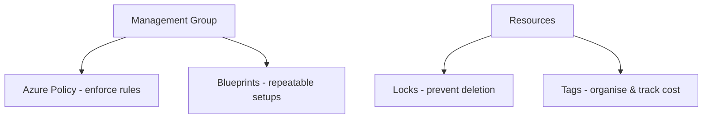
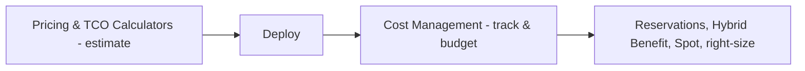

# Part J — Governance, Cost & SLAs

> Section goal: Learn how organisations keep Azure usage compliant and consistent (governance), how Azure prices things and how to control spend (cost), and what guarantees Azure makes about uptime (SLAs).

Covers index items: governance, compliance, cost management, SLAs & service lifecycle.

---

## 1. Governance — keeping order at scale

**Governance** = *the rules and guardrails that keep everyone's cloud usage consistent, compliant, and safe.* **Analogy:** the building rules of a large apartment complex — what you can/can't do, applied to everyone automatically.

### 🔍 Plain-English deep-dive
- **Azure Policy** — *rules that audit or enforce requirements on resources (e.g. "only allow resources in Europe," "all resources must have a tag").* **Analogy:** an automatic rule-checker that blocks or flags anything breaking the house rules. **Why:** consistent compliance without manual policing.
- **Azure Blueprints** — *packaged, repeatable environment setups combining policies, role assignments, and templates.* **Analogy:** a pre-approved "starter pack" to stamp out compliant environments. **Why:** spin up governed environments fast and consistently.
- **Resource locks** — *prevent accidental deletion or modification of critical resources (CanNotDelete / ReadOnly).* **Analogy:** a "do not delete" padlock on an important box. **Why:** protect production from oops moments.
- **Tags** — *name/value labels attached to resources (e.g. `Environment=Prod`, `CostCenter=Finance`).* **Analogy:** sticky labels for sorting and tracking. **Why:** organise, filter, and report costs by team/project.

---

## 2. The Microsoft Cloud Adoption Framework (intro)

- **Cloud Adoption Framework (CAF)** — *Microsoft's proven guidance for planning and executing a cloud journey (strategy, plan, ready, adopt, govern, manage).* **Analogy:** a step-by-step recipe-book for moving a whole company to the cloud safely. (More in Part Q.)

---

## 3. Cost management — understanding and controlling spend

### How Azure charges you
Costs depend on factors like resource type, usage (compute hours, storage GB, data transfer), region, and chosen tier. **Key idea:** **you pay for what you use** (OpEx, from Part A).

### Tools to estimate and control cost
- **Pricing Calculator** — *estimate the cost of a planned setup before you build it.* **Analogy:** a shopping cart total before checkout.
- **Total Cost of Ownership (TCO) Calculator** — *compare the cost of running on-premises vs in Azure over time.* **Analogy:** a "buy vs rent" comparison spreadsheet.
- **Microsoft Cost Management** — *track, analyse, and report actual spend, with budgets and alerts.* **Analogy:** a budgeting app showing where your money goes and warning you near limits.

### Ways to save money
- **Reservations** — *commit to 1 or 3 years for a big discount* (vs pay-as-you-go). **Analogy:** an annual gym membership — cheaper than paying per visit.
- **Azure Hybrid Benefit** — *reuse existing Windows/SQL licenses to cut costs.*
- **Spot VMs** — *use spare capacity at steep discounts* (can be reclaimed anytime) for interruptible work.
- **Right-sizing & auto-shutdown** — *don't over-provision; turn off idle resources.*

| Tool | Used when | Answers |
|------|-----------|---------|
| Pricing Calculator | Before building | "What will this cost?" |
| TCO Calculator | Deciding to migrate | "Cheaper than on-prem?" |
| Cost Management | After deploying | "What am I actually spending?" |

---

## 4. Service Level Agreements (SLAs)

- **SLA (Service Level Agreement)** — *Microsoft's formal promise about a service's uptime/availability, with credits if they miss it.* **Analogy:** a delivery company guaranteeing "99.9% on-time, or money back." **Why it matters:** tells you how reliable a service is and what compensation you get for outages.
- Uptime is expressed as "nines": **99.9%** ≈ 8.7 hours downtime/year; **99.99%** ≈ 52 minutes/year. More nines = less allowed downtime.
- **Composite SLA** — *combining multiple services multiplies their SLAs*, so an app's overall guarantee can be *lower* than any single part. **Analogy:** a chain is only as strong as all links multiplied. *Designing across zones/regions can raise effective availability.*

| Availability | Approx downtime/year |
|--------------|----------------------|
| 99.9% ("three nines") | ~8.7 hours |
| 99.95% | ~4.4 hours |
| 99.99% ("four nines") | ~52 minutes |

> 💡 **Free/preview tiers** often have **no SLA**. Production workloads should use SLA-backed tiers.

---

## 5. Service lifecycle: previews vs GA

- **Private/Public Preview** — *early features for testing; may change, often without SLA.* **Analogy:** a beta test — try it, but don't rely on it.
- **General Availability (GA)** — *fully released, supported, SLA-backed.* **Analogy:** the official product launch. **Why:** only build production on GA features.
- **Trust Center / Service Trust Portal** — *where Microsoft publishes its compliance certifications (ISO, GDPR, HIPAA, etc.).* **Analogy:** a wall of audited certificates proving they meet standards. **Why:** prove regulatory compliance to auditors.

---

## ✅ Quick Self-Check

**Q1. What does Azure Policy do?**
> Audits or enforces rules on resources (e.g. allowed regions, required tags) to keep usage compliant automatically — distinct from RBAC, which controls *who* can do things.

**Q2. What are resource locks and tags for?**
> Locks prevent accidental deletion/modification of critical resources. Tags are labels for organising resources and tracking/reporting costs by team or project.

**Q3. Pricing Calculator vs TCO Calculator?**
> Pricing Calculator estimates the cost of a planned Azure setup. TCO Calculator compares on-premises vs Azure costs to justify migration.

**Q4. Name two ways to reduce Azure costs.**
> Reservations (1/3-year commitment for discounts), Azure Hybrid Benefit (reuse licenses), Spot VMs (cheap interruptible capacity), right-sizing/auto-shutdown of idle resources.

**Q5. What is an SLA, and what does "more nines" mean?**
> A formal availability guarantee with credits for misses. More nines = higher uptime / less allowed downtime (99.99% ≈ 52 min/year vs 99.9% ≈ 8.7 hr/year).

**Q6. Why can a multi-service app have a lower overall SLA than its parts?**
> Composite SLAs multiply together, so combining services reduces the overall guarantee — though designing across zones/regions can improve effective availability.

---

## 🧠 30-Second Memory Hooks
- **Azure Policy** = automatic house-rule enforcer (*what's allowed*); **RBAC** = *who* can act.
- **Locks** = "do not delete" padlock; **Tags** = sticky labels for cost tracking.
- **Pricing Calc** = cart total before building; **TCO** = buy-vs-rent; **Cost Management** = budgeting app after.
- **Save:** Reservations (annual membership), Hybrid Benefit, Spot VMs, right-size.
- **SLA** = uptime promise; more nines = less downtime; previews often have **no SLA**.
- **GA** = official launch (build production here); **Trust Center** = wall of compliance certs.

---

*Next suggested section:* **[Part K — AI & ML Fundamentals](Part-K-ai-ml-fundamentals.md)** (Azure platform complete — now we begin the AI half of the guide).
