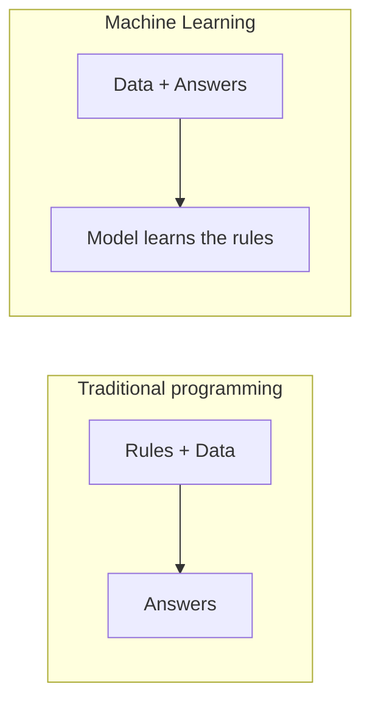
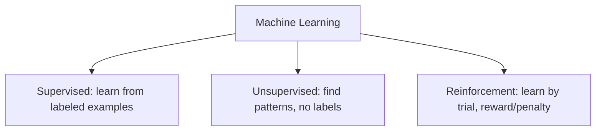
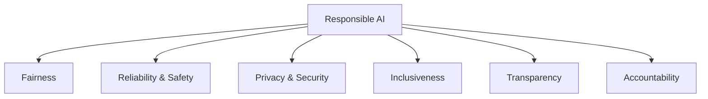

# Part K — AI & Machine Learning Fundamentals

> Section goal: Build a clear, jargon-free mental model of what Artificial Intelligence and Machine Learning actually are, the main types of learning, and Microsoft's Responsible AI principles — the foundation for every Azure AI service that follows.

Covers index items: AI/ML concepts + Responsible AI (start of the AI half).

---

## 1. What is AI, really?

- **Artificial Intelligence (AI)** — *software that performs tasks normally needing human intelligence: recognising images, understanding language, making predictions, deciding.* **Analogy:** teaching a computer to *notice patterns and make judgments* like a person, rather than following only fixed instructions. **Why it matters:** AI lets software handle messy, real-world problems (Is this a cat? Is this review angry?) that rigid rules can't.

- **Machine Learning (ML)** — *the main way we build AI: instead of programming rules, we show the computer lots of examples and it learns the patterns itself.* **Analogy:** teaching a child what a dog is by showing many dogs, not by writing a definition. **Why:** for many problems, examples are easier than rules.

> 💡 **The big flip:** traditional code = *rules + data → answers.* ML = *data + answers → the rules (a model).*

---

## 2. Key vocabulary

### 🔍 Plain-English deep-dive
- **Model** — *the learned "brain" that, after training, can make predictions on new data.* **Analogy:** a trained guide dog — after lots of training it reliably does its job.
- **Training** — *the process of feeding examples to create the model.* **Analogy:** the school years.
- **Inference / prediction** — *using the trained model on new, unseen data.* **Analogy:** the dog now working in the real world.
- **Dataset** — *the collection of examples used to train.* **Analogy:** the textbook of worked examples. *More/better data usually = a smarter model.*
- **Features** — *the input characteristics the model looks at (e.g. a house's size, location).* **Analogy:** the clues. **Label** — *the answer you want to predict (e.g. the house's price).* **Analogy:** the correct answer in the back of the book.

---

## 3. Types of machine learning

- **Supervised learning** — *learns from labeled examples (inputs *with* the correct answers).* **Analogy:** studying with an answer key. Two sub-types:
  - *Classification* = predict a **category** (spam vs not spam; cat vs dog).
  - *Regression* = predict a **number** (house price, tomorrow's temperature).
- **Unsupervised learning** — *finds patterns/groups in data that has no labels.* **Analogy:** sorting a mixed bag of fruit into groups without being told the names. Main type: *clustering* (e.g. grouping customers by behavior).
- **Reinforcement learning** — *learns by trial and error, getting rewards or penalties.* **Analogy:** training a pet with treats — good actions rewarded, bad ones not. Used in robotics, games.

| Type | Has labels? | Predicts | Example |
|------|-------------|----------|---------|
| Supervised – Classification | Yes | A category | Spam detection |
| Supervised – Regression | Yes | A number | Price prediction |
| Unsupervised – Clustering | No | Groupings | Customer segments |
| Reinforcement | Reward signal | Best actions | Game-playing bot |

> 💡 **Quick test:** *Labels + categories → classification. Labels + numbers → regression. No labels → clustering.*

---

## 4. Deep learning & neural networks

- **Neural network** — *an ML model loosely inspired by how brain neurons connect, made of layers that learn increasingly complex patterns.* **Analogy:** an assembly line where each station spots a more advanced feature (edges → shapes → faces).
- **Deep learning** — *neural networks with many layers, powering the most advanced AI (image recognition, speech, modern language models).* **Analogy:** a very deep assembly line able to learn extremely subtle patterns. **Why it matters:** it's behind today's breakthroughs, including generative AI (Part O).

---

## 5. Responsible AI — Microsoft's six principles

AI can cause harm if misused, so Microsoft defines six principles. These are heavily tested on AI-900.

- **Fairness** — *treat all groups equitably; avoid bias.* **Analogy:** an impartial referee. (e.g. a loan model shouldn't discriminate.)
- **Reliability & Safety** — *work consistently and safely, even in unexpected situations.* **Analogy:** a car that brakes reliably in all weather.
- **Privacy & Security** — *protect personal data and secure the system.* **Analogy:** a doctor keeping records confidential.
- **Inclusiveness** — *work for people of all abilities and backgrounds.* **Analogy:** a building with ramps and lifts for everyone.
- **Transparency** — *people should understand how the AI works and its limits.* **Analogy:** clear ingredient labels on food.
- **Accountability** — *humans remain responsible for the AI's outcomes.* **Analogy:** a manager answerable for the team's work.

> 💡 **Memory trick (FRPITA-ish):** *Fair Robots Probably Include Transparent Accountability* → Fairness, Reliability&safety, Privacy&security, Inclusiveness, Transparency, Accountability.

---

## ✅ Quick Self-Check

**Q1. How does machine learning differ from traditional programming?**
> Traditional: rules + data → answers. ML: data + answers → a model that learns the rules itself, then predicts on new data.

**Q2. Classification vs regression?**
> Both are supervised. Classification predicts a category (spam/not spam); regression predicts a number (price, temperature).

**Q3. What is unsupervised learning, and a common use?**
> Learning patterns from unlabeled data; clustering is common — e.g. grouping customers by behavior without predefined groups.

**Q4. What is deep learning?**
> Machine learning using multi-layered neural networks, enabling advanced tasks like image recognition, speech, and modern language models.

**Q5. Define features and labels.**
> Features are the input characteristics the model uses (house size, location); the label is the answer to predict (the price).

**Q6. Name Microsoft's six Responsible AI principles.**
> Fairness; Reliability & Safety; Privacy & Security; Inclusiveness; Transparency; Accountability.

---

## 🧠 30-Second Memory Hooks
- **Traditional = rules+data→answers. ML = data+answers→the rules (model).**
- **Model** = trained brain; **training** = school; **inference** = working in the real world.
- **Supervised** = study with answer key (classification = category, regression = number); **Unsupervised** = sort fruit unlabeled; **Reinforcement** = treats for good actions.
- **Deep learning** = many-layer neural net behind modern AI.
- **Responsible AI 6:** Fairness, Reliability&Safety, Privacy&Security, Inclusiveness, Transparency, Accountability.

---

*Next suggested section:* **[Part L — Azure AI Services Overview](Part-L-azure-ai-services.md)** (concepts in hand — now meet the ready-made AI you consume on Azure).
