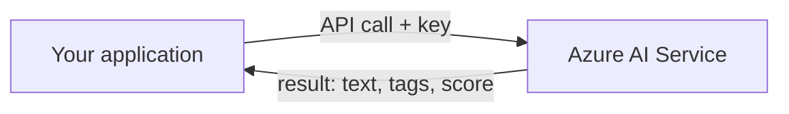
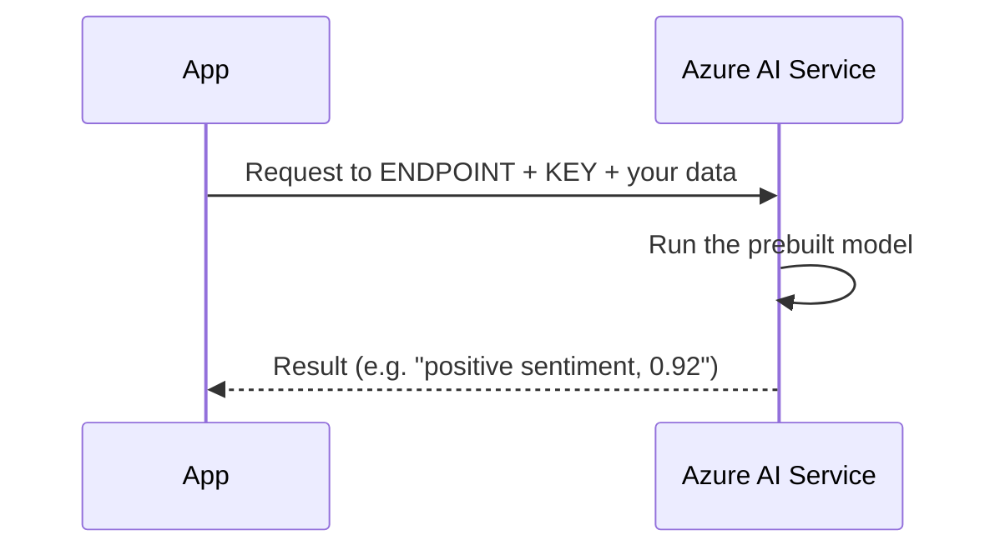
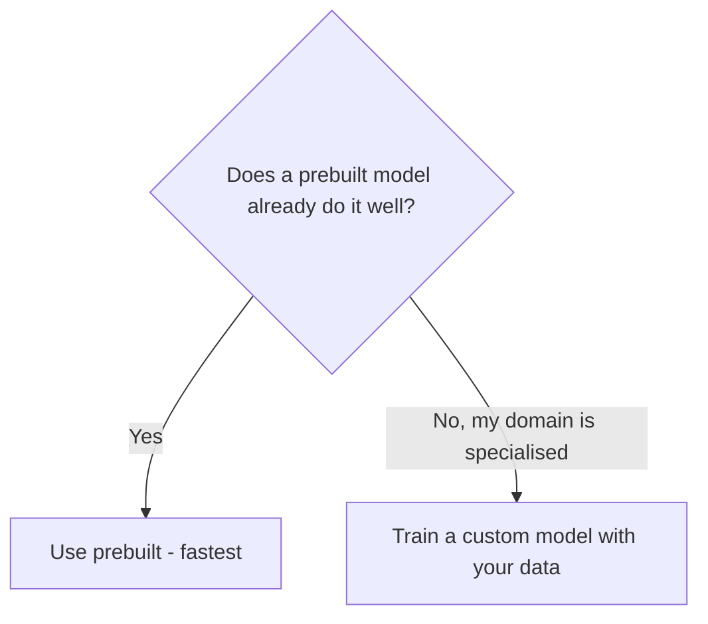

# Part L — Azure AI Services Overview

> Section goal: Understand the umbrella of prebuilt AI capabilities Azure offers, how you actually *call* them (keys and endpoints), and how to choose between using a ready-made service and building your own model.

Covers index items: the Azure AI Services family + how consumption works.

---

## 1. The big idea: AI you don't have to build

Most organisations don't want to train AI from scratch — it needs huge data, expertise, and time. Azure offers **prebuilt AI** you simply call.

- **Azure AI Services** — *a family of cloud services offering ready-made AI capabilities (vision, language, speech, decision, generative) via simple API calls.* **API = Application Programming Interface** = *a defined way for one program to ask another for something.* **Analogy:** ordering from a menu — you don't cook the dish (train a model), you just order it and it arrives. **Why it matters:** add powerful AI to an app in minutes without being a data scientist.
  - *(Formerly called "Azure Cognitive Services" — you'll see both names.)*

---

## 2. The main categories

| Category | What it does | Example services | Covered in |
|----------|--------------|------------------|------------|
| **Vision** | Understand images & video | Azure AI Vision, Custom Vision, Face, Document Intelligence | Part M |
| **Language** | Understand & generate text | Language service, Translator | Part N |
| **Speech** | Convert speech ↔ text | Speech service | Part N |
| **Decision** | Detect anomalies, content moderation | Anomaly Detector, Content Safety | this Part |
| **Generative** | Create new content | Azure OpenAI Service | Part O |
| **Search/Knowledge** | Find info in your data | Azure AI Search | Part N |

> 💡 You'll meet each in detail next. This Part is the map and the "how to call them."

---

## 3. How you consume an AI service: keys & endpoints

To use any Azure AI service, you create a resource and get two things:

### 🔍 Plain-English deep-dive
- **Endpoint** — *the web address (URL) where the service lives and listens for your requests.* **Analogy:** the restaurant's address you send your order to.
- **Key** — *a secret password proving you're allowed to use the service (and how billing is tracked).* **Analogy:** a membership card that unlocks the service. **Why it matters:** keys must be kept secret — store them in **Key Vault** (Part I), never in code.

---

## 4. Single-service vs multi-service resources

When provisioning, you choose how the service is packaged:

- **Single-service resource** — *one specific capability (e.g. just Speech), often with a free tier and separate billing.* **Analogy:** buying one specialist tool. **Why:** isolate and track one capability.
- **Multi-service resource** — *one resource + key giving access to many AI services together.* **Analogy:** a Swiss-army-knife subscription with one bill. **Why:** convenience and unified billing when using several.

| | Single-service | Multi-service |
|---|----------------|---------------|
| Access | One capability | Many capabilities |
| Keys | One per service | One shared key |
| Best for | Isolated use, free tier | Using several services together |

---

## 5. Build vs buy: prebuilt vs custom

- **Prebuilt (out-of-the-box)** — *Microsoft already trained it; you just call it.* **Analogy:** ready-made clothes off the rack. Fast, no data needed.
- **Custom** — *you bring your own examples to tailor a model to your specific needs* (e.g. Custom Vision recognising *your* products). **Analogy:** tailored clothes fitted to you. **Why:** when the generic model doesn't know your specialised domain.

> 💡 **Decision rule:** try prebuilt first; go custom only when your domain is too specific for the generic model.

---

## 6. A couple of "Decision" services worth knowing

- **Anomaly Detector** — *spots unusual data points in time-series (e.g. a sudden spike in errors or fraud).* **Analogy:** a smoke alarm for your data — it shrieks when something's abnormal.
- **Azure AI Content Safety** — *detects harmful content (hate, violence, self-harm, sexual) in text and images.* **Analogy:** a content moderator screening posts. **Why:** keep apps and generative AI outputs safe (ties to Responsible AI, Part K).

---

## ✅ Quick Self-Check

**Q1. What are Azure AI Services and why use them?**
> A family of prebuilt AI capabilities (vision, language, speech, decision, generative) callable via APIs — letting you add AI without building/training models yourself.

**Q2. What is an API?**
> A defined way for one program to request a capability or data from another — here, your app asking an Azure AI service for a result.

**Q3. What two things do you need to call an AI service, and how do you secure one?**
> An endpoint (the service's URL) and a key (secret access credential). Keep the key in Azure Key Vault, never hard-coded.

**Q4. Single-service vs multi-service resource?**
> Single-service exposes one capability (often with a free tier, separate billing); multi-service gives one key/resource for many AI services with unified billing.

**Q5. When choose a custom model over prebuilt?**
> When your domain is too specialised for the generic prebuilt model — you supply your own examples to tailor it (e.g. recognising your specific products).

**Q6. What does Anomaly Detector do?**
> Identifies abnormal points in time-series data — useful for fraud, equipment faults, or sudden metric spikes.

---

## 🧠 30-Second Memory Hooks
- **Azure AI Services** = a *menu* of ready-made AI (was "Cognitive Services") — order, don't cook.
- **Endpoint** = the address; **Key** = the membership card (store in Key Vault!).
- **Single-service** = one specialist tool; **Multi-service** = one Swiss-army key for many.
- **Prebuilt** = off-the-rack; **Custom** = tailored to your data.
- **Anomaly Detector** = smoke alarm for data; **Content Safety** = content moderator.

---

*Next suggested section:* **[Part M — Computer Vision](Part-M-computer-vision.md)** (start exploring the categories, beginning with how AI sees).
