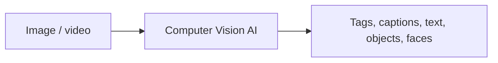
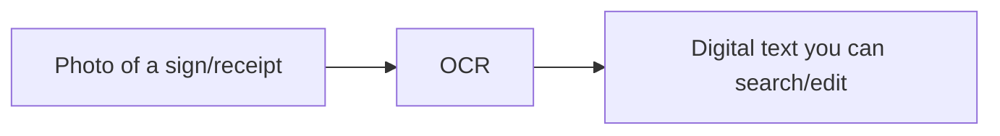
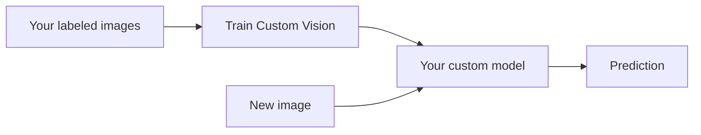

# Part M — Computer Vision

> Section goal: Learn how Azure lets software "see" — analysing images and video, reading text from pictures (OCR), extracting data from documents, detecting faces, and training custom image models.

Covers index items: the Vision category of Azure AI Services.

---

## 1. What is computer vision?

- **Computer Vision** — *AI that interprets and understands the content of images and video.* **Analogy:** giving a computer eyes *and* the brain to describe what it sees. **Why it matters:** automates tasks like tagging photos, reading documents, checking products on a line, and accessibility (describing scenes to blind users).

---

## 2. Azure AI Vision — general image analysis

- **Azure AI Vision** — *a prebuilt service that analyses images to return descriptions, tags, objects, and more.* What it can do:
  - **Image description / captioning** — a human-readable sentence about the image. **Analogy:** a friend describing a photo.
  - **Tagging** — list relevant keywords ("dog," "outdoor," "grass").
  - **Object detection** — find objects *and their location* (a box around each). **Analogy:** circling items in a photo.
  - **Categorisation** — assign the image to broad categories.

> 💡 **Detection vs classification:** *classification* says "this image contains a dog." *Object detection* says "there's a dog *here* and a ball *there*" (with locations).

---

## 3. OCR — reading text from images

- **OCR (Optical Character Recognition)** — *extracting printed or handwritten text from images into machine-readable text.* **Analogy:** a person reading a sign aloud so it can be typed up. **Why:** digitise receipts, signs, notes, forms.

---

## 4. Document Intelligence (Form Recognizer)

- **Azure AI Document Intelligence** — *extracts structured data — fields, key-value pairs, tables — from documents like invoices, receipts, and forms.* **Analogy:** a clerk who reads an invoice and types the totals, dates, and line items into a spreadsheet automatically. **Why it matters:** automates paperwork-heavy processes; goes beyond plain OCR by understanding *structure and meaning*.
  - *(Formerly "Form Recognizer.")*
  - Offers **prebuilt models** (invoices, receipts, IDs) and **custom models** trained on your own form layouts.

| | OCR | Document Intelligence |
|---|-----|----------------------|
| Output | Raw text | Structured fields (key-value, tables) |
| Understands layout? | No | Yes |
| Use | Read any text | Process forms/invoices automatically |

---

## 5. Face detection and analysis

- **Azure AI Face** — *detects human faces in images and can analyse attributes or verify/identify a person.* **Analogy:** how your phone finds and recognises faces in photos. Capabilities: detect location of faces, compare faces (verification), and find similar faces.
- **Important responsibility note:** facial recognition is sensitive; some features are **restricted/gated** and must follow Responsible AI rules (fairness, privacy — Part K). **Why:** prevents misuse and bias.

---

## 6. Custom Vision — train your own image model

- **Azure AI Custom Vision** — *you upload and label your own images to train a model that recognises *your* specific objects or categories.* **Analogy:** teaching a new employee to recognise *your* company's specific products by showing labeled examples. **Why:** when the general model doesn't know your niche (e.g. distinguishing your product variants, spotting a specific defect).
  - Two project types: **classification** (whole-image category) and **object detection** (locate items).

> 💡 **Prebuilt vs Custom Vision:** use **Azure AI Vision** for general scenes; use **Custom Vision** when you need it to learn *your* specialised images (ties to build-vs-buy, Part L).

---

## ✅ Quick Self-Check

**Q1. What is computer vision?**
> AI that interprets the content of images and video — describing scenes, tagging, detecting objects, reading text, and recognising faces.

**Q2. Image classification vs object detection?**
> Classification labels the whole image ("contains a dog"); object detection finds *each* object and its location (a bounding box around the dog and the ball).

**Q3. What is OCR?**
> Optical Character Recognition — extracting printed or handwritten text from images into editable, searchable digital text.

**Q4. How does Document Intelligence go beyond OCR?**
> It understands document structure, extracting fields, key-value pairs, and tables (e.g. invoice totals and dates) — not just raw text.

**Q5. When would you use Custom Vision instead of Azure AI Vision?**
> When you need to recognise your own specialised objects/categories that the general prebuilt model doesn't know — you train it on your labeled images.

**Q6. Why are some Face features restricted?**
> Facial recognition is privacy-sensitive and prone to misuse/bias, so Microsoft gates certain capabilities under Responsible AI requirements.

---

## 🧠 30-Second Memory Hooks
- **Computer Vision** = giving computers eyes + understanding.
- **Classification** = "what's in it"; **Object detection** = "what *and where*."
- **OCR** = read text from a picture; **Document Intelligence** = read *forms/invoices into structured fields* (was Form Recognizer).
- **Face** = find/recognise faces (gated for privacy).
- **Custom Vision** = train on *your* labeled images for niche recognition.

---

*Next suggested section:* **[Part N — Natural Language, Speech & Search](Part-N-language-speech.md)** (after sight, give your AI the power of language and hearing).
