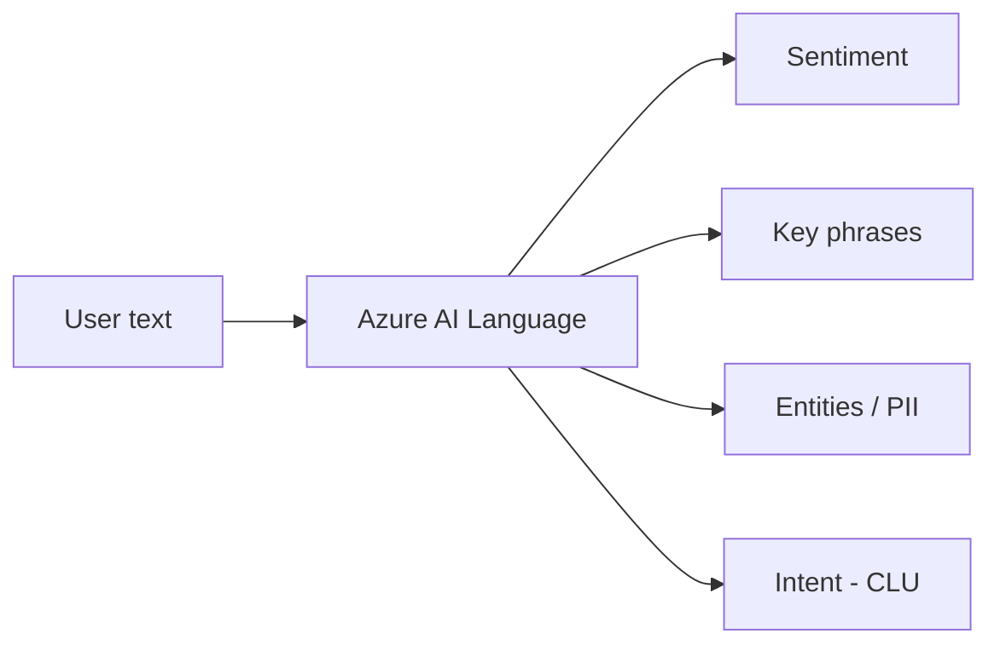
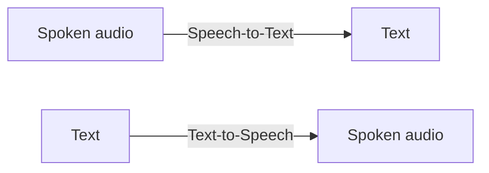
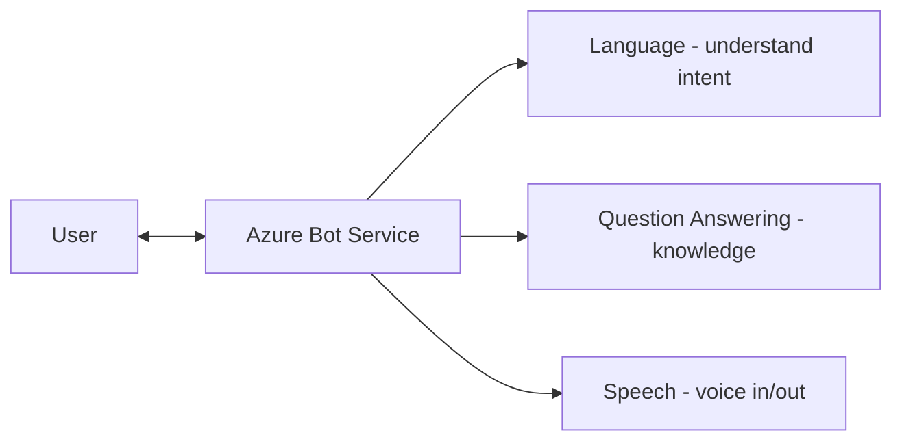

# Part N — Natural Language, Speech & Search

> Section goal: Learn how Azure AI understands and produces human language (text), converts between speech and text, powers chatbots, and lets you search your own content intelligently.

Covers index items: the Language, Speech, conversational AI, and knowledge-mining capabilities.

---

## 1. Natural Language Processing (NLP)

- **Natural Language Processing (NLP)** — *AI that understands, interprets, and works with human language (text and speech).* **Analogy:** giving a computer the ability to *read and comprehend* like a person, not just store characters. **Why it matters:** powers chatbots, sentiment analysis, translation, search, and voice assistants.

---

## 2. Azure AI Language service — understanding text

- **Azure AI Language** — *a prebuilt service offering several text-understanding features.* Key capabilities:
  - **Sentiment analysis** — *is the text positive, negative, or neutral?* **Analogy:** reading the mood of a message. Use: gauge customer reviews.
  - **Key phrase extraction** — *pull out the main points/topics.* **Analogy:** a highlighter marking the important bits.
  - **Entity recognition** — *identify and categorise things named in text (people, places, dates, organisations).* **Analogy:** underlining proper nouns and labeling them. (Also **PII detection** — find personal data like emails/phone numbers.)
  - **Language detection** — *identify which language the text is in.*
  - **Question answering** — *build a Q&A bot from your documents/FAQ.* **Analogy:** an FAQ assistant that answers in plain language.
  - **Conversational Language Understanding (CLU)** — *interpret a user's intent and extract details from their phrasing* (e.g. "book a flight to Paris tomorrow" → intent: BookFlight, destination: Paris, date: tomorrow). **Analogy:** a clerk who understands what you *mean*, not just the words.

---

## 3. Azure AI Translator

- **Azure AI Translator** — *real-time text translation across 100+ languages.* **Analogy:** a tireless multilingual interpreter. **Why:** localise apps, translate chats and documents instantly.

---

## 4. Azure AI Speech — speech ↔ text

The Speech service bridges spoken and written language.

- **Speech-to-Text (speech recognition)** — *convert spoken audio into written text.* **Analogy:** automatic dictation/transcription. Use: captions, voice commands, meeting transcripts.
- **Text-to-Speech (speech synthesis)** — *convert written text into natural spoken audio.* **Analogy:** a narrator reading text aloud. Use: voice assistants, accessibility, audiobooks.
- **Speech Translation** — *translate spoken words from one language to spoken/written another, in near real time.* **Analogy:** a live interpreter at a conference.

| Feature | Direction | Example |
|---------|-----------|---------|
| Speech-to-Text | Voice → text | Live captions, transcripts |
| Text-to-Speech | Text → voice | Voice assistant replies |
| Speech Translation | Voice → other language | Real-time interpreting |

---

## 5. Conversational AI: Azure Bot Service

- **Conversational AI** — *software that holds a back-and-forth dialogue with users (a chatbot or voice bot).* **Analogy:** a virtual receptionist available 24/7.
- **Azure Bot Service** — *a platform to build, host, and connect bots to channels (web, Teams, etc.).* It often combines **Language** (to understand intent) + **Speech** (for voice) + **Question Answering** (for knowledge). **Why:** automate customer support and FAQs at scale.

---

## 6. Azure AI Search — knowledge mining

- **Azure AI Search** — *a search service that indexes your own content and adds AI "enrichment" so users can find information intelligently.* **Knowledge mining** = *extracting insights and making large amounts of your content searchable.* **Analogy:** a super-librarian who has read all your documents, tagged them, and can instantly find the right passage. **Why it matters:** powers smart search over company data — and is the backbone of **RAG** for generative AI (Part O), where an AI app retrieves your facts before answering.

> 💡 **Connection forward:** Azure AI Search is how generative AI gets *grounded* in your real data instead of guessing — remember this for Part O.

---

## ✅ Quick Self-Check

**Q1. What is NLP?**
> Natural Language Processing — AI that understands and works with human language (text/speech), powering sentiment analysis, translation, chatbots, and more.

**Q2. Name three features of the Azure AI Language service.**
> Sentiment analysis, key phrase extraction, entity/PII recognition, language detection, question answering, conversational language understanding (intent).

**Q3. Speech-to-Text vs Text-to-Speech?**
> Speech-to-Text converts spoken audio into written text (transcription/captions). Text-to-Speech converts written text into natural spoken audio (voice replies).

**Q4. What is Azure Bot Service, and what might it combine?**
> A platform to build and host chatbots/voice bots, often combining Language (intent), Question Answering (knowledge), and Speech (voice) across channels like web and Teams.

**Q5. What is Azure AI Search / knowledge mining?**
> A service that indexes and AI-enriches your own content so users can search it intelligently — also used to ground generative AI in your real data.

**Q6. What does Conversational Language Understanding (CLU) extract?**
> The user's intent plus relevant details/entities from their phrasing (e.g. intent BookFlight, destination Paris, date tomorrow).

---

## 🧠 30-Second Memory Hooks
- **NLP** = computers that *read and comprehend* language.
- **Language service** = sentiment (mood) + key phrases (highlighter) + entities (underline names) + intent (CLU).
- **Translator** = tireless interpreter (100+ languages).
- **Speech:** to-Text = dictation; to-Speech = narrator; Speech Translation = live interpreter.
- **Bot Service** = 24/7 virtual receptionist (Language + Speech + Q&A).
- **AI Search** = super-librarian; the grounding engine for RAG (Part O).

---

*Next suggested section:* **[Part O — Generative AI & Azure OpenAI](Part-O-generative-ai.md)** (now the headline act — AI that *creates* content).
