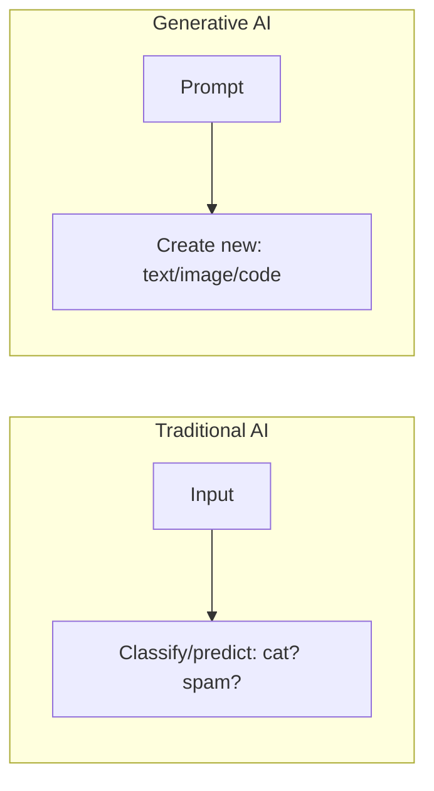
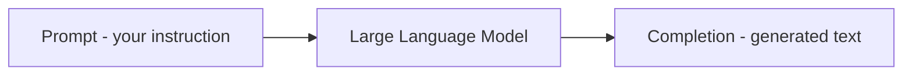
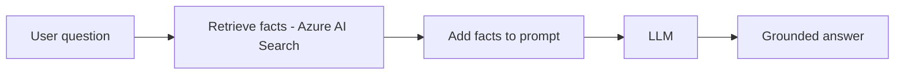

# Part O — Generative AI & Azure OpenAI

> Section goal: Understand what generative AI is, the key concepts behind large language models (tokens, prompts, grounding/RAG), how Azure OpenAI Service delivers it safely, and what Copilots are.

Covers index items: generative AI, LLMs, Azure OpenAI, prompts, RAG, responsible generative AI.

---

## 1. What is generative AI?

- **Generative AI** — *AI that *creates new content* — text, images, code, audio — rather than just classifying or predicting from existing data.* **Analogy:** earlier AI was a *judge* (sorts/labels things); generative AI is an *author/artist* (produces something new). **Why it matters:** it writes emails, summarises documents, answers questions conversationally, generates images and code — a massive productivity shift.

---

## 2. Large Language Models (LLMs)

- **Large Language Model (LLM)** — *a deep-learning model trained on enormous amounts of text that predicts the next word to generate human-like language.* **Analogy:** an extraordinarily well-read assistant who, having read much of the internet, can continue any sentence sensibly. **Why it matters:** LLMs (like GPT) power ChatGPT, Copilots, and most text-generative apps.

### 🔍 Plain-English deep-dive
- **Token** — *a chunk of text (roughly a word or word-piece) that the model processes; you're billed by tokens.* **Analogy:** Lego bricks of language — the model reads and builds in tokens. **Why:** prompt + response length is measured in tokens and affects cost and limits.
- **Prompt** — *the instruction or question you give the model.* **Analogy:** the brief you hand a freelancer. **Why:** the quality of your prompt strongly shapes the output.
- **Completion / response** — *the text the model generates back.*
- **Prompt engineering** — *crafting prompts (clear instructions, examples, context) to get better results.* **Analogy:** learning to ask a genie precisely so the wish comes out right.

---

## 3. Limitations to understand

- **Hallucination** — *the model confidently states something false.* **Analogy:** a smooth talker who makes up facts when unsure. **Why it matters:** outputs need checking; never assume correctness.
- **Knowledge cutoff** — *the model only "knows" up to its training date and doesn't inherently know your private/current data.* **Analogy:** a brilliant graduate who hasn't read today's news or your company files.
- **Bias** — outputs can reflect biases in training data (ties to Responsible AI, Part K).

> 💡 These limits are *why* grounding/RAG (next) exists.

---

## 4. Grounding and RAG — making AI use *your* facts

- **Grounding** — *giving the model relevant, trusted information to base its answer on.* **Analogy:** handing the assistant the exact reference documents before they write.
- **RAG (Retrieval-Augmented Generation)** — *a pattern where the app first *retrieves* relevant facts (often via Azure AI Search, Part N) and feeds them into the prompt so the model answers from real data.* **Analogy:** an open-book exam — fetch the right page, then answer. **Why it matters:** dramatically reduces hallucination and lets AI answer about *your* private/current data.

---

## 5. Azure OpenAI Service

- **Azure OpenAI Service** — *Azure's offering of powerful OpenAI models (GPT for text/chat, DALL·E for images, embeddings, etc.) with enterprise security, compliance, and Responsible AI controls.* **Analogy:** the same world-class engine as ChatGPT, but inside your secure corporate garage with locks, monitoring, and rules. **Why it matters:** enterprises get cutting-edge generative AI with Azure's privacy, network controls, and content safety.
  - Includes **content filters** and Responsible AI guardrails to reduce harmful output.
  - Your data isn't used to train the base models — important for privacy.

| | Public ChatGPT | Azure OpenAI Service |
|---|----------------|----------------------|
| Models | OpenAI models | Same OpenAI models |
| Hosting | OpenAI's consumer service | Your Azure tenant, enterprise controls |
| Security/compliance | Consumer-grade | Enterprise (network, RBAC, compliance) |
| Best for | Personal use | Business apps with governance |

---

## 6. Copilots

- **Copilot** — *an AI assistant embedded in a product that helps you work (e.g. Microsoft 365 Copilot, GitHub Copilot).* **Analogy:** a knowledgeable co-pilot beside you — you stay in control, it assists and suggests. **Why:** brings generative AI into everyday tools (writing docs, emails, code) — and is the model for how to use AI responsibly: *human in the loop.*

---

## 7. Responsible generative AI

Generative AI amplifies the Responsible AI need (Part K). Microsoft applies a process: **Identify** potential harms → **Measure** them → **Mitigate** (with content filters, system prompts, grounding) → **Operate** responsibly. **Azure AI Content Safety** (Part L) screens inputs and outputs for harmful content.

> 💡 **Always:** keep a human reviewing important AI output, ground it in trusted data, and filter for safety.

---

## ✅ Quick Self-Check

**Q1. How does generative AI differ from traditional AI?**
> Traditional AI classifies/predicts from existing data (a judge); generative AI creates new content — text, images, code (an author/artist).

**Q2. What is a token, and why does it matter?**
> A chunk of text (≈ a word/word-piece) the model processes; prompt and response lengths are counted in tokens, affecting cost and limits.

**Q3. What is a hallucination?**
> When the model confidently produces false information — a key reason outputs must be verified and grounded.

**Q4. Explain RAG and why it's used.**
> Retrieval-Augmented Generation: retrieve relevant facts (e.g. via Azure AI Search) and add them to the prompt so the model answers from real/your data — reducing hallucination and enabling current/private knowledge.

**Q5. What does Azure OpenAI Service add over public ChatGPT?**
> The same OpenAI models plus enterprise security, networking, RBAC, compliance, content filtering, and data privacy within your Azure tenant.

**Q6. What is a Copilot?**
> An AI assistant embedded in a product (M365, GitHub) that helps the user while keeping a human in control.

---

## 🧠 30-Second Memory Hooks
- **Generative AI** = author/artist (creates), vs traditional AI = judge (classifies).
- **LLM** = ultra-well-read assistant predicting the next word; **token** = Lego brick of text (billing unit).
- **Prompt** = the brief; **prompt engineering** = asking the genie precisely.
- **Hallucination** = confident made-up facts; fix with **grounding/RAG** = open-book exam (retrieve then answer).
- **Azure OpenAI** = ChatGPT's engine in your secure corporate garage.
- **Copilot** = AI co-pilot, human stays in control.

---

*Next suggested section:* **[Part P — Azure Machine Learning Service](Part-P-azure-ml.md)** (consumed prebuilt AI — now see how custom models are built end-to-end).
