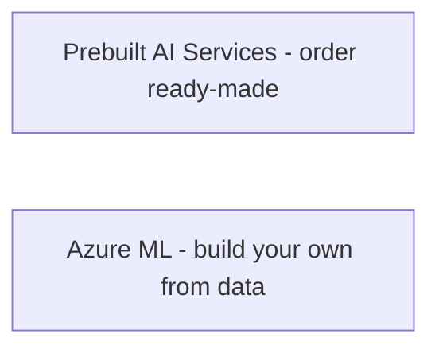
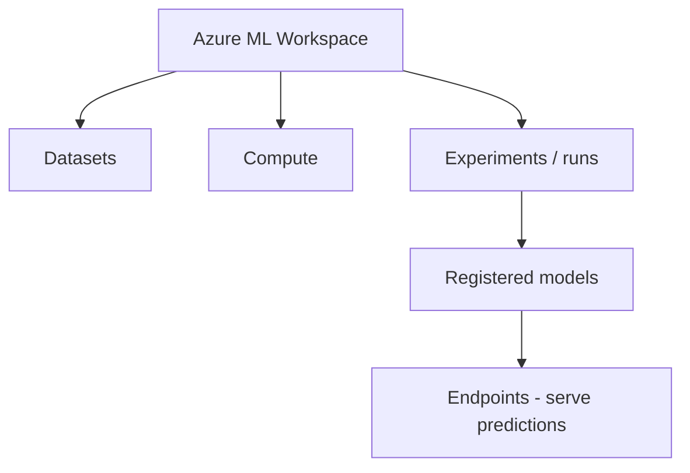
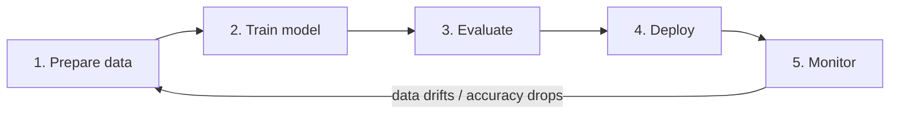
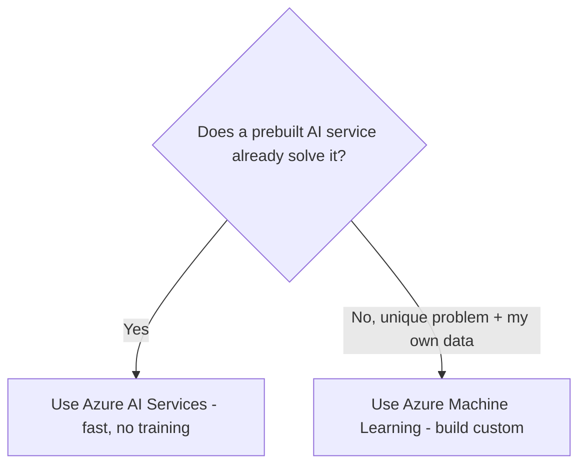

# Part P — Azure Machine Learning Service

> Section goal: Understand the end-to-end platform for *building your own* machine-learning models on Azure — workspaces, the low-code Designer, Automated ML, and the MLOps lifecycle — for when prebuilt AI services aren't enough.

Covers index items: Azure Machine Learning + the ML lifecycle (MLOps).

---

## 1. When prebuilt isn't enough

Parts L–O used **prebuilt** AI (order from the menu). Sometimes you need a **custom model** trained on your own data for your unique problem (predicting *your* sales, detecting *your* equipment's faults).

- **Azure Machine Learning (Azure ML)** — *a cloud platform giving data scientists and developers tools to build, train, deploy, and manage their own ML models at scale.* **Analogy:** a fully-equipped professional workshop for *making* AI models, versus buying a finished tool off the shelf. **Why it matters:** the home for custom ML, from experimentation to production.

---

## 2. The workspace and its building blocks

- **Workspace** — *the top-level container for all your ML work — data, experiments, models, and deployments.* **Analogy:** the workshop building that holds all your tools and projects.
- **Compute** — *the processing power (CPUs/GPUs) used to train and run models.* **Analogy:** the workbenches and machinery; you rent more power for bigger jobs.
- **Datasets / Data assets** — *registered, reusable data for training.*
- **Experiments & runs** — *each training attempt, tracked so you can compare results.* **Analogy:** lab notebooks recording every trial.
- **Models** — *the trained outputs, versioned and stored in a registry.*
- **Endpoints** — *where a deployed model is exposed for predictions.* **Analogy:** the service hatch where finished work is handed out.

---

## 3. Ways to build models in Azure ML

Azure ML suits different skill levels:

### 🔍 Plain-English deep-dive
- **Azure ML Designer** — *a drag-and-drop visual canvas to build ML pipelines with no/low code.* **Analogy:** building with labeled blocks instead of writing instructions. **Why:** great for beginners and fast prototyping.
- **Automated Machine Learning (AutoML)** — *automatically tries many algorithms and settings to find the best model for your data.* **Analogy:** a master chef who rapidly tests many recipes and hands you the winner. **Why:** get a strong model without deep ML expertise.
- **Notebooks (code-first)** — *write Python (with frameworks like scikit-learn, PyTorch, TensorFlow) for full control.* **Analogy:** cooking freestyle from scratch — maximum flexibility for experts.

| Approach | Skill level | Best for |
|----------|-------------|----------|
| Designer | Low/no code | Visual learners, prototypes |
| AutoML | Low code | Best model fast, less expertise |
| Notebooks | Code-first | Full control, advanced needs |

---

## 4. The ML lifecycle & MLOps

Building a model isn't one-and-done — it's a continuous cycle.

- **Training** — feed data to learn patterns (Part K).
- **Evaluation** — *measure how good the model is* using metrics (e.g. accuracy). **Analogy:** marking a mock exam before the real one.
- **Deployment** — *publish the model to an endpoint so apps can use it.*
- **Monitoring** — *watch performance in production; retrain when it degrades.*
- **Data drift** — *when real-world data changes over time, making the model less accurate.* **Analogy:** a map going out of date as new roads are built — you must update it.

- **MLOps (Machine Learning Operations)** — *applying DevOps-style automation, testing, and monitoring to the ML lifecycle for reliable, repeatable models in production.* **Analogy:** an assembly line with quality control for continuously producing and updating models, not hand-crafting each once. **Why:** keeps models accurate, versioned, and maintainable at scale.

---

## 5. Azure ML vs Azure AI Services — choosing

| | Azure AI Services | Azure Machine Learning |
|---|-------------------|------------------------|
| Who | Developers | Data scientists/ML engineers |
| Effort | Call an API | Build, train, deploy |
| Data needed | None (prebuilt) | Your own labeled data |
| Use when | Common AI tasks | Unique/custom predictions |

---

## ✅ Quick Self-Check

**Q1. What is Azure Machine Learning for?**
> An end-to-end platform to build, train, deploy, and manage your *own* custom ML models — used when prebuilt AI services don't fit your unique problem.

**Q2. What is an Azure ML workspace?**
> The top-level container holding all ML assets — data, compute, experiments, models, and endpoints — for a project.

**Q3. Designer vs AutoML vs Notebooks?**
> Designer = drag-and-drop visual pipelines (low/no code); AutoML = auto-tries many algorithms to find the best model; Notebooks = code-first Python for full control.

**Q4. What is data drift?**
> When real-world input data changes over time so the model's accuracy degrades — signaling a need to retrain.

**Q5. What is MLOps?**
> Applying DevOps practices (automation, testing, versioning, monitoring) to the ML lifecycle for reliable, repeatable, maintainable models in production.

**Q6. When use Azure AI Services vs Azure ML?**
> Use AI Services for common tasks solvable by prebuilt APIs (no training). Use Azure ML to build custom models on your own data for unique problems.

---

## 🧠 30-Second Memory Hooks
- **Azure ML** = a workshop to *build* AI; **AI Services** = buy AI off the shelf.
- **Workspace** = the workshop building (holds data, compute, models, endpoints).
- **Designer** = drag-drop blocks; **AutoML** = chef tries recipes, hands you the best; **Notebooks** = freestyle code.
- **Lifecycle:** prepare → train → evaluate → deploy → monitor → (retrain).
- **Data drift** = the map going out of date; **MLOps** = assembly line + QC for models.

---

*Next suggested section:* **[Part Q — Misc, Deeper Topics & Trends](Part-Q-misc-trends.md)** (the final Part — frameworks, trends, and how to prep for the AZ-900 & AI-900 exams).
