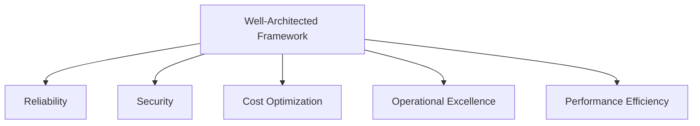
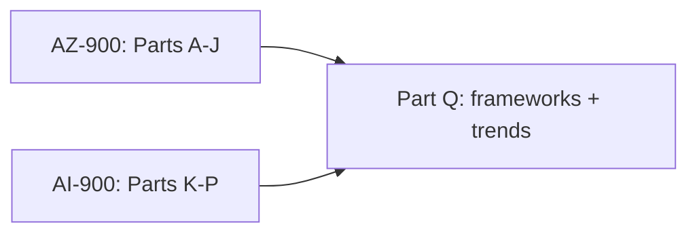

# Part Q — Miscellaneous, Deeper Topics & Trends

> Section goal: Tie everything together with the "extra edge" material — Microsoft's architecture and adoption frameworks, the competitive landscape, current trends, and a focused study plan for the AZ-900 and AI-900 certification exams.

Covers index items: frameworks, trends, certification readiness.

---

## 1. The two key Microsoft frameworks

### Cloud Adoption Framework (CAF)
- **Cloud Adoption Framework** — *Microsoft's end-to-end guidance for an organisation's whole cloud journey.* **Analogy:** a relocation guide for moving an entire company to a new city — plan, prepare, move, settle, maintain. Phases: **Strategy → Plan → Ready → Adopt (Migrate/Innovate) → Govern → Manage.** **Why:** the "big picture" roadmap for *adopting* cloud.

### Well-Architected Framework (WAF)
- **Well-Architected Framework** — *five pillars of best practice for designing good cloud workloads.* **Analogy:** a building code ensuring each structure is sound. The five pillars:
  1. **Reliability** — recovers from failures.
  2. **Security** — protects data and systems.
  3. **Cost Optimization** — avoids waste.
  4. **Operational Excellence** — runs and monitors smoothly.
  5. **Performance Efficiency** — uses resources effectively, scales well.

> 💡 **CAF vs WAF:** CAF = how to *adopt* cloud (the journey). WAF = how to *design each workload* well (the blueprint quality). Memory: **CAF = company journey, WAF = workload quality.**

---

## 2. Competitive landscape (context)

Azure is one of the "big three" public clouds. Knowing the map helps:

| Provider | Cloud | Strength/context |
|----------|-------|------------------|
| Microsoft | **Azure** | Deep enterprise & Microsoft 365 integration, hybrid, strong AI (OpenAI) |
| Amazon | AWS | Largest, earliest, broadest service catalog |
| Google | GCP | Strong in data/analytics and ML |

> 💡 You don't need rival details for AZ-900/AI-900, but knowing Azure's *enterprise + hybrid + OpenAI* edge is useful context.

---

## 3. Current trends worth knowing

- **Generative AI & Copilots everywhere** — AI assistants embedded across products (Part O). The defining trend.
- **RAG & "AI on your data"** — grounding AI in private/enterprise data via Azure AI Search (Parts N–O).
- **AI agents** — AI that can take multi-step actions, not just answer.
- **Responsible AI & regulation** — growing focus on fairness, transparency, safety, and laws like the EU AI Act (Part K).
- **Sustainability** — cloud providers targeting carbon-neutral/efficient datacenters; Azure offers a sustainability calculator.
- **Edge + hybrid AI** — running AI closer to devices (IoT, Azure Arc) for speed and privacy.

---

## 4. Concepts that link multiple Parts (quick consolidation)

| Theme | Where it appears |
|-------|------------------|
| Shared responsibility | A (intro), I (security) |
| Pay-per-use / OpEx | A, J (cost) |
| Identity as the perimeter | G, I |
| Prebuilt vs custom | L, M, P |
| Grounding/RAG ties Search + GenAI | N, O |
| Responsible AI | K, L, O |
| High availability via zones/regions | B, E, J (SLA) |

---

## 5. Certification study plan

You're covering the ground of **two** fundamentals certs:

### AZ-900 (Azure Fundamentals) — Parts A–J
Skill areas (approx weighting):
- **Cloud concepts** (~25%) → Part A.
- **Azure architecture & services** (~35%) → Parts B–F.
- **Management & governance** (~30%) → Parts H, I, J (plus identity G).

### AI-900 (Azure AI Fundamentals) — Parts K–P
Skill areas (approx weighting):
- **AI workloads & Responsible AI** (~20%) → Part K.
- **Machine learning fundamentals** (~20%) → Parts K, P.
- **Computer vision** (~15%) → Part M.
- **NLP** (~15%) → Part N.
- **Generative AI** (~20%) → Part O.

### Exam tips
- **Format:** ~40–60 multiple-choice/multi-response, ~45–60 min, **pass ≈ 700/1000**, no penalty for guessing (so answer everything).
- **Watch for "which service?" questions** — be able to map a *scenario* to the right service (use the comparison tables in each Part).
- **Common traps:** authentication vs authorization (G); Policy vs RBAC (J vs G); classification vs regression (K); Azure AI Services vs Azure ML (L vs P); VPN Gateway vs ExpressRoute (D); LRS vs GRS (E).
- **Practice:** use Microsoft Learn's free learning paths and official practice assessments; both exams are free to *study* and have no formal prerequisites.

---

## 6. A study routine that works
1. **Read** each Part once for understanding.
2. **Do the ✅ Quick Self-Checks** aloud, without peeking.
3. **Re-read the 🧠 Memory Hooks** the night before.
4. **Take practice tests**; review every wrong answer back to its Part.
5. **Map services from scenarios** — the core exam skill.

> 💡 **Honesty:** reading this guide builds solid understanding, but real readiness also needs practice questions and recalling concepts aloud. Treat the self-checks as mini mock exams.

---

## ✅ Quick Self-Check

**Q1. CAF vs WAF?**
> CAF (Cloud Adoption Framework) guides the organisation's overall journey to cloud (strategy→manage). WAF (Well-Architected Framework) guides designing individual workloads well via five pillars.

**Q2. Name the five Well-Architected pillars.**
> Reliability, Security, Cost Optimization, Operational Excellence, Performance Efficiency.

**Q3. Which exam covers cloud concepts and Azure services, and which covers AI?**
> AZ-900 (Azure Fundamentals) covers cloud/Azure (Parts A–J); AI-900 (Azure AI Fundamentals) covers AI (Parts K–P).

**Q4. Name three current AI trends.**
> Generative AI/Copilots everywhere; RAG / AI on your own data; AI agents; Responsible AI & regulation; sustainability; edge/hybrid AI.

**Q5. What's the passing score and a smart guessing strategy?**
> ~700/1000; there's no penalty for wrong answers, so always answer every question.

**Q6. Give two classic "easy to confuse" exam pairs.**
> Authentication vs authorization; Azure Policy vs RBAC; classification vs regression; VPN Gateway vs ExpressRoute; LRS vs GRS; AI Services vs Azure ML.

---

## 🧠 30-Second Memory Hooks
- **CAF = company journey** (adopt cloud); **WAF = workload quality** (5 pillars: Reliability, Security, Cost, Operations, Performance).
- **Azure's edge** = enterprise + hybrid + OpenAI.
- **Trends** = GenAI/Copilots, RAG on your data, agents, Responsible AI, sustainability, edge.
- **AZ-900 = A–J; AI-900 = K–P.** Pass ≈ 700/1000; answer *everything*.
- **Exam skill** = match the *scenario* to the right *service*.

---

🎉 **You've reached the end of the guide!** Return to the **[master index](../Azure%20Fundamentals%20and%20AI%20-%20Study%20Guide.md)** to revisit any Part. Best next move: run through every ✅ Quick Self-Check aloud, then take an official practice assessment on Microsoft Learn.
