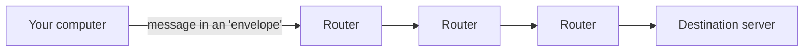
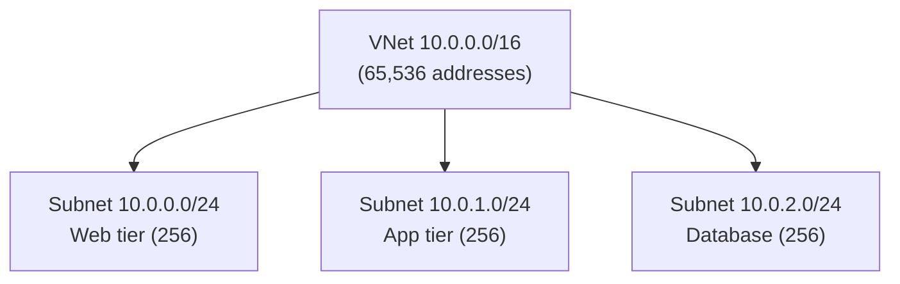
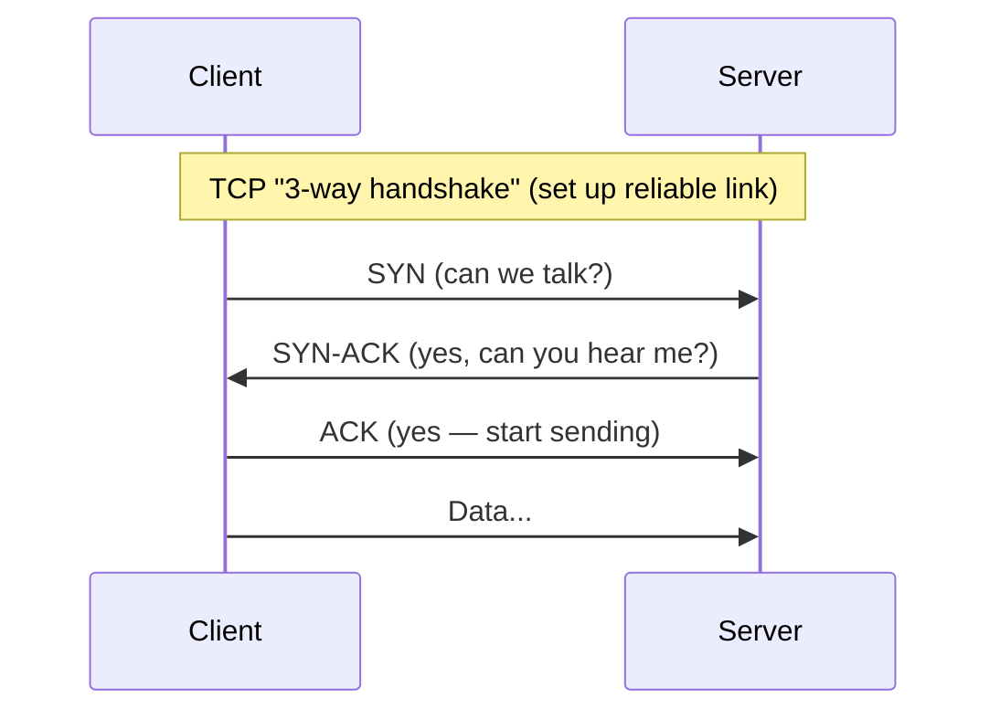
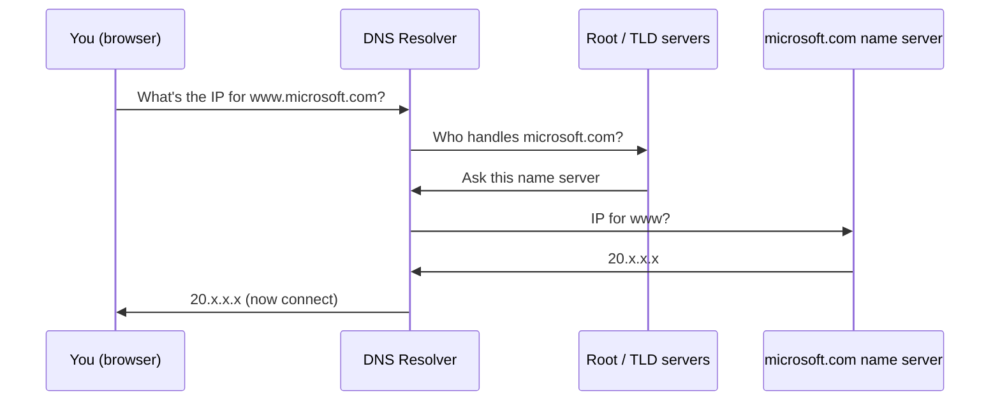
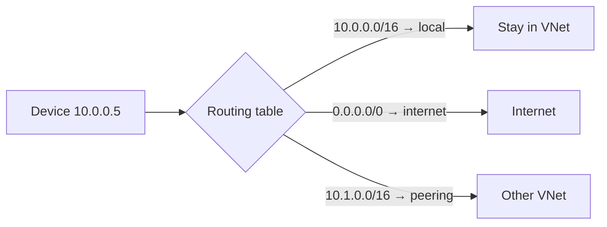

# Part A — Networking Fundamentals From Scratch

> Section goal: Give you the **entire vocabulary of networking** — IP addresses, subnets, DNS, ports, protocols, the OSI model and routing — so that every later Azure concept makes sense. If you only deeply learn one Part, make it this one.

Covers index items **Group 1 (Foundations)**. Everything in AZ-700 is "networking, but in Azure." This Part is the *networking* half.

---

## 0. The big picture: what is a network, really?

A **network** is just two or more computers that can send each other messages. The internet is millions of these networks joined together.

> **Analogy:** Think of the **postal system**. Every house has a unique address. To send a letter you write the destination address, drop it in a postbox, and a chain of sorting offices forwards it until it arrives. Computer networking is the same idea — only the "houses" are computers, the "addresses" are **IP addresses**, and the "sorting offices" are **routers**.

Keep that postal analogy in your head; we'll reuse it constantly.



---

## 1. IP addresses — the "postal address" of a computer

An **IP address** (Internet Protocol address) is a unique number that identifies a device on a network. The most common form (**IPv4**) looks like `192.168.1.10` — four numbers separated by dots.

### 🔍 Plain-English deep-dive: what those four numbers mean

- **Octet** — *each of the four numbers in an IPv4 address.* Each can be **0–255**. Why 0–255? Because each octet is **8 binary bits**, and 8 bits can count from 0 to 255. Four octets = **32 bits total**. **Analogy:** like a 4-part postcode where each part has a limited range. **Why it matters:** the exam expects you to plan addresses, and that means thinking in these ranges.
- **Binary** — *computers store everything as 0s and 1s.* `192` in binary is `11000000`. You rarely convert by hand, but understanding that an address is really **32 on/off switches** is the key to subnets (next section). **Analogy:** a row of 32 light switches. **Why it matters:** subnet maths is just "how many switches are fixed vs free."
- **IPv4 vs IPv6** — *IPv4 has ~4.3 billion addresses (we ran out); IPv6 is a newer, vastly bigger format* like `2001:db8::1`. **Why it matters:** AZ-700 covers dual-stack (IPv4+IPv6) VNets — noted in Part L.

```mermaid
flowchart LR
    subgraph One IPv4 address = 32 bits
    O1["192<br/>(8 bits)"] --- O2["168<br/>(8 bits)"] --- O3["1<br/>(8 bits)"] --- O4["10<br/>(8 bits)"]
    end
```

> 💡 **Beginner tie-in:** You've seen `192.168.x.x` on your home router. That's a **private** address (next section) handed out by your Wi-Fi.

---

## 2. Public vs Private IP addresses

Not every address is reachable from the internet. Some ranges are reserved for **private** internal use.

| Type | Reachable from internet? | Example ranges | Used for |
|------|--------------------------|----------------|----------|
| **Public IP** | ✅ Yes | Anything not in the private ranges | Websites, your home router's outside address |
| **Private IP** | ❌ No (internal only) | `10.0.0.0/8`, `172.16.0.0/12`, `192.168.0.0/16` | Devices inside a home/office/Azure VNet |

> **Analogy:** A **public IP** is your building's street address — anyone can post to it. A **private IP** is the **internal room number** (Room 204) — only meaningful *inside* the building. The receptionist (your router) translates between them.

That translation is called **NAT** (Network Address Translation) — many private devices share one public address to reach the internet. **Why it matters:** Azure uses these exact private ranges for **VNets** (Part C), and **NAT Gateway** for outbound internet (Part C).

> 🎯 **Exam gotcha:** Memorise the three private ranges (10/8, 172.16/12, 192.168/16). Azure lets you use any of them for a VNet, but they **must not overlap** with other VNets you want to connect.

---

## 3. CIDR & Subnets — the most important maths in AZ-700

This is the single concept beginners fear and the exam tests most. We'll go slow.

A **subnet** is a smaller network carved out of a bigger one. **CIDR notation** (e.g. `10.0.0.0/24`) tells you *how big* that network is.

### 🔍 Plain-English deep-dive: reading `/24`

- The number after the slash (the **prefix length**) = *how many of the 32 bits are FIXED as the network identity.* The remaining bits are **free for hosts (devices)**.
- `/24` = 24 bits fixed, **8 bits free** → 2⁸ = **256 addresses** (`10.0.0.0` to `10.0.0.255`).
- `/16` = 16 fixed, **16 free** → 2¹⁶ = **65,536 addresses**.
- **Smaller slash number = BIGGER network.** `/8` is huge, `/30` is tiny. **Analogy:** the slash number is how specific the postcode is. A short postcode covers a whole city; a long one covers one street.

| CIDR | Free (host) bits | Total addresses | Common use |
|------|------------------|-----------------|------------|
| `/8`  | 24 | 16,777,216 | Entire huge ranges |
| `/16` | 16 | 65,536 | A whole VNet address space |
| `/24` | 8  | 256 | A typical subnet |
| `/27` | 5  | 32  | A small subnet |
| `/28` | 4  | 16  | Smallest *practical* Azure subnet |



> 🎯 **Exam gotcha — Azure reserves 5 IPs per subnet.** In a `/24` (256 addresses) you get **251 usable**, not 256. Azure takes:
> - `.0` network address, `.255` broadcast (standard networking), **and** `.1` (gateway), `.2`, `.3` (Azure DNS/future use). Remember **"−5"** for any Azure subnet question.
> - **Smallest Azure subnet is /29** (8 addresses, 3 usable) — and **/28 or larger is recommended**. The exam loves "what's the smallest subnet" questions.

> 💡 **Beginner tie-in:** You'll do real CIDR planning in Part C's lab. For now, just remember: **bigger number = smaller network**, and **Azure subtracts 5**.

---

## 4. The OSI Model — the 7 layers (and why you only need a few)

The **OSI model** is a 7-layer map of how data travels. You don't memorise all 7 deeply, but AZ-700 distinguishes **Layer 4** vs **Layer 7** load balancing (Part G), so know those.

| Layer | Name | Plain meaning | Azure example |
|-------|------|---------------|---------------|
| 7 | Application | The app data itself (HTTP, DNS) | App Gateway, Front Door |
| 6 | Presentation | Formatting/encryption | TLS |
| 5 | Session | Keeping a conversation open | — |
| **4** | **Transport** | **Ports + TCP/UDP reliability** | **Azure Load Balancer** |
| 3 | Network | **IP addresses + routing** | Routers, UDRs, VNets |
| 2 | Data Link | Local hardware addresses (MAC) | — |
| 1 | Physical | Cables, radio | — |

> **Analogy:** Posting a parcel. **Layer 7** is *the letter's content*. **Layer 4** decides *which department (port)* and *whether you need delivery confirmation (TCP)*. **Layer 3** is *the street address (IP)* the sorting office routes by.

> 🎯 **Exam gotcha:** "Layer 4 = IP + port (fast, dumb)" vs "Layer 7 = understands the actual web request, can route by URL/host (smart)." This single distinction explains **why** you'd pick Load Balancer vs Application Gateway. Tattoo it on your brain.

---

## 5. Ports, TCP & UDP — the "department number"

A computer runs many services at once (web, email, database). A **port** number says *which service* a message is for.

- **Port** — *a numbered door on a computer (0–65535).* Web = **80** (HTTP) / **443** (HTTPS), DNS = **53**, RDP = **3389**, SSH = **22**. **Analogy:** the IP is the building; the **port is the department/room** inside it.
- **TCP** (Transmission Control Protocol) — *reliable delivery with confirmation.* It sets up a connection (the "handshake"), guarantees order, and resends lost data. **Analogy:** registered post with signature on delivery. Used by web, email, databases.
- **UDP** (User Datagram Protocol) — *fast, fire-and-forget, no guarantee.* **Analogy:** shouting across a room — quick, but no confirmation. Used by DNS lookups, video calls, gaming.



> 🎯 **Exam gotcha:** Network Security Groups (Part I) filter by **protocol (TCP/UDP), port, and IP**. You'll write rules like "Allow TCP 443 from Internet." Knowing port 443 = HTTPS and 3389 = RDP is assumed knowledge.

---

## 6. DNS — turning names into addresses

You type `www.microsoft.com`, not an IP. **DNS** (Domain Name System) is the internet's **phone book** that translates human names into IP addresses.



- **DNS record types you must know:** **A** (name → IPv4), **AAAA** (name → IPv6), **CNAME** (name → another name/alias), **MX** (mail). 
- **Why it matters:** Part D is entirely Azure DNS (public zones, **Private DNS zones**, the **Private Resolver**). DNS is also the #1 cause of "why can't my private endpoint be reached" exam scenarios.

> 💡 **Beginner tie-in:** Every time a website "loads slowly to start then speeds up," the first delay is often a DNS lookup. You've felt DNS without knowing its name.

---

## 7. Routing — how messages find their way

A **router** is a device that forwards messages between networks, choosing the next hop toward the destination. It reads a **routing table** — a list of "to reach network X, send via Y."

- **Default route (`0.0.0.0/0`)** — *"anything I don't have a specific rule for, send here"* (usually toward the internet). **Analogy:** "if you don't recognise the address, give it to the main post office." **Why it matters:** Azure **User-Defined Routes** (Part E) and **forced tunnelling** revolve around overriding this default route.
- **BGP** (Border Gateway Protocol) — *how big networks automatically tell each other which routes they know.* **Analogy:** sorting offices phoning each other to share updated delivery maps. **Why it matters:** ExpressRoute and VPN Gateways (Part F) use BGP to learn routes dynamically.



> 🎯 **Exam gotcha:** Azure has **system routes** (automatic) and you add **User-Defined Routes (UDRs)** to override them — e.g. to force traffic through a firewall. "Most specific prefix wins; UDR beats system route" is a core routing-domain rule (Part E).

---

## 🛠️ Hands-on Lab — Set up your free practice environment

You can't learn Azure networking without clicking through Azure. This lab costs **₹0 / $0** if you use the free tier and delete resources after.

1. **Create a free Azure account** → https://azure.microsoft.com/free (gives credit + always-free services). You'll need a card for verification but won't be charged on free tier.
2. **Install the tooling** (we'll use these throughout):
   ```powershell
   # Azure CLI - the command-line way to build everything (great for repeatable labs)
   winget install -e --id Microsoft.AzureCLI
   az login
   az account show   # confirm you're connected
   ```
3. **Practice CIDR maths** — without Azure, install a subnet calculator mindset:
   - Pick `10.10.0.0/16` as your future VNet. Carve three `/24` subnets from it: `10.10.0.0/24`, `10.10.1.0/24`, `10.10.2.0/24`. Write down **usable IPs each = 251** (256 − 5 Azure reserved).
4. **Verify DNS & ports on your own machine** (pure networking, no Azure needed):
   ```powershell
   nslookup www.microsoft.com      # see DNS resolve a name to an IP
   Test-NetConnection www.microsoft.com -Port 443   # see a TCP port 443 connection succeed
   ipconfig                        # find your own private IP (likely 192.168.x.x)
   ```

✅ **Lab goal:** You have Azure CLI logged in, and you've *seen* DNS resolution and a TCP port test with your own eyes. This is the foundation for the running hub-and-spoke project we build from Part C onward.

---

## ⭐ Likely Exam Questions for This Section

**Q1. "How many usable IP addresses are in an Azure /24 subnet?"**
> *Model answer:* 256 total minus **5 reserved by Azure** = **251 usable**. Azure reserves the network address, broadcast address, the default gateway, and two addresses for DNS/future use.

**Q2. "What is the smallest subnet you can create in an Azure VNet?"**
> *Model answer:* **/29** (8 addresses, 3 usable). Microsoft *recommends* /28 or larger so you don't run out after the 5 reserved IPs.

**Q3. "Explain the difference between a /16 and a /24."**
> *Model answer:* The slash number is how many of the 32 bits are fixed as network identity. /16 leaves 16 host bits = 65,536 addresses; /24 leaves 8 = 256. Smaller number = bigger network.

**Q4. "What's the difference between Layer 4 and Layer 7 in networking?"**
> *Model answer:* Layer 4 (Transport) works with IP + port and TCP/UDP — fast but unaware of the application content; Azure Load Balancer is L4. Layer 7 (Application) understands the actual request (HTTP host/URL) and can route on it; Application Gateway and Front Door are L7.

**Q5. "Which three IP ranges are private (RFC 1918)?"**
> *Model answer:* `10.0.0.0/8`, `172.16.0.0/12`, and `192.168.0.0/16`. Azure VNets use these and they must not overlap when you connect networks.

**Q6. "What does a default route (0.0.0.0/0) do?"**
> *Model answer:* It's the catch-all — any traffic without a more specific route match is sent to that next hop, typically the internet. In Azure you override it with a UDR to force traffic through, say, a firewall.

**Q7. "TCP vs UDP — when is each used?"**
> *Model answer:* TCP is connection-oriented and reliable (handshake, ordering, retransmission) — web, databases, email. UDP is connectionless and fast with no guarantee — DNS, voice/video, gaming.

**Q8. "Why must connected VNets have non-overlapping address spaces?"**
> *Model answer:* Routing is by IP prefix. If two networks share a range, routers can't tell which side a destination belongs to, so peering/VPN connections won't form or traffic is misdelivered.

---

## 🧠 30-Second Memory Hooks
- **IP = building address, Port = room number, Protocol = how you knock.**
- **Slash number ↑ = network ↓** (bigger slash = smaller net). `/24` = 256.
- **Azure subtracts 5** from every subnet. /24 → 251 usable. Smallest = **/29**.
- **Private ranges:** "**10, 172.16, 192.168**" — say it like a phone number.
- **L4 = IP+port (dumb & fast). L7 = reads the web request (smart).**
- **DNS = the internet's phone book.** A record = name→IPv4.
- **0.0.0.0/0 = "everything else → this way."** UDR overrides it.

---

*Next suggested section:* **Part B — Azure & Cloud Basics for Networking** (now that you know networking, learn the Azure "container" model — subscriptions, regions, zones, resource groups — that everything plugs into).
