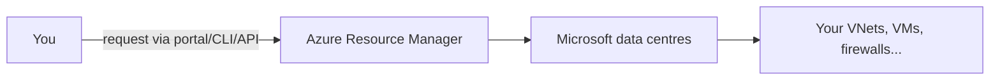
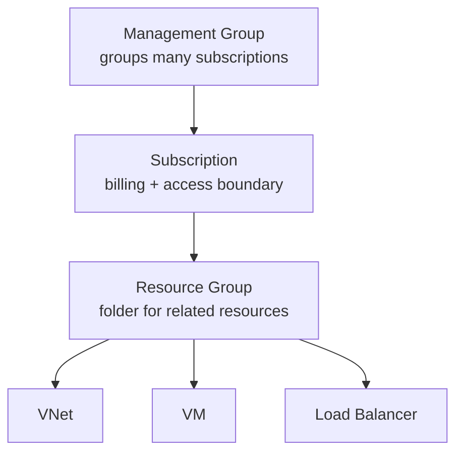
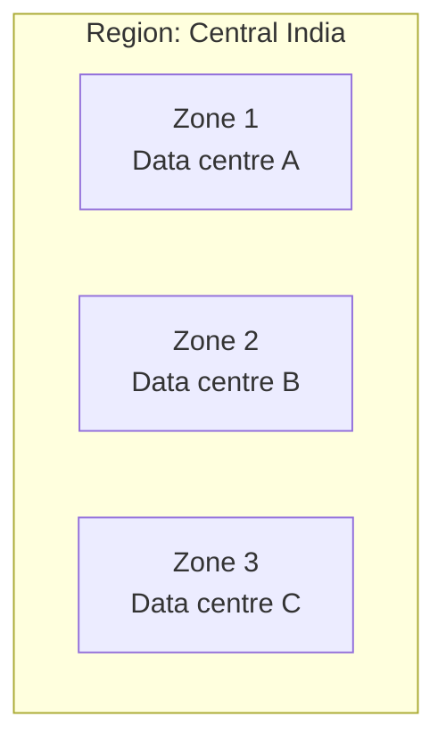
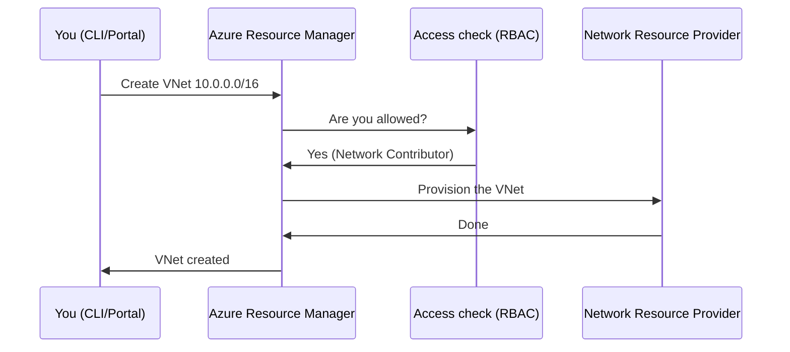

# Part B — Azure & Cloud Basics for Networking

> Section goal: Learn the Azure "container model" — subscriptions, regions, availability zones, resource groups and Azure Resource Manager — and understand how Azure's **software-defined network** actually works. This is the stage on which every networking resource is placed.

Covers index items **Group 1 (Foundations)**. Part A taught networking; this Part teaches **Azure**, so the two combine into "networking in Azure."

---

## 0. What is "the cloud," really?

The **cloud** just means *renting someone else's computers over the internet, on demand, paying for what you use.* Microsoft owns giant warehouses full of servers (**data centres**); Azure is the software that lets you rent slices of them in seconds.

> **Analogy:** Instead of **buying and maintaining your own car** (a physical server you must house, power, cool and repair), you use a **taxi/rental** — you summon exactly what you need, for as long as you need it, and hand it back. Networking in the cloud is "renting the roads, junctions and traffic police" too, all defined in software.



---

## 1. The Azure hierarchy — how everything is organised

Azure organises resources in a strict **hierarchy**. The exam expects you to know which level scopes what.



### 🔍 Plain-English deep-dive: each level

- **Tenant (Microsoft Entra ID)** — *your organisation's identity directory* (formerly Azure AD). It holds users/groups and is the root of "who can do what." **Analogy:** the company's HR/staff directory. **Why it matters:** access to networking resources is granted to identities here.
- **Management Group** — *an optional grouping of many subscriptions* so you can apply policy/access once across all. **Analogy:** a regional head office over many branch offices. **Why it matters:** enterprise designs (Part K) apply network policy at this level.
- **Subscription** — *a billing and security boundary; resources live inside one.* **Analogy:** a company credit-card account with a spending limit. **Why it matters:** VNets can't span subscriptions by default; peering connects across them (Part E).
- **Resource Group (RG)** — *a folder that holds related resources sharing a lifecycle.* Delete the RG, you delete everything in it. **Analogy:** a project folder on your desktop. **Why it matters:** you place a VNet *into* an RG and a region.
- **Resource** — *the actual thing* (a VNet, a VM, a public IP).

> 🎯 **Exam gotcha:** A **resource group is just a logical folder — it is NOT a network boundary.** Two VMs in the same RG but different VNets still can't talk without peering. Beginners wrongly assume "same RG = connected." It does not.

---

## 2. Regions & Availability Zones — *where* your network lives

### Regions
A **region** is a *geographic location* (e.g. *Central India*, *West Europe*) containing one or more data centres. You choose a region when creating most resources.

- **Why it matters:** A **VNet lives in exactly one region.** To connect VNets in different regions you use **global peering** (Part E). Latency and data-residency/compliance often dictate region choice.

### Availability Zones (AZs)
An **availability zone** is *a physically separate data centre within a region* (its own power, cooling, network). A region typically has **3 zones**.

> **Analogy:** A region is a **city**; availability zones are **three separate buildings** across that city. If one building loses power, the other two keep running. You spread your app across buildings so a single failure doesn't take you down.



| Concept | What it protects against | Networking example |
|---------|--------------------------|--------------------|
| **Availability Zone** | One data centre failing | Zone-redundant Load Balancer, zone-redundant VPN Gateway |
| **Region pair** | A whole region disaster | Cross-region failover with Front Door / Traffic Manager (Part G) |

> 🎯 **Exam gotcha:** Many networking resources have **"zone-redundant"** SKUs (Standard Load Balancer, Standard Public IP, VPN/ExpressRoute gateways). The exam tests *"how do I make this highly available?"* → answer is usually **zone-redundant** or **multi-region**.

---

## 3. Azure Resource Manager (ARM) — the control plane

Everything you create in Azure goes through **Azure Resource Manager (ARM)** — the single **management API and deployment engine**. Portal, CLI, PowerShell, Terraform — all of them ultimately call ARM.

> **Analogy:** ARM is the **central reception desk / control tower** of Azure. No matter which door you walk in (portal, command line, code), every request is processed, authorised and recorded by the same desk.

- **Control plane vs data plane** — *control plane = managing the resource* (create/configure a VNet); *data plane = the resource doing its job* (packets flowing through the VNet). **Why it matters:** RBAC (below) governs the control plane; NSGs/firewalls govern the data plane.
- **ARM/Bicep templates** — *declarative files describing the resources you want* ("infrastructure as code"). Deploy the file and ARM builds it identically every time. **Analogy:** a recipe — same ingredients, same result. **Why it matters:** repeatable network deployments; the exam mentions IaC as best practice.



---

## 4. Identity & access — RBAC (just enough for networking)

**RBAC** (Role-Based Access Control) decides *who* can do *what* on *which* resource.

- **Role** — *a bundle of permissions* (e.g. **Network Contributor** can manage VNets/NSGs but not other resources). **Analogy:** a job title that comes with specific keys. 
- **Scope** — *where the role applies* (subscription, RG, or single resource). **Why it matters:** least-privilege network admin = give **Network Contributor** scoped to one RG, not the whole subscription.

> 🎯 **Exam gotcha:** Know the built-in **Network Contributor** role exists for delegating network management without giving full owner rights — a common "secure least-privilege design" answer.

---

## 5. Azure networking is *software-defined* — why that changes everything

In a traditional office, networking = physical cables, switches and router boxes. In Azure there are **no cables for you** — the network is **defined entirely in software** and overlaid on Microsoft's physical fabric.

- You create a **Virtual Network (VNet)** with a few clicks — Azure programmes the underlying hardware to behave as if you had your own private switch/router.
- There's **no physical broadcast** — Azure uses an SDN overlay, which is *why some traditional protocols don't behave the same* (e.g. no IP broadcast/multicast by default).

> **Analogy:** It's like a **video-game map editor**. You're not laying real roads with concrete; you describe roads, junctions and barriers in software, and the engine makes them real instantly. Tear them down just as fast.

| Traditional networking | Azure (software-defined) |
|------------------------|--------------------------|
| Buy router/switch hardware | Click to create VNet/subnet |
| Re-cable to change topology | Edit config; takes seconds |
| Physical firewalls | NSGs + Azure Firewall (software) |
| Days to provision | Seconds, repeatable via code |

> 🎯 **Exam gotcha:** Azure VNets **do not support broadcast or multicast**, and you don't manage MAC/physical layers. Questions sometimes test whether you know "this is virtual; some legacy network features aren't available."

---

## 🛠️ Hands-on Lab — Create your account scaffolding

Build the "containers" you'll drop networking into for the rest of the guide.

```powershell
# 1. Confirm your subscription
az account show --output table

# 2. Pick a region close to you (list them)
az account list-locations --query "[].{Name:name, Display:displayName}" -o table

# 3. Create the resource group for the running project (use your nearest region)
az group create --name rg-az700-lab --location centralindia

# 4. Verify it exists
az group show --name rg-az700-lab -o table
```

✅ **Lab goal:** You have a resource group `rg-az700-lab` in a chosen region. This RG will hold the **hub-and-spoke network** we start building in Part C. Note your region — your VNets will live there.

> 💡 **Cost safety:** A resource group itself costs nothing. You only pay for billable resources inside it. We'll delete everything at the end with `az group delete --name rg-az700-lab --yes`.

---

## ⭐ Likely Exam Questions for This Section

**Q1. "What is the relationship between subscriptions, resource groups and resources?"**
> *Model answer:* A subscription is a billing/security boundary; it contains resource groups, which are logical folders that contain resources sharing a lifecycle. Management groups can group multiple subscriptions above that.

**Q2. "Does a virtual network span multiple regions?"**
> *Model answer:* No. A VNet exists in exactly one region. To connect VNets across regions you use **global VNet peering** or a Virtual WAN.

**Q3. "How do availability zones improve network resilience?"**
> *Model answer:* Zones are physically separate data centres within a region with independent power/cooling/network. Deploying zone-redundant resources (e.g. Standard Load Balancer, zone-redundant gateways) keeps services running if one zone fails.

**Q4. "If two VMs are in the same resource group, can they communicate?"**
> *Model answer:* Not automatically — a resource group is a logical folder, not a network boundary. Connectivity depends on their VNets/subnets and whether those are peered, plus NSG rules.

**Q5. "What is Azure Resource Manager?"**
> *Model answer:* The unified control-plane API and deployment engine for Azure. All tools (portal, CLI, PowerShell, Bicep/Terraform) call ARM, which authorises (RBAC) and provisions resources consistently.

**Q6. "Which built-in role lets someone manage networking without full subscription ownership?"**
> *Model answer:* **Network Contributor**, scoped to the relevant resource group or subscription, following least-privilege.

**Q7. "Why is Azure networking called 'software-defined'?"**
> *Model answer:* The network (VNets, routing, firewalls) is defined entirely in software overlaid on Microsoft's physical fabric, so you create and change topology in seconds with no physical cabling, and some legacy features like broadcast/multicast aren't supported.

---

## 🧠 30-Second Memory Hooks
- **Hierarchy:** Tenant → Management Group → **Subscription → Resource Group → Resource**.
- **Region = city; Availability Zone = separate building** in that city.
- **RG = folder, NOT a network boundary.** Same RG ≠ connected.
- **VNet = one region only.** Cross-region needs global peering.
- **ARM = the reception desk** every request goes through.
- **High availability answer = "zone-redundant" or "multi-region."**
- **Azure network = software-defined → no broadcast/multicast.**

---

*Next suggested section:* **Part C — Virtual Networks, Subnets & IP Addressing** (now you have the containers — let's build the actual VNet, subnets and IPs, applying the CIDR maths from Part A).
