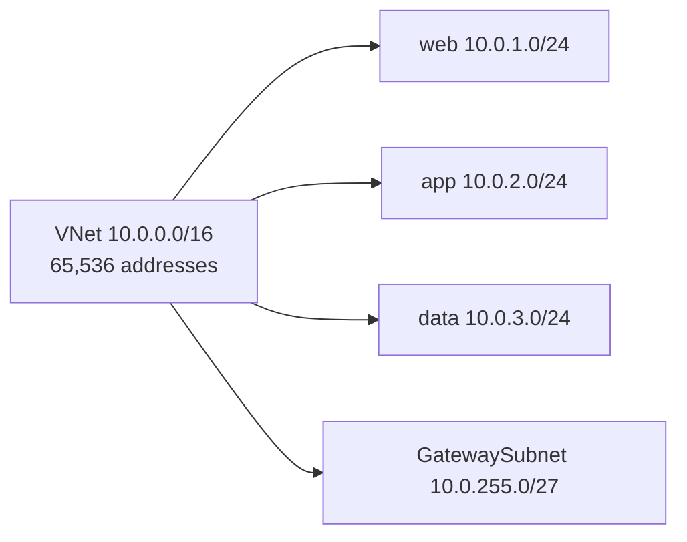
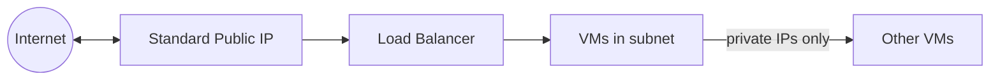
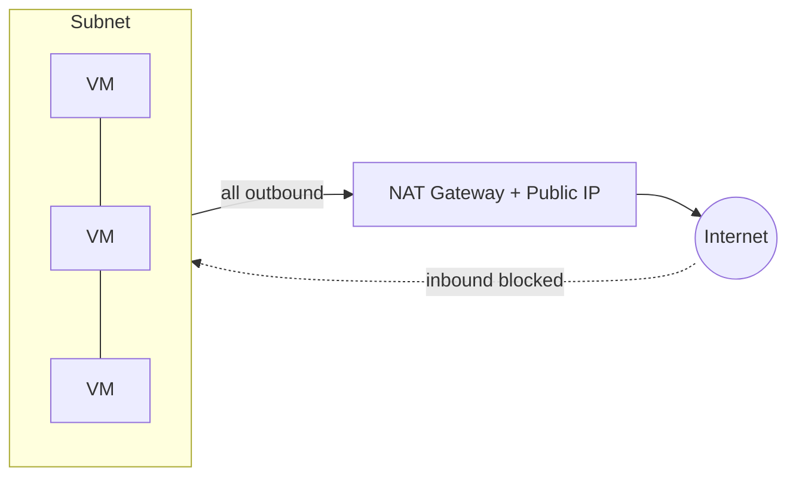
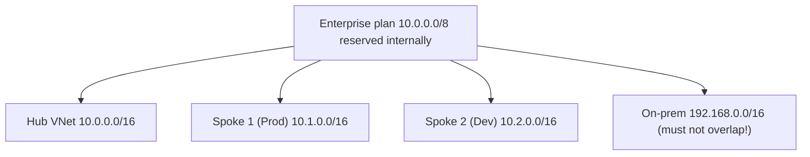

# Part C — Virtual Networks, Subnets & IP Addressing

> Section goal: Build the foundation object of all Azure networking — the **Virtual Network (VNet)** — and master subnets, address spaces, public/private IPs and **NAT Gateway**. This is **~20–25% of AZ-700** and underpins every other Part.

Covers index items **Group 2 (Core Infrastructure)**. Applies the CIDR maths from [Part A](Part-A-networking-fundamentals.md) inside the Azure containers from [Part B](Part-B-azure-cloud-basics.md).

---

## 1. What is a Virtual Network (VNet)?

A **Virtual Network (VNet)** is *your own private, isolated network inside Azure*, defined entirely in software. It's the cloud equivalent of the private network in an office building.

> **Analogy:** A VNet is a **private office building** you rent in Azure. By default, what's inside can talk to other things inside, but the outside world can't wander in. You decide the floors (**subnets**), the room-numbering scheme (**address space**), and the doors/security (NSGs, firewalls).

```mermaid
flowchart TD
    subgraph VNet "VNet 10.0.0.0/16 (Central India)"
    S1[Subnet: web<br/>10.0.1.0/24]
    S2[Subnet: app<br/>10.0.2.0/24]
    S3[Subnet: data<br/>10.0.3.0/24]
    end
```

### 🔍 Plain-English deep-dive: the key VNet properties

- **Address space** — *the overall range of private IPs the VNet owns,* e.g. `10.0.0.0/16`. You can have **multiple** address spaces on one VNet. **Analogy:** the full block of room numbers the building reserves. **Why it matters:** must **not overlap** with other VNets you'll connect (peering/VPN).
- **Region** — *a VNet lives in exactly one region* (from Part B). 
- **Subscription** — *a VNet lives in one subscription* (but can peer across subscriptions).
- **Isolation** — *by default a VNet is fully isolated;* nothing reaches it from the internet unless you explicitly allow it.

> 🎯 **Exam gotcha:** A VNet's address space **must use private RFC 1918 ranges** (10/8, 172.16/12, 192.168/16) for normal use. Plan it **larger than you think** — you can add ranges later, but resizing is easier if you start generous and non-overlapping with on-prem.

---

## 2. Subnets — dividing the VNet

A **subnet** is a *sub-range of the VNet's address space* where you actually place resources (VMs, gateways, private endpoints). Resources in a VNet always sit in a subnet.

> **Analogy:** If the VNet is the building, **subnets are the floors** — you put the web team on floor 1, the app team on floor 2, the database team on floor 3. Each floor has its own room range and its own security guard (NSG).



### The 5 reserved IPs (recap + apply)
From Part A: Azure reserves **5 IPs per subnet**. In `10.0.1.0/24`:

| IP | Reserved use |
|----|--------------|
| `10.0.1.0` | Network address |
| `10.0.1.1` | Default gateway |
| `10.0.1.2`, `10.0.1.3` | Azure DNS mapping |
| `10.0.1.255` | Broadcast |

→ **251 usable** out of 256.

### Special-purpose subnets (the exam loves these names)
Some Azure services require a subnet with an **exact name** and minimum size:

| Subnet name | Used by | Minimum size |
|-------------|---------|--------------|
| **GatewaySubnet** | VPN / ExpressRoute gateways (Part F) | /27 recommended |
| **AzureFirewallSubnet** | Azure Firewall (Part I) | /26 required |
| **AzureBastionSubnet** | Azure Bastion (secure VM access) | /26 |
| **RouteServerSubnet** | Azure Route Server | /27 |

> 🎯 **Exam gotcha:** These names are **case-sensitive and mandatory** — a VPN gateway will only deploy into a subnet literally called **GatewaySubnet**. AzureFirewallSubnet must be **at least /26**. Memorise these.

---

## 3. IP addressing — private and public

### Private IPs
Every resource (e.g. a VM's NIC) gets a **private IP** from its subnet, used for VNet-internal communication. Allocation can be:
- **Dynamic** — Azure assigns the next free IP (can change on stop/deallocate).
- **Static** — you fix it (e.g. for a DNS server or appliance that must keep its address).

### Public IPs
A **public IP** is needed when a resource must be reachable from / reach the **internet** directly.

| Property | Detail |
|----------|--------|
| **SKU** | **Basic** (legacy, being retired) vs **Standard** (recommended: secure-by-default, zone-redundant) |
| **Assignment** | Standard = **static** only; Basic = static or dynamic |
| **Association** | Attach to a VM NIC, Load Balancer, NAT Gateway, VPN Gateway, etc. |

> 🎯 **Exam gotcha:** **Standard SKU public IPs are "secure by default"** — *all inbound is blocked* until an NSG explicitly allows it. Basic SKU is *open by default*. Microsoft is retiring Basic; the exam-correct answer is almost always **Standard**. Also: Standard public IP is **static** and **zone-redundant**.



---

## 4. NAT Gateway — clean, scalable outbound internet

By default, VMs may reach the internet via Azure's **default outbound** — but that's being deprecated and is unpredictable. The modern, exam-correct way to give a subnet **outbound** internet access is **NAT Gateway**.

- **NAT Gateway** — *a managed service that gives a subnet a stable, scalable set of outbound public IPs.* Inbound is NOT opened — it's **outbound only**. **Analogy:** the building's **single mailroom** that stamps all outgoing post with one return address; it doesn't let strangers walk in.
- **Why it matters:** Solves **SNAT port exhaustion** (running out of outbound connections) far better than Load Balancer outbound rules. Associated at the **subnet** level.



> 🎯 **Exam gotcha:** When a scenario says *"VMs need reliable outbound internet, lots of connections, no inbound exposure"* → answer is **NAT Gateway**. It's **outbound-only**, attaches to a subnet, and beats default outbound and LB SNAT for scale.

---

## 5. IP address planning — the skill the exam tests hardest

Good design avoids overlaps and leaves room to grow. A typical enterprise plan:



**Planning rules:**
1. Pick a big private block; give each VNet a non-overlapping slice.
2. **Never overlap** with on-premises ranges you'll VPN/ExpressRoute to (Part F).
3. Leave gaps for future subnets (gateway, firewall, bastion).
4. Size subnets for growth — remember the **−5 reserved**.

> 💡 **Beginner tie-in:** This is exactly the `10.10.0.0/16 → three /24s` exercise from Part A's lab, now done for real.

---

## 🛠️ Hands-on Lab — Build the hub VNet (start of the running project)

We begin the **hub-and-spoke** network. This Part: create the **hub VNet** with subnets and a NAT Gateway.

```powershell
# 1. Create the hub VNet with an initial subnet
az network vnet create `
  --resource-group rg-az700-lab `
  --name vnet-hub `
  --address-prefix 10.0.0.0/16 `
  --subnet-name snet-shared `
  --subnet-prefix 10.0.1.0/24

# 2. Add the special subnets we'll need later (exact names matter!)
az network vnet subnet create -g rg-az700-lab --vnet-name vnet-hub `
  --name GatewaySubnet --address-prefix 10.0.255.0/27
az network vnet subnet create -g rg-az700-lab --vnet-name vnet-hub `
  --name AzureFirewallSubnet --address-prefix 10.0.254.0/26

# 3. Create a Standard public IP + NAT Gateway for clean outbound
az network public-ip create -g rg-az700-lab --name pip-nat --sku Standard --allocation-method Static
az network nat gateway create -g rg-az700-lab --name natgw-hub --public-ip-addresses pip-nat --idle-timeout 10

# 4. Attach NAT Gateway to the shared subnet
az network vnet subnet update -g rg-az700-lab --vnet-name vnet-hub `
  --name snet-shared --nat-gateway natgw-hub

# 5. Inspect what you built
az network vnet show -g rg-az700-lab -n vnet-hub -o table
az network vnet subnet list -g rg-az700-lab --vnet-name vnet-hub -o table
```

✅ **Lab goal:** A hub VNet `10.0.0.0/16` with `snet-shared`, `GatewaySubnet`, `AzureFirewallSubnet`, and a NAT Gateway providing outbound. Notice you created the *named* subnets that VPN (Part F) and Firewall (Part I) will plug into. **Don't delete this** — we extend it each Part.

---

## ⭐ Likely Exam Questions for This Section

**Q1. "What address ranges can a VNet use?"**
> *Model answer:* Private RFC 1918 ranges — 10.0.0.0/8, 172.16.0.0/12, 192.168.0.0/16 — and they must not overlap with connected VNets or on-prem networks.

**Q2. "A VPN gateway won't deploy. The subnet is named 'gateway-subnet'. Why?"**
> *Model answer:* The subnet must be named exactly **GatewaySubnet** (case-sensitive). Rename/recreate it correctly; /27 is recommended.

**Q3. "VMs need reliable outbound internet for thousands of connections but no inbound exposure. What do you use?"**
> *Model answer:* **NAT Gateway** attached to the subnet. It provides scalable outbound SNAT with stable public IPs and avoids SNAT port exhaustion, while keeping inbound closed.

**Q4. "Why choose Standard over Basic public IP SKU?"**
> *Model answer:* Standard is secure-by-default (inbound blocked until an NSG allows it), static, zone-redundant, and supported going forward; Basic is open-by-default and being retired.

**Q5. "How many usable IPs in a /27 subnet in Azure?"**
> *Model answer:* /27 = 32 addresses − 5 reserved = **27 usable**.

**Q6. "Can you change a VNet's address space after creation?"**
> *Model answer:* Yes — you can add or modify address ranges, but you can't remove a range that subnets still use, and changes shouldn't create overlaps with peered networks.

**Q7. "What's the minimum size for AzureFirewallSubnet?"**
> *Model answer:* **/26**. (GatewaySubnet /27 recommended; AzureBastionSubnet /26.)

**Q8. "How does Azure isolate one customer's VNet from another's?"**
> *Model answer:* VNets are software-defined and isolated by default on Microsoft's SDN fabric; traffic stays within the VNet unless you explicitly enable peering, a gateway, or public exposure.

---

## 🧠 30-Second Memory Hooks
- **VNet = private building; subnet = a floor.** One VNet = one region.
- **Address space must be private + non-overlapping.** Plan big.
- **Magic subnet names:** **GatewaySubnet** (/27), **AzureFirewallSubnet** (/26), **AzureBastionSubnet** (/26) — case-sensitive.
- **NAT Gateway = outbound-only mailroom.** Fixes SNAT exhaustion.
- **Public IP: Standard = secure, static, zonal.** Basic = open, dying.
- **−5 reserved per subnet** (still true everywhere).

---

*Next suggested section:* **Part D — Name Resolution & Azure DNS** (your VNet works by IP; now make names resolve — public zones, Private DNS zones, and the Private Resolver, which is critical for private endpoints later).
