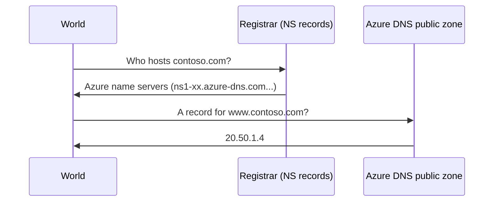
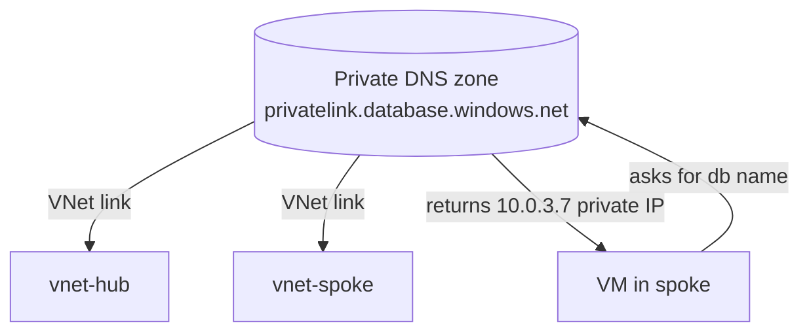
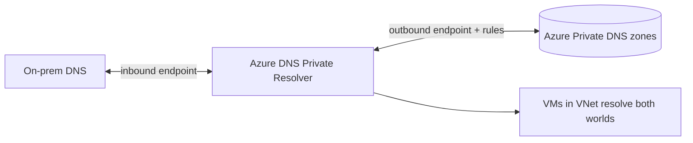
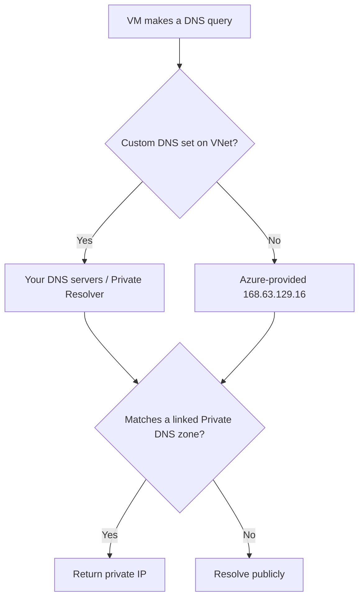

# Part D — Name Resolution & Azure DNS

> Section goal: Make **names resolve to IPs** inside and outside Azure. Master public DNS zones, **Private DNS zones**, the **Private Resolver**, and custom DNS — the knowledge that makes Private Endpoints (Part H) actually work and that the exam tests constantly.

Covers index items **Group 2 (Core Infrastructure)**. Builds on DNS basics from [Part A §6](Part-A-networking-fundamentals.md).

---

## 1. Recap: why DNS matters in Azure

From Part A: **DNS** is the internet's phone book — it turns `app.contoso.com` into an IP. In Azure, DNS is also the **secret sauce** that makes private connectivity transparent: you keep using friendly names while traffic quietly routes over private IPs.

> **Analogy:** DNS is a **company switchboard**. You ask for "Sales" and the operator connects you — you never dial the raw extension. In Azure, the operator can be *public* (anyone can call) or *private* (only callers inside the building get the internal extension).


---

## 2. Azure DNS (public) — hosting your domain's records

**Azure DNS** is Microsoft's service to **host a public domain's DNS records** (the records that tell the world where your website/mail lives). You don't buy the domain here (you buy from a registrar), but you can host its **zone**.

- **DNS zone** — *a container for all the records of a domain* (e.g. `contoso.com`). **Analogy:** the page in the phone book for one company. 
- **Record types** (recap): **A** (→IPv4), **AAAA** (→IPv6), **CNAME** (alias), **MX** (mail), **TXT** (verification), **NS** (which servers are authoritative).
- **How delegation works:** at your registrar, you set the **name servers** to Azure's, so the world asks Azure for that domain's records.



> 🎯 **Exam gotcha:** Public Azure DNS is for **internet-facing** name resolution. It does **not** resolve private IPs for your VNet — that's **Private DNS zones** (next). Don't mix them up.

---

## 3. Azure-provided default DNS (inside a VNet)

Every VNet automatically gets **Azure-provided DNS** at the special address **`168.63.129.16`** (memorise this — it appears in exams). It auto-resolves:
- Azure resource names within the VNet,
- public internet names (recursively).

> 🎯 **Exam gotcha:** **`168.63.129.16`** is a magic Azure IP used for **DNS and health probes**. If a firewall/NSG blocks it, name resolution and load-balancer probes break. Always allow it.

---

## 4. Private DNS zones — internal name resolution

A **Private DNS zone** lets you resolve names to **private IPs** inside one or more VNets — without running your own DNS servers.

- **Private DNS zone** — *a DNS zone that only your linked VNets can see,* mapping names to private IPs. **Analogy:** the **internal staff extension list** — only people inside the building can use it.
- **Virtual network link** — *connects a VNet to the private zone* so resources there can resolve its records. With **auto-registration**, VMs' records are created automatically.



> 🎯 **Exam gotcha — the Private Endpoint connection:** When you create a **Private Endpoint** (Part H) for, say, Azure SQL, Azure suggests a Private DNS zone named **`privatelink.database.windows.net`**. Linking it makes the *public* SQL hostname secretly resolve to the **private IP**. **DNS misconfiguration is the #1 reason private endpoints "don't work"** — and the exam tests this exact scenario. Each Azure service has its own `privatelink.*` zone name.

| Azure service | privatelink DNS zone |
|---------------|----------------------|
| Azure SQL | `privatelink.database.windows.net` |
| Storage (blob) | `privatelink.blob.core.windows.net` |
| Key Vault | `privatelink.vaultcore.azure.net` |
| App Service | `privatelink.azurewebsites.net` |

---

## 5. Custom DNS & hybrid name resolution

What if you have **on-premises DNS servers** (e.g. Active Directory) and need Azure VMs to resolve internal company names? You have options:

| Option | What it does | When |
|--------|--------------|------|
| **Azure-provided default** | Resolves Azure + public names | Simple, cloud-only |
| **Custom DNS servers** | Point the VNet at *your* DNS server IPs | You run AD/BIND and need on-prem names |
| **Azure DNS Private Resolver** | Managed service to forward queries between Azure & on-prem, both ways | Modern hybrid DNS without running DNS VMs |

### Azure DNS Private Resolver — the modern answer
The **Private Resolver** is a *managed, highly-available service that forwards DNS queries between Azure and on-premises* using **inbound** and **outbound endpoints**, no DNS VMs to maintain.

- **Inbound endpoint** — *lets on-prem resolve Azure private zones* (on-prem → Azure).
- **Outbound endpoint + ruleset** — *lets Azure forward chosen domains to on-prem DNS* (Azure → on-prem).



> 🎯 **Exam gotcha:** When a scenario says *"resolve on-prem names from Azure and Azure private zones from on-prem, without managing DNS servers"* → answer is **Azure DNS Private Resolver** (inbound + outbound endpoints + forwarding ruleset). The older answer was "DNS forwarder VMs" — Private Resolver replaces it.

---

## 6. Putting DNS resolution order together



> 💡 **Beginner tie-in:** Think of it as the switchboard checking the *internal extension list first* (private zone), then dialling *outside* (public) if not found.

---

## 🛠️ Hands-on Lab — Add private DNS to the project

Extend the hub-and-spoke with a Private DNS zone (we'll attach a private endpoint to it in Part H).

```powershell
# 1. Create a Private DNS zone (the one Azure SQL private endpoints use)
az network private-dns zone create -g rg-az700-lab `
  --name "privatelink.database.windows.net"

# 2. Link it to the hub VNet, with auto-registration off (PE records added later)
az network private-dns link vnet create -g rg-az700-lab `
  --zone-name "privatelink.database.windows.net" `
  --name link-hub --virtual-network vnet-hub --registration-enabled false

# 3. Verify the Azure-provided DNS IP is reachable from a VM (concept check)
#    On any Azure VM: nslookup should use 168.63.129.16 under the hood.

# 4. Inspect
az network private-dns zone show -g rg-az700-lab -n "privatelink.database.windows.net" -o table
az network private-dns link vnet list -g rg-az700-lab -z "privatelink.database.windows.net" -o table
```

✅ **Lab goal:** A Private DNS zone `privatelink.database.windows.net` linked to your hub VNet, ready for the Private Endpoint you'll build in Part H. You've now wired the exact mechanism the exam asks about most.

---

## ⭐ Likely Exam Questions for This Section

**Q1. "What is the IP address of Azure's internal DNS resolver?"**
> *Model answer:* **168.63.129.16** — a virtual public IP used for Azure-provided DNS and health probes. It must not be blocked by NSGs/firewalls.

**Q2. "A private endpoint to Azure SQL is created but apps still connect to the public IP. Why?"**
> *Model answer:* DNS isn't resolving the SQL hostname to the private IP. You need the **privatelink.database.windows.net** Private DNS zone, linked to the VNet, with the A record for the endpoint, so the public hostname resolves privately.

**Q3. "Public Azure DNS vs Private DNS zone — what's the difference?"**
> *Model answer:* Public Azure DNS hosts internet-facing records for a domain; Private DNS zones resolve names to private IPs only within linked VNets, for internal/private-endpoint resolution.

**Q4. "You need bidirectional DNS resolution between Azure and on-prem without managing DNS VMs. What do you use?"**
> *Model answer:* **Azure DNS Private Resolver** with an inbound endpoint (on-prem→Azure), an outbound endpoint, and a forwarding ruleset (Azure→on-prem).

**Q5. "What does a virtual network link with auto-registration do?"**
> *Model answer:* It connects a VNet to a Private DNS zone and automatically creates/updates DNS A records for VMs in that VNet, so they're resolvable by name.

**Q6. "Which record type maps a name to an IPv4 address? To another name?"**
> *Model answer:* **A** record → IPv4; **CNAME** → another (canonical) name/alias. AAAA → IPv6.

**Q7. "Can one Private DNS zone be linked to multiple VNets?"**
> *Model answer:* Yes — link it to many VNets (e.g. hub and spokes) so all resolve the same private records; central hub linking is common in hub-and-spoke.

---

## 🧠 30-Second Memory Hooks
- **DNS = switchboard.** Public zone = anyone calls; Private zone = internal extensions.
- **168.63.129.16** = Azure's magic DNS + health-probe IP. **Never block it.**
- **Private Endpoint "broken" = DNS not pointing to private IP.** Use the right **privatelink.*** zone.
- **Private Resolver** = managed hybrid DNS (inbound + outbound endpoints), no DNS VMs.
- **Resolution order:** custom/private zone first → public fallback.

---

*Next suggested section:* **Part E — VNet Connectivity & Routing** (your VNets resolve names; now connect them and control how traffic flows — peering, system routes, User-Defined Routes and BGP).
