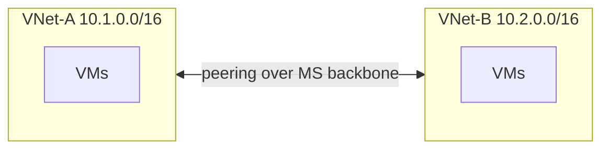
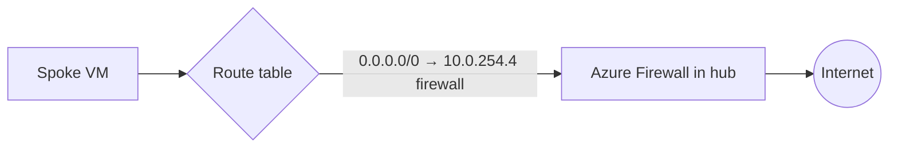
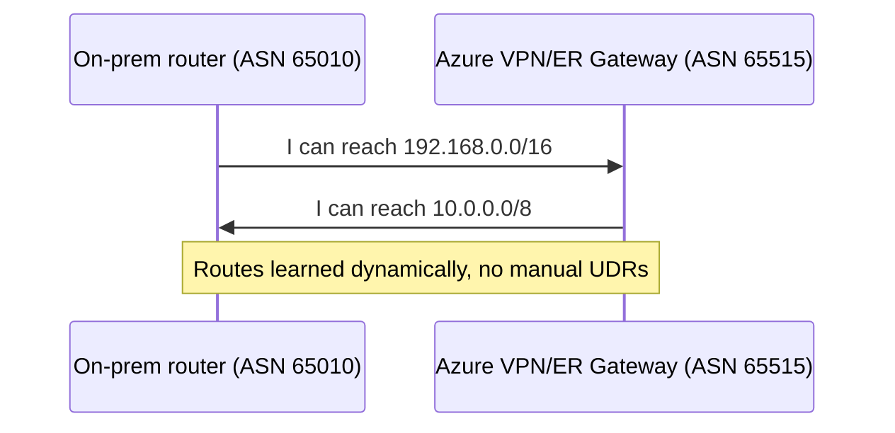

# Part E — VNet Connectivity & Routing

> Section goal: Connect VNets together and **control how traffic flows** — VNet peering, system routes, **User-Defined Routes (UDRs)**, service chaining, gateway transit and **BGP**. Two AZ-700 domains live here (routing ~15–20%, connectivity ~15–20%).

Covers index items **Group 3 (Routing & Connectivity)**. Builds on routing basics from [Part A §7](Part-A-networking-fundamentals.md).

---

## 1. VNet Peering — joining two private networks

By default VNets are isolated. **VNet peering** privately connects two VNets so resources talk using **private IPs**, as if on one network — over Microsoft's **backbone** (not the public internet).

> **Analogy:** Two neighbouring office buildings build a **private covered walkway** between them. Staff move freely without stepping onto the public street. Fast, private, secure.



### Key properties
- **Non-transitive** — *peering doesn't chain.* If A↔B and B↔C, **A cannot reach C** through B automatically. **Analogy:** a walkway from A to B and B to C doesn't mean A↔C — you'd need a direct walkway *or* a router/gateway in B. **Why it matters:** this is the #1 peering exam trap and the reason **hub-and-spoke** uses extra tricks (below).
- **Regional vs Global peering** — same region vs across regions; both private over the backbone.
- **Non-overlapping address spaces required** (Part A rule).
- **Low latency, high bandwidth**; you pay for data transferred.

| Setting on a peering | Meaning |
|----------------------|---------|
| **Allow forwarded traffic** | Accept traffic that originated elsewhere and was forwarded (needed for hub NVA/firewall) |
| **Allow gateway transit** (on hub) | Let spokes use the hub's VPN/ExpressRoute gateway |
| **Use remote gateways** (on spoke) | This VNet uses the peer's gateway instead of its own |

> 🎯 **Exam gotcha:** **Peering is NOT transitive.** Spoke-to-spoke traffic in hub-and-spoke must go **through the hub** via a firewall/NVA + UDRs, or via **Azure Virtual WAN / Route Server**. Memorise this.

---

## 2. How Azure routes traffic — system routes

Azure **automatically** creates **system routes** so things just work. Every subnet has an invisible routing table with defaults:

| Destination | Next hop | Meaning |
|-------------|----------|---------|
| VNet address space | Virtual network | Stay local |
| `0.0.0.0/0` | Internet | Default outbound to internet |
| Peered VNet range | VNet peering | Reach the peer |
| On-prem range (if gateway) | Virtual network gateway | Reach on-prem |

> **Analogy:** Azure pre-loads your sat-nav with sensible default routes. You only intervene when you want a **detour** (next section).

---

## 3. User-Defined Routes (UDRs) — forcing detours

A **User-Defined Route (UDR)**, held in a **Route Table**, *overrides system routes* to send traffic where YOU want — most often **through a firewall/NVA**.

- **Route Table** — *a set of custom routes you attach to a subnet.* 
- **Next hop types:** **Virtual appliance** (a firewall VM/Azure Firewall IP), **Virtual network gateway**, **Internet**, **VNet**, **None** (drop).
- **Forced tunnelling** — *a UDR `0.0.0.0/0 → on-prem/firewall`* so even internet-bound traffic is inspected first. **Analogy:** routing all outgoing post through the security office before it leaves the building.



### Route selection rules (exam-critical)
When multiple routes match, Azure picks in this order:
1. **Longest prefix match** (most specific wins — `/32` beats `/24` beats `/0`).
2. If equal prefix: **UDR > BGP route > system route**.

> 🎯 **Exam gotcha:** "**Most specific prefix wins; on a tie, UDR beats BGP beats system.**" And a UDR with next hop **None** is how you **blackhole/drop** traffic. These rules appear in routing-domain questions repeatedly.

---

## 4. Service chaining & the hub-and-spoke pattern

**Service chaining** = using UDRs to send traffic *through* an appliance in another VNet (the hub), enabling spoke-to-spoke and centralised inspection despite non-transitive peering.

```mermaid
flowchart TD
    subgraph Hub[Hub VNet]
    FW[Azure Firewall / NVA]
    GW[VPN/ExpressRoute Gateway]
    end
    Spoke1[Spoke 1] <-->|peering| Hub
    Spoke2[Spoke 2] <-->|peering| Hub
    Spoke1 -. UDR 0.0.0.0/0 → FW .-> FW
    Spoke2 -. UDR to reach Spoke1 → FW .-> FW
    FW --> GW
```

**How spoke-to-spoke works:** Spoke1's route table sends Spoke2's range to the **firewall in the hub**; the firewall forwards to Spoke2. The hub peerings have **"allow forwarded traffic"** and **"allow gateway transit"** enabled.

> 🎯 **Exam gotcha:** To make hub-and-spoke route correctly you need **three things together**: (1) peering with *allow forwarded traffic*, (2) **UDRs** on spokes pointing to the firewall, (3) the firewall configured to allow/forward. Missing any one breaks it.

---

## 5. Gateway transit — sharing the hub's gateway

Rather than every spoke owning an expensive VPN/ExpressRoute gateway, the **hub** owns one and shares it via **gateway transit**.

- On the **hub** peering: enable **Allow gateway transit**.
- On the **spoke** peering: enable **Use remote gateways**.
- Result: spokes reach on-prem through the **hub's** gateway. **Analogy:** one shared loading dock for the whole campus instead of one per building.

> 🎯 **Exam gotcha:** A spoke can **Use remote gateways** only if it has **no gateway of its own**, and the hub must have a deployed gateway with **Allow gateway transit** on. This pairing is a classic exam config question.

---

## 6. BGP — dynamic routing between networks

**BGP** (Border Gateway Protocol), introduced in Part A, lets connected networks **advertise their routes to each other automatically**, so you don't hand-maintain routes as networks change.

- Used by **VPN Gateways** (optional) and **ExpressRoute** (required) — Part F.
- **ASN** (Autonomous System Number) identifies each side's "routing domain." **Analogy:** each postal authority has an ID and shares its updated delivery maps with neighbours.
- **Azure Route Server** — *a managed service that lets your NVA exchange routes with the VNet via BGP,* so you don't manually maintain UDRs for the NVA. Enables transit and simpler NVA integration.



> 🎯 **Exam gotcha:** ExpressRoute **requires BGP**; Site-to-Site VPN can use **static** routing or BGP. **Azure Route Server** has its own dedicated **RouteServerSubnet (/27)** and is the answer for "dynamic route exchange with an NVA without managing UDRs."

---

## 🛠️ Hands-on Lab — Peer a spoke to the hub

Extend the running project: create a spoke VNet and peer it to the hub (we'll add the firewall/UDRs in Part I).

```powershell
# 1. Create a spoke VNet (non-overlapping with the hub 10.0.0.0/16)
az network vnet create -g rg-az700-lab --name vnet-spoke1 `
  --address-prefix 10.1.0.0/16 --subnet-name snet-web --subnet-prefix 10.1.1.0/24

# 2. Peer hub -> spoke (allow forwarded traffic; will allow gateway transit later)
az network vnet peering create -g rg-az700-lab --name hub-to-spoke1 `
  --vnet-name vnet-hub --remote-vnet vnet-spoke1 `
  --allow-vnet-access --allow-forwarded-traffic

# 3. Peer spoke -> hub
az network vnet peering create -g rg-az700-lab --name spoke1-to-hub `
  --vnet-name vnet-spoke1 --remote-vnet vnet-hub `
  --allow-vnet-access --allow-forwarded-traffic

# 4. Create a route table + UDR sending spoke internet traffic to a (future) firewall IP
az network route-table create -g rg-az700-lab --name rt-spoke1
az network route-table route create -g rg-az700-lab --route-table-name rt-spoke1 `
  --name to-firewall --address-prefix 0.0.0.0/0 `
  --next-hop-type VirtualAppliance --next-hop-ip-address 10.0.254.4
az network vnet subnet update -g rg-az700-lab --vnet-name vnet-spoke1 `
  --name snet-web --route-table rt-spoke1

# 5. Verify
az network vnet peering list -g rg-az700-lab --vnet-name vnet-hub -o table
az network route-table route list -g rg-az700-lab --route-table-name rt-spoke1 -o table
```

✅ **Lab goal:** A spoke peered to the hub with forwarded traffic allowed, and a UDR forcing `0.0.0.0/0` toward the hub firewall IP (`10.0.254.4`, the first usable in AzureFirewallSubnet). You've implemented **service chaining** — it'll fully work once the firewall exists in Part I.

---

## ⭐ Likely Exam Questions for This Section

**Q1. "Is VNet peering transitive?"**
> *Model answer:* No. If A peers B and B peers C, A can't reach C through B. You need direct peering, or route via a hub firewall/NVA with UDRs, or use Virtual WAN/Route Server.

**Q2. "How do you force all spoke internet traffic through a central firewall?"**
> *Model answer:* Attach a UDR `0.0.0.0/0` with next hop **Virtual appliance** = the firewall's private IP to the spoke subnets, enable *allow forwarded traffic* on peerings, and let the firewall handle egress.

**Q3. "Two routes match a packet. How does Azure choose?"**
> *Model answer:* Longest (most specific) prefix wins. On a tie, the priority is UDR > BGP-learned > system route.

**Q4. "What two peering settings enable spokes to use the hub's VPN gateway?"**
> *Model answer:* On the hub peering enable **Allow gateway transit**; on the spoke peering enable **Use remote gateways** (the spoke must have no gateway of its own).

**Q5. "What does next hop type 'None' do in a route?"**
> *Model answer:* It drops (blackholes) traffic to that prefix — useful to block specific routes.

**Q6. "When is BGP required vs optional?"**
> *Model answer:* ExpressRoute requires BGP; Site-to-Site VPN can use static routing or BGP. BGP enables dynamic route exchange so routes update automatically.

**Q7. "What is Azure Route Server for?"**
> *Model answer:* It enables BGP route exchange between your NVA and the VNet so routes propagate dynamically without manually maintaining UDRs; it needs a dedicated RouteServerSubnet.

**Q8. "Spoke-to-spoke traffic isn't flowing in hub-and-spoke. Likely cause?"**
> *Model answer:* Peering is non-transitive — you need UDRs on each spoke pointing to the hub firewall, *allow forwarded traffic* on peerings, and the firewall configured to forward between spokes.

---

## 🧠 30-Second Memory Hooks
- **Peering = private walkway, but NOT transitive.** A→B→C ≠ A→C.
- **System routes = free sat-nav; UDR = your detour** (usually via firewall).
- **Route priority:** most specific → then **UDR > BGP > system**.
- **Next hop None = drop.** VirtualAppliance = firewall/NVA.
- **Gateway transit (hub) + use remote gateways (spoke)** = shared gateway.
- **ExpressRoute needs BGP; VPN can be static or BGP.**
- **Route Server = dynamic routes with an NVA, no manual UDRs.**

---

*Next suggested section:* **Part F — Hybrid Connectivity** (connect Azure to the outside world — Site-to-Site & Point-to-Site VPN, ExpressRoute, and Virtual WAN — plugging into the GatewaySubnet you already made).
