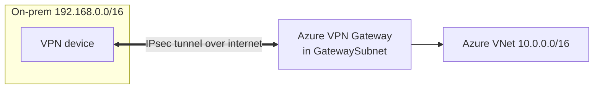
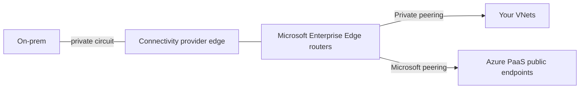
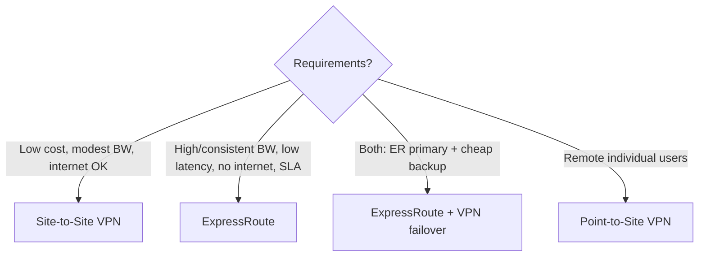
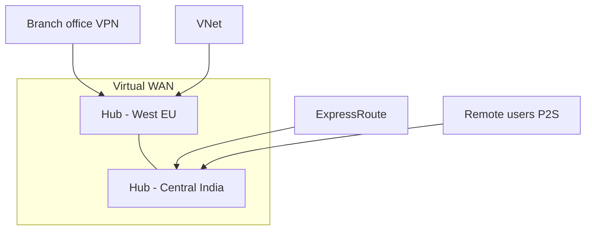

# Part F — Hybrid Connectivity

> Section goal: Connect Azure to **on-premises and remote users** — Site-to-Site & Point-to-Site **VPN**, **ExpressRoute**, and **Virtual WAN**. Know which to pick, their SKUs, resilience options and BGP behaviour. Connectivity is ~15–20% of AZ-700.

Covers index items **Group 3 (Routing & Connectivity)**. Uses the **GatewaySubnet** from [Part C](Part-C-vnets-subnets-ip.md) and BGP/transit from [Part E](Part-E-connectivity-routing.md).

---

## 1. The hybrid problem

You have servers in your **office data centre (on-premises)** and resources in **Azure**. They need to talk **privately and securely**. Three tools solve this:

| Tool | What it is | Travels over | Typical use |
|------|------------|--------------|-------------|
| **Site-to-Site VPN** | Encrypted tunnel office↔Azure | Public internet (encrypted) | Cheap, quick hybrid links |
| **Point-to-Site VPN** | Encrypted tunnel *single device*↔Azure | Public internet | Remote workers/admins |
| **ExpressRoute** | Private dedicated circuit | Private (a telco partner) | High bandwidth, low latency, compliance |
| **Virtual WAN** | Managed hub mesh tying many sites/VNets together | MS backbone | Global, many branches |

> **Analogy:** Site-to-Site VPN is a **secure armoured-car route over public roads** between two buildings. ExpressRoute is your **own private underground tunnel** — no public roads at all. Point-to-Site is **one employee with a secure courier bag**. Virtual WAN is **hiring a logistics company** to run the whole road network for you.

---

## 2. VPN Gateway — the foundation for VPNs

A **VPN Gateway** is a special Azure resource deployed into the **GatewaySubnet** that terminates encrypted tunnels.

- **VPN** (Virtual Private Network) — *an encrypted tunnel over the public internet* so data is private despite the shared road. Uses **IPsec/IKE** encryption. **Analogy:** the armoured car.
- It's deployed once per VNet (or shared via gateway transit, Part E).

### Site-to-Site (S2S) VPN
Connects a **whole network** (your office) to Azure.
- Needs a **Local Network Gateway** — *an Azure object representing your on-prem side* (its public IP + on-prem address ranges).
- Routing: **static** (you list on-prem ranges) **or BGP** (dynamic).



### Point-to-Site (P2S) VPN
Connects a **single client device** (laptop) to Azure — great for remote admins.
- Client auth via **certificates**, **RADIUS**, or **Microsoft Entra ID**.
- Protocols: **OpenVPN**, **IKEv2**, or legacy SSTP.

> 🎯 **Exam gotcha:** **S2S = whole site (needs Local Network Gateway + on-prem VPN device). P2S = one device (needs client VPN software + auth).** You can run **both on the same VPN Gateway**. P2S over **OpenVPN/IKEv2** is preferred; SSTP is legacy/Windows-only and limited to 128 connections.

### VPN Gateway SKUs & resilience
- SKUs (Basic → VpnGw1–5, and AZ variants) set **throughput** and **tunnel/connection limits**.
- **Active-active** — *two gateway instances both live* for higher resilience/throughput.
- **Zone-redundant (AZ SKUs)** — spread across availability zones.

> 🎯 **Exam gotcha:** For high availability use **active-active** gateways and/or **zone-redundant (AZ) SKUs**. **Basic SKU** lacks BGP/active-active and is legacy. Throughput needs → pick a higher VpnGw SKU.

---

## 3. ExpressRoute — private, dedicated connectivity

**ExpressRoute** gives a **private connection** between on-prem and Azure through a **connectivity provider** — it does **not** traverse the public internet at all.

- **Why choose it:** higher, more **consistent bandwidth** (50 Mbps–100 Gbps), **lower latency**, better **SLA**, and traffic that **never touches the internet** (compliance).
- **BGP required** for route exchange.

### ExpressRoute peering types
| Peering | Carries traffic to | Example |
|---------|--------------------|---------| 
| **Private peering** | Your VNets (private IPs) | VMs, databases over private IPs |
| **Microsoft peering** | Microsoft public services (PaaS, M365*) | Storage, SQL public endpoints |

\*M365 over ExpressRoute requires special authorisation and is rarely recommended.

### Resilience & global reach
- **ExpressRoute Global Reach** — *link two on-prem sites to each other THROUGH Azure's ExpressRoute,* so your branches talk via the Azure backbone.
- **FastPath** — sends data-plane traffic straight to VMs, bypassing the gateway for lower latency.
- **ExpressRoute + VPN failover** — common design: VPN as cheap backup if the circuit drops.



> 🎯 **Exam gotcha:** ExpressRoute = **private, not encrypted by default** (it's a private circuit; add IPsec over it if encryption is mandated). **Global Reach** connects **on-prem sites to each other** via Azure. For max resilience: **ExpressRoute with a VPN backup**, or dual circuits in different peering locations.

---

## 4. VPN vs ExpressRoute — the decision



| Factor | Site-to-Site VPN | ExpressRoute |
|--------|------------------|--------------|
| Path | Public internet (encrypted) | Private circuit |
| Bandwidth | Up to ~10 Gbps (SKU-dependent) | 50 Mbps–100 Gbps |
| Latency | Variable | Low, consistent |
| Cost | Low | Higher |
| Encryption | Built-in (IPsec) | Not by default |
| Setup time | Minutes | Days–weeks (provider) |

---

## 5. Azure Virtual WAN — managed global networking

**Virtual WAN (vWAN)** is a *managed service that provides a global transit network* using Microsoft-managed **hubs**. Instead of building hub-and-spoke by hand, Azure runs the hub for you and connects VNets, branches (VPN), users (P2S) and ExpressRoute — all meshed automatically.

- **Solves transitivity for you** — hub-managed routing gives **any-to-any** (spoke↔spoke, branch↔VNet) without manual UDRs.
- **Secured Virtual Hub** — a vWAN hub with **Azure Firewall** built in (via Firewall Manager) for centralised security.



> 🎯 **Exam gotcha:** When a scenario has **many branches/regions and wants simple, scalable, any-to-any connectivity managed by Azure** → **Virtual WAN**. For **centralised security inside vWAN** → **Secured Virtual Hub** (Azure Firewall in the hub). Manual hub-and-spoke is the alternative when you want full control.

---

## 🛠️ Hands-on Lab — Add a VPN Gateway (concept + cost note)

> ⚠️ **Cost warning:** A VPN Gateway is **billed per hour** and isn't free-tier. The commands below show the real workflow; **only run if you accept the cost**, and delete promptly. Otherwise, read and understand the steps.

```powershell
# 1. Public IP for the gateway (Standard, zone-redundant)
az network public-ip create -g rg-az700-lab --name pip-vpngw --sku Standard --allocation-method Static

# 2. Deploy the VPN gateway into the existing GatewaySubnet (takes ~30-45 min)
az network vnet-gateway create -g rg-az700-lab --name vpngw-hub `
  --vnet vnet-hub --gateway-type Vpn --vpn-type RouteBased `
  --sku VpnGw1 --public-ip-addresses pip-vpngw

# 3. Represent your on-prem side as a Local Network Gateway
az network local-gateway create -g rg-az700-lab --name lng-onprem `
  --gateway-ip-address 203.0.113.10 --local-address-prefixes 192.168.0.0/16

# 4. Create the Site-to-Site connection (shared key must match your on-prem device)
az network vpn-connection create -g rg-az700-lab --name cn-s2s `
  --vnet-gateway1 vpngw-hub --local-gateway2 lng-onprem `
  --shared-key "DoNotUseThisDemoKey123!"

# 5. Enable gateway transit so spokes can use it (ties back to Part E)
az network vnet peering update -g rg-az700-lab --vnet-name vnet-hub `
  --name hub-to-spoke1 --set allowGatewayTransit=true
az network vnet peering update -g rg-az700-lab --vnet-name vnet-spoke1 `
  --name spoke1-to-hub --set useRemoteGateways=true
```

✅ **Lab goal (concept):** Understand the full S2S build — gateway in GatewaySubnet, Local Network Gateway for on-prem, a connection with a shared key, and **gateway transit** so spokes reach on-prem through the hub. **Delete the gateway** after (`az network vnet-gateway delete ...`) to stop charges.

---

## ⭐ Likely Exam Questions for This Section

**Q1. "Site-to-Site vs Point-to-Site VPN?"**
> *Model answer:* S2S connects an entire on-prem network via an on-prem VPN device and Local Network Gateway; P2S connects individual client devices running VPN software, authenticated by cert/RADIUS/Entra ID. Both can share one VPN Gateway.

**Q2. "When choose ExpressRoute over VPN?"**
> *Model answer:* When you need high, consistent bandwidth, low predictable latency, a stronger SLA, or traffic that must not traverse the public internet (compliance). VPN is cheaper and faster to set up but rides the internet.

**Q3. "Is ExpressRoute encrypted?"**
> *Model answer:* Not by default — it's a private circuit, not the internet. If encryption is required, run IPsec/MACsec over it.

**Q4. "What does ExpressRoute Global Reach do?"**
> *Model answer:* It connects two on-premises sites to each other through Azure's ExpressRoute backbone, so branches communicate via Microsoft's network.

**Q5. "How do you make a VPN gateway highly available?"**
> *Model answer:* Use **active-active** configuration and/or a **zone-redundant (AZ) SKU**; avoid the Basic SKU. For hybrid resilience, pair ExpressRoute with a VPN failover.

**Q6. "Difference between ExpressRoute private peering and Microsoft peering?"**
> *Model answer:* Private peering reaches your VNets over private IPs; Microsoft peering reaches Microsoft public/PaaS endpoints (e.g. storage, SQL public).

**Q7. "A company has 50 branch offices worldwide needing any-to-any connectivity with minimal management. What do you recommend?"**
> *Model answer:* **Azure Virtual WAN** — a managed global transit network with automatic any-to-any routing; add a **Secured Virtual Hub** for centralised firewalling.

**Q8. "Which subnet must a VPN gateway be deployed into, and what size?"**
> *Model answer:* **GatewaySubnet**, /27 recommended (case-sensitive name).

---

## 🧠 30-Second Memory Hooks
- **S2S = whole site; P2S = one laptop; ExpressRoute = private tunnel; vWAN = managed mesh.**
- **VPN rides the internet (encrypted); ExpressRoute is a private circuit (NOT encrypted by default).**
- **Local Network Gateway = your on-prem side, in Azure's words.**
- **Global Reach = link on-prem sites THROUGH Azure.**
- **HA gateway = active-active + AZ SKU.** Basic = legacy.
- **Many branches, low admin = Virtual WAN.** Secured hub = +Azure Firewall.
- **VPN gateway lives in GatewaySubnet (/27).**

---

*Next suggested section:* **Part G — Load Balancing & Application Delivery** (traffic now reaches Azure — distribute it across servers and regions with Load Balancer, Application Gateway, Traffic Manager and Front Door).
