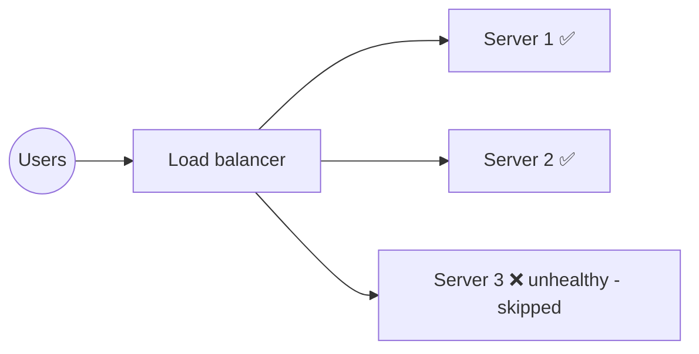
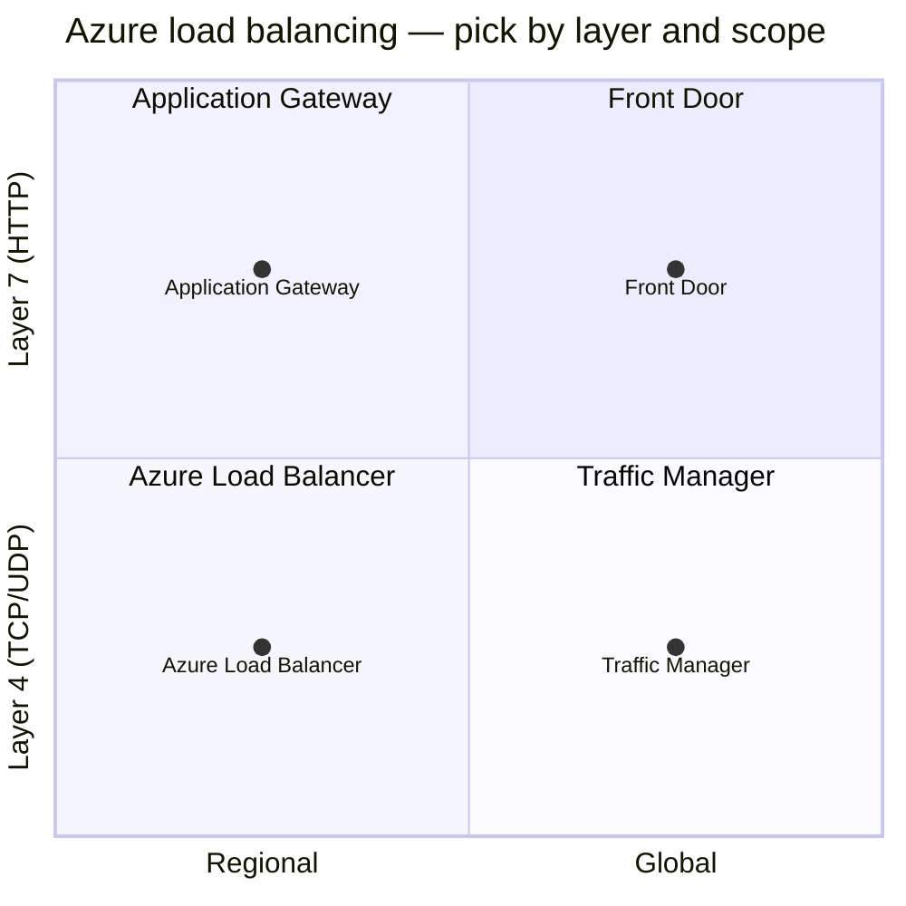
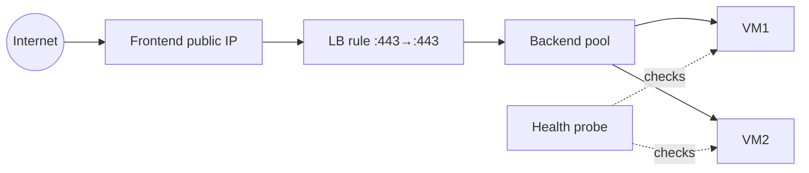
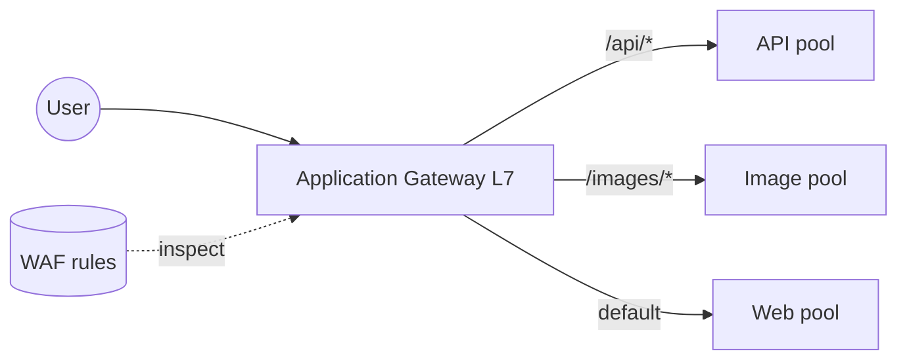
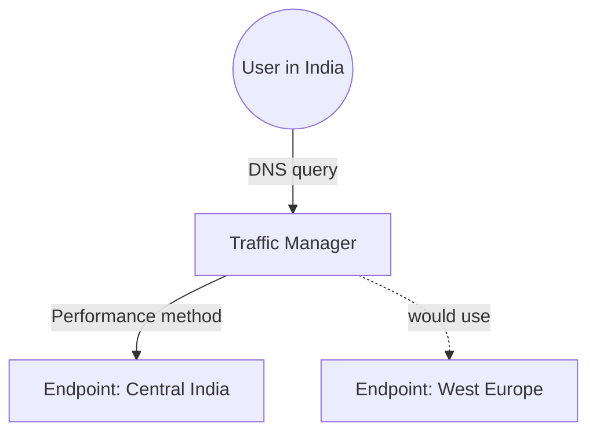
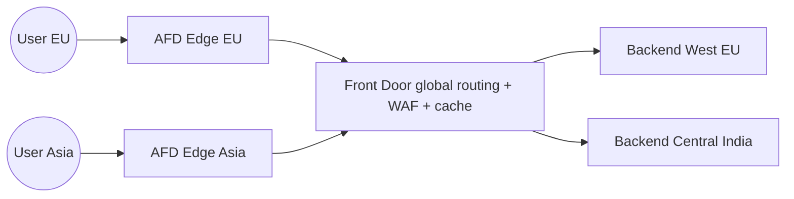
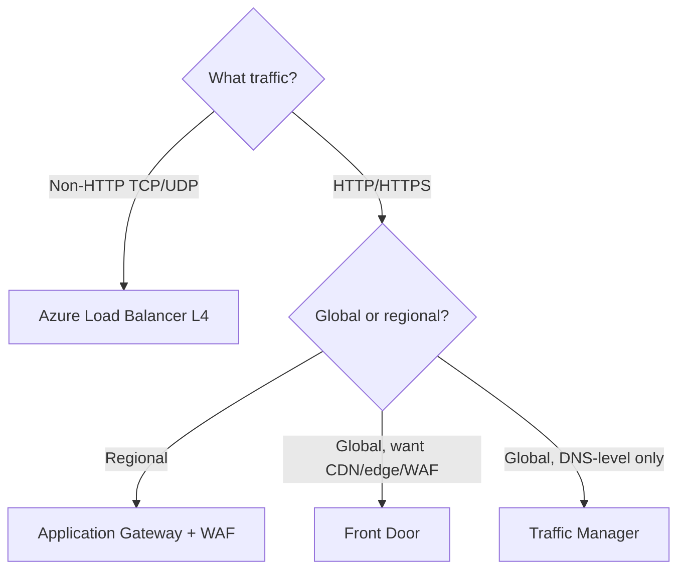

# Part G — Load Balancing & Application Delivery

> Section goal: Distribute traffic across servers and regions for **scale and availability** using the four Azure options — **Load Balancer, Application Gateway, Traffic Manager, Front Door** — and confidently pick the right one. The "choose the right load balancer" question is on almost every AZ-700 exam.

Covers index items **Group 4 (Apps & Security)**. Relies on the **L4 vs L7** distinction from [Part A §4](Part-A-networking-fundamentals.md).

---

## 1. Why load balancing?

If one server handles all traffic, it becomes slow and a single point of failure. A **load balancer** spreads incoming requests across **multiple healthy servers**.

> **Analogy:** A busy supermarket with one till = huge queue. Add a **queue manager** who directs shoppers to whichever till is free = faster, and if one till closes, shoppers just go to others. That manager is a load balancer.



Two big axes decide which Azure product you use:
1. **Layer 4 (IP+port) vs Layer 7 (HTTP-aware)** — from Part A.
2. **Regional (within one region) vs Global (across regions)**.



| Product | Layer | Scope | Core job |
|---------|-------|-------|----------|
| **Azure Load Balancer** | 4 (TCP/UDP) | Regional | Fast IP/port distribution |
| **Application Gateway** | 7 (HTTP) | Regional | URL/host routing + WAF |
| **Traffic Manager** | DNS-based | Global | Route users to best region via DNS |
| **Front Door** | 7 (HTTP) | Global | Global HTTP routing + CDN + WAF |

> 🎯 **Exam gotcha:** Memorise that quadrant. The exam describes a need and you pick the box. **L4=Load Balancer, L7 regional=App Gateway, global DNS=Traffic Manager, global HTTP/CDN=Front Door.**

---

## 2. Azure Load Balancer (L4, regional)

The **Azure Load Balancer (ALB)** distributes **TCP/UDP** traffic by IP and port. It doesn't understand HTTP — it's fast and simple.

- **Public Load Balancer** — distributes **internet** traffic to backend VMs.
- **Internal (private) Load Balancer** — distributes **internal** traffic (e.g. front-end tier → app tier) using a private IP.

### Key concepts
- **Frontend IP** — where traffic arrives (public or private).
- **Backend pool** — the VMs/instances receiving traffic.
- **Health probe** — *periodic check (TCP/HTTP) to see if a backend is alive;* unhealthy ones are skipped. (Uses the magic `168.63.129.16`, Part D.)
- **Load-balancing rule** — maps frontend port → backend port.
- **SKU:** **Standard** (zone-redundant, secure-by-default, recommended) vs Basic (legacy/retiring).



> 🎯 **Exam gotcha:** **Standard Load Balancer** is zone-redundant and secure-by-default (needs NSG to allow traffic). It's **L4 only** — for URL-based routing or TLS termination you need **Application Gateway**. Internal LB = private frontend.

---

## 3. Application Gateway (L7, regional)

**Application Gateway (App Gw)** is a **Layer 7** load balancer that understands HTTP/HTTPS, so it can route by **URL path** or **host header**, terminate TLS, and includes an optional **WAF**.

### What L7 unlocks
- **Path-based routing** — `/images/*` → image servers, `/api/*` → API servers.
- **Multi-site hosting** — many domains on one gateway.
- **SSL/TLS termination** — decrypt at the gateway (offload work from backends).
- **Cookie-based session affinity**, **autoscaling** (v2), **WAF** (Part I).



> 🎯 **Exam gotcha:** If the scenario mentions **path-based / URL routing, host-based routing, TLS termination, or WAF in a single region** → **Application Gateway**. Pair it with **WAF** for OWASP protection (Part I). It's **regional**, not global.

---

## 4. Traffic Manager (global, DNS-based)

**Traffic Manager (TM)** works at the **DNS level** to send users to the **best regional endpoint**. It doesn't see your traffic — it just answers DNS with the right endpoint's address.

### Routing methods (know these names)
| Method | Sends user to… |
|--------|----------------|
| **Priority** | Primary; fail over to backup if down |
| **Weighted** | Distribute by assigned weights (e.g. A/B testing) |
| **Performance** | Lowest-latency region for the user |
| **Geographic** | Region based on user's location (compliance) |
| **Multivalue** | Returns multiple healthy endpoints |
| **Subnet** | Map user IP ranges to endpoints |



> 🎯 **Exam gotcha:** Traffic Manager is **DNS-based and global** — it does **not** proxy traffic; after the DNS answer the client connects **directly** to the endpoint. Because it's DNS, **failover is subject to DNS TTL/caching** (not instant). For instant global HTTP failover + caching, use **Front Door**.

---

## 5. Azure Front Door (global, L7 + CDN + WAF)

**Front Door (AFD)** is a **global, Layer-7** entry point: it terminates connections at Microsoft's **edge** near the user, routes to the best/healthy backend, caches static content (CDN), and applies **WAF** — all globally.

- **Global HTTP load balancing** with instant failover (it's a real proxy, unlike TM).
- **CDN caching** for static content close to users.
- **TLS termination at the edge**, **WAF**, **path/host routing** globally.
- **Anycast** — *one IP advertised from many edge locations;* users hit the nearest. **Analogy:** one phone number that always connects to your nearest branch.



> 🎯 **Exam gotcha:** **Front Door = global L7 + CDN + WAF, true proxy with fast failover.** Choose it for **global web apps** needing edge acceleration and global WAF. **Traffic Manager** is the *DNS-only* global option (no proxy/cache). You can even stack: **Front Door (global) → App Gateway (regional)**.

---

## 6. The decision tree (commit this to memory)



| Need | Pick |
|------|------|
| TCP/UDP, any port, regional | **Azure Load Balancer** |
| HTTP routing/TLS/WAF, one region | **Application Gateway** |
| Send users to nearest/healthy region via DNS | **Traffic Manager** |
| Global HTTP, edge caching, global WAF, fast failover | **Front Door** |

---

## 🛠️ Hands-on Lab — Internal Load Balancer for the app tier

Add a Standard internal Load Balancer in front of two app VMs in the spoke (no public exposure).

```powershell
# 1. Create the internal Load Balancer with a private frontend in the spoke subnet
az network lb create -g rg-az700-lab --name ilb-app --sku Standard `
  --vnet-name vnet-spoke1 --subnet snet-web `
  --frontend-ip-name feip --backend-pool-name bepool `
  --private-ip-address 10.1.1.100

# 2. Health probe (TCP 80) and load-balancing rule (80 -> 80)
az network lb probe create -g rg-az700-lab --lb-name ilb-app --name probe80 `
  --protocol Tcp --port 80
az network lb rule create -g rg-az700-lab --lb-name ilb-app --name rule80 `
  --protocol Tcp --frontend-port 80 --backend-port 80 `
  --frontend-ip-name feip --backend-pool-name bepool --probe-name probe80

# 3. Inspect
az network lb show -g rg-az700-lab -n ilb-app -o table
az network lb rule list -g rg-az700-lab --lb-name ilb-app -o table
```

✅ **Lab goal:** A Standard internal Load Balancer with a health probe and rule, ready to balance two app VMs privately at `10.1.1.100`. This is the **app-tier** of your hub-and-spoke project. (Add backend VMs when you want a fully live test.)

---

## ⭐ Likely Exam Questions for This Section

**Q1. "You need to load balance non-HTTP TCP traffic within a region. Which service?"**
> *Model answer:* **Azure Load Balancer (Standard)** — a Layer 4 load balancer for TCP/UDP. Use an internal LB for private traffic, public LB for internet.

**Q2. "You need URL path-based routing and TLS termination in one region. Which service?"**
> *Model answer:* **Application Gateway** (Layer 7), ideally with **WAF** enabled for OWASP protection.

**Q3. "Traffic Manager vs Front Door for global traffic?"**
> *Model answer:* Traffic Manager is DNS-based — it returns the best endpoint and the client connects directly; failover depends on DNS TTL. Front Door is a global L7 reverse proxy with edge caching, WAF, and fast failover. Use Front Door for global web apps needing acceleration/WAF.

**Q4. "Name three Traffic Manager routing methods and their use."**
> *Model answer:* Priority (active/passive failover), Performance (lowest latency), Geographic (route by user location for compliance). Also Weighted, Multivalue, Subnet.

**Q5. "What is a health probe and why does it matter?"**
> *Model answer:* A periodic TCP/HTTP check that determines backend health; the load balancer only sends traffic to healthy instances, providing automatic failover.

**Q6. "Why choose Standard over Basic Load Balancer?"**
> *Model answer:* Standard is zone-redundant, secure-by-default (requires NSG to allow traffic), supports larger backend pools and HA ports, and is the supported SKU going forward.

**Q7. "Can you combine these services?"**
> *Model answer:* Yes — a common pattern is Front Door (global L7/WAF/CDN) routing to regional Application Gateways or Load Balancers, giving global reach plus regional control.

**Q8. "Which services include a WAF?"**
> *Model answer:* **Application Gateway** (regional WAF) and **Azure Front Door** (global WAF). Load Balancer and Traffic Manager do not.

---

## 🧠 30-Second Memory Hooks
- **The quadrant:** LB=L4 regional, App Gw=L7 regional, Traffic Manager=DNS global, Front Door=L7 global.
- **Non-HTTP = Load Balancer.** URL routing/WAF one region = **App Gateway**.
- **Traffic Manager = DNS only (no proxy, TTL failover). Front Door = real global proxy + CDN + WAF.**
- **Health probe = skip the dead tills.**
- **Standard SKU = zone-redundant + secure-by-default.**
- **WAF lives on App Gateway & Front Door.**

---

*Next suggested section:* **Part H — Private Access to Azure Services** (stop exposing PaaS like SQL/Storage to the internet — use Service Endpoints and Private Endpoints/Private Link, tying back to the Private DNS zone from Part D).
