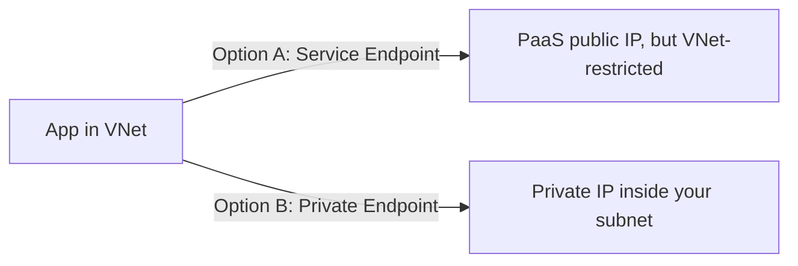
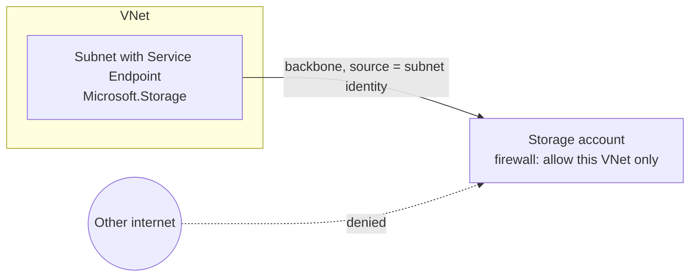

# Part H — Private Access to Azure Services

> Section goal: Stop exposing PaaS services (Storage, SQL, Key Vault) to the public internet. Master **Service Endpoints** vs **Private Endpoints / Private Link** — their differences, DNS implications and when to use each. This is its own AZ-700 domain (~10–15%).

Covers index items **Group 4 (Apps & Security)**. Heavily depends on **Private DNS zones** from [Part D](Part-D-name-resolution-dns.md).

---

## 1. The problem: PaaS services are public by default

Azure **PaaS** services — *Platform-as-a-Service, fully-managed services you consume without managing servers* (e.g. Azure SQL Database, Azure Storage, Key Vault) — get a **public endpoint** by default, like `mydb.database.windows.net`, reachable from the internet.

> **Analogy:** Your database has a **public shopfront on the high street**. Even with a lock (firewall rules), it's exposed to everyone walking past. You'd rather it had a **private door that only opens inside your building**.

Two technologies make access private. They sound similar but work very differently.



---

## 2. Service Endpoints — keep public IP, restrict to your VNet

A **Service Endpoint** *extends your VNet identity to the Azure service over the backbone,* so the service can be configured to accept traffic **only from your subnet**. The service still uses its **public IP**, but traffic takes the Microsoft backbone and the service firewall trusts your subnet.

- Enabled **per subnet, per service type** (e.g. `Microsoft.Storage`).
- The PaaS firewall is set to **allow that VNet/subnet** and deny the rest of the internet.
- **No private IP** is created; DNS still resolves to the **public** name/IP.



> 🎯 **Exam gotcha:** Service Endpoints **don't bring the service into your VNet** and **don't give it a private IP** — they just let the service's firewall trust your subnet. **No DNS changes** needed. They **don't extend to on-premises** (on-prem can't use a VNet service endpoint). Free of charge.

---

## 3. Private Endpoints / Private Link — bring the service into your VNet

A **Private Endpoint (PE)** *creates a network interface with a private IP inside your subnet that maps to a specific PaaS resource* via **Azure Private Link**. The service effectively gets a **private address in your network**.

- **Private Link** — *the technology that maps a PE to one specific PaaS resource* (e.g. *this* storage account, not all storage).
- The public hostname now resolves to a **private IP** (via the **privatelink** DNS zone — Part D).
- **Reachable from on-premises** too (over VPN/ExpressRoute), because it's just a private IP in your VNet.

```mermaid
flowchart LR
    subgraph VNet 10.0.0.0/16
    PE[Private Endpoint NIC<br/>10.0.3.7]
    end
    App[App / on-prem] -->|connects to private IP| PE
    PE -->|Private Link| SQL[Azure SQL DB<br/>specific resource]
    PZ[(privatelink.database.windows.net)] -. resolves public name → 10.0.3.7 .- App
```

### The DNS link (the #1 exam + real-world gotcha)
Creating the PE isn't enough — the app keeps using the **public hostname** (`mydb.database.windows.net`). You must make that name resolve to the **private IP**:
1. Create/locate the **`privatelink.<service>`** Private DNS zone (Part D table).
2. **Link** it to the VNet.
3. The PE registers an **A record** there.
4. Now the public name → CNAME → privatelink zone → **private IP**.

> 🎯 **Exam gotcha:** **"Private endpoint created but app still hits the public endpoint" = DNS not configured.** Always pair a PE with the correct **privatelink** Private DNS zone linked to the VNet (and to on-prem DNS via the **Private Resolver** for hybrid). This exact scenario is on the exam and in every real deployment.

---

## 4. Service Endpoint vs Private Endpoint — side by side

| Aspect | Service Endpoint | Private Endpoint (Private Link) |
|--------|------------------|---------------------------------|
| **Private IP in your VNet?** | ❌ No | ✅ Yes |
| **Service still public IP?** | ✅ Yes (firewall-restricted) | ❌ Effectively private |
| **DNS changes needed?** | ❌ No | ✅ Yes (privatelink zone) |
| **Granularity** | Whole service type per subnet | One specific resource |
| **Reachable from on-prem?** | ❌ No | ✅ Yes (via VPN/ER) |
| **Cost** | Free | Hourly + data charges |
| **Protects against data exfiltration?** | Weaker (any account of that type) | Stronger (one resource) |

> 🎯 **Exam gotcha:** When the requirement is **"truly private, specific resource, reachable from on-prem, no public exposure"** → **Private Endpoint**. When it's **"cheap, simple, lock a service to my subnet, cloud-only"** → **Service Endpoint**. **Private Endpoint is the modern, recommended default** for sensitive data.

---

## 5. Private Link Service — expose YOUR service privately

The flip side: if **you** build a service behind a Standard Load Balancer and want **other** customers/VNets to reach it privately, you publish a **Private Link Service**. Consumers create a Private Endpoint to it. **Analogy:** you open a *private members' entrance* to your building that approved partners can connect their own private corridor to.

> 🎯 **Exam gotcha:** **Private Endpoint = consume** a service privately. **Private Link Service = provide/publish** your own service privately (front-ended by a Standard Load Balancer).

---

## 🛠️ Hands-on Lab — Private Endpoint to Storage (with DNS)

Add a Private Endpoint for a Storage account and wire its DNS — the core skill of this domain.

```powershell
# 1. Create a storage account (globally-unique name; change 'az700lab123')
az storage account create -g rg-az700-lab -n az700lab123 `
  --sku Standard_LRS --kind StorageV2

# 2. Disable public access (lock the shopfront)
az storage account update -g rg-az700-lab -n az700lab123 --public-network-access Disabled

# 3. Private DNS zone for blob storage + link to hub VNet
az network private-dns zone create -g rg-az700-lab --name "privatelink.blob.core.windows.net"
az network private-dns link vnet create -g rg-az700-lab `
  --zone-name "privatelink.blob.core.windows.net" --name link-blob `
  --virtual-network vnet-hub --registration-enabled false

# 4. Create the Private Endpoint in the hub shared subnet, target = blob
$said = az storage account show -g rg-az700-lab -n az700lab123 --query id -o tsv
az network private-endpoint create -g rg-az700-lab --name pe-blob `
  --vnet-name vnet-hub --subnet snet-shared `
  --private-connection-resource-id $said `
  --group-id blob --connection-name pe-blob-conn

# 5. Auto-create the DNS A record via a DNS zone group (the crucial step!)
az network private-endpoint dns-zone-group create -g rg-az700-lab `
  --endpoint-name pe-blob --name zg-blob `
  --private-dns-zone "privatelink.blob.core.windows.net" --zone-name blob

# 6. Verify the private IP + DNS record
az network private-endpoint show -g rg-az700-lab -n pe-blob --query "customDnsConfigs" -o json
az network private-dns record-set a list -g rg-az700-lab -z "privatelink.blob.core.windows.net" -o table
```

✅ **Lab goal:** Storage with **public access disabled**, a Private Endpoint giving it a private IP in your hub, and a **privatelink.blob** DNS zone resolving the public hostname to that private IP. This is *exactly* the exam's favourite scenario, built end-to-end.

---

## ⭐ Likely Exam Questions for This Section

**Q1. "Service Endpoint vs Private Endpoint — key difference?"**
> *Model answer:* A Service Endpoint keeps the service's public IP but restricts it to trusted subnets (no private IP, no DNS change). A Private Endpoint creates a private IP in your VNet for a specific resource via Private Link, requires privatelink DNS, and is reachable from on-prem.

**Q2. "A private endpoint to Azure SQL is created but the app still connects publicly. Why?"**
> *Model answer:* DNS isn't resolving to the private IP. Configure the **privatelink.database.windows.net** Private DNS zone, link it to the VNet, and ensure the A record exists (DNS zone group). For on-prem, forward via the Private Resolver.

**Q3. "Can on-premises clients use a Service Endpoint?"**
> *Model answer:* No — Service Endpoints apply to VNet subnets only. For private on-prem access to PaaS, use a Private Endpoint reachable over VPN/ExpressRoute.

**Q4. "You must guarantee data never traverses the public internet and only one specific storage account is reachable. What do you use?"**
> *Model answer:* A **Private Endpoint** (Private Link) to that storage account, with public network access disabled and privatelink DNS configured.

**Q5. "What is Private Link Service?"**
> *Model answer:* It lets you publish your own service (behind a Standard Load Balancer) for private consumption by others, who connect via their own Private Endpoints.

**Q6. "Are Service Endpoints or Private Endpoints free?"**
> *Model answer:* Service Endpoints are free; Private Endpoints incur hourly and data-processing charges.

**Q7. "Which DNS zone is used for a Key Vault private endpoint?"**
> *Model answer:* **privatelink.vaultcore.azure.net** (each service has its own privatelink zone).

**Q8. "Why is a Private Endpoint better against data exfiltration than a Service Endpoint?"**
> *Model answer:* A Private Endpoint maps to one specific resource, so a compromised host can't reach arbitrary accounts of that service type; Service Endpoints permit the whole service type from the subnet.

---

## 🧠 30-Second Memory Hooks
- **Service Endpoint = public IP, but firewall trusts my subnet. No private IP, no DNS change, cloud-only, free.**
- **Private Endpoint = a private IP for one resource in MY subnet. Needs privatelink DNS. Works from on-prem.**
- **"PE not working" = DNS.** Always link the **privatelink.*** zone.
- **Consume privately = Private Endpoint. Publish privately = Private Link Service.**
- **Sensitive data default = Private Endpoint.**

---

*Next suggested section:* **Part I — Network Security** (now lock the network itself — NSGs, ASGs, Azure Firewall, WAF and DDoS Protection; we finally deploy the firewall the Part E UDRs point to).
