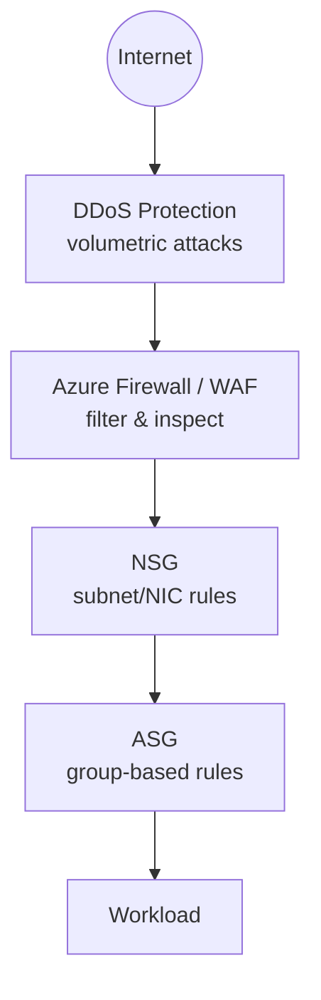
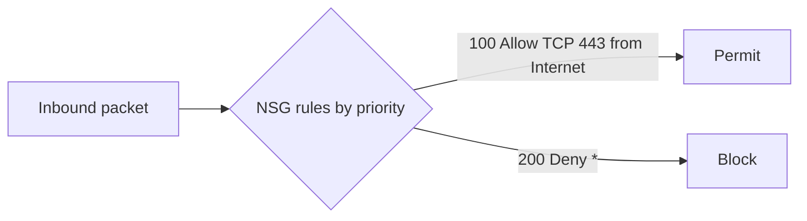
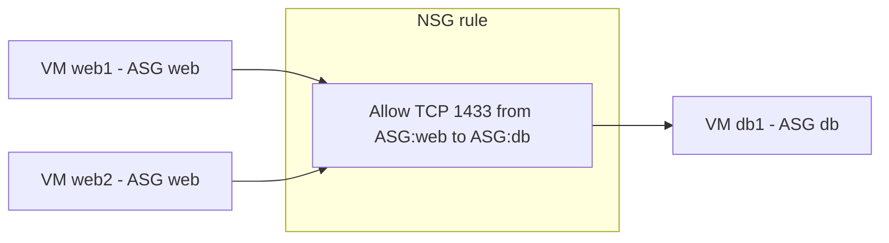
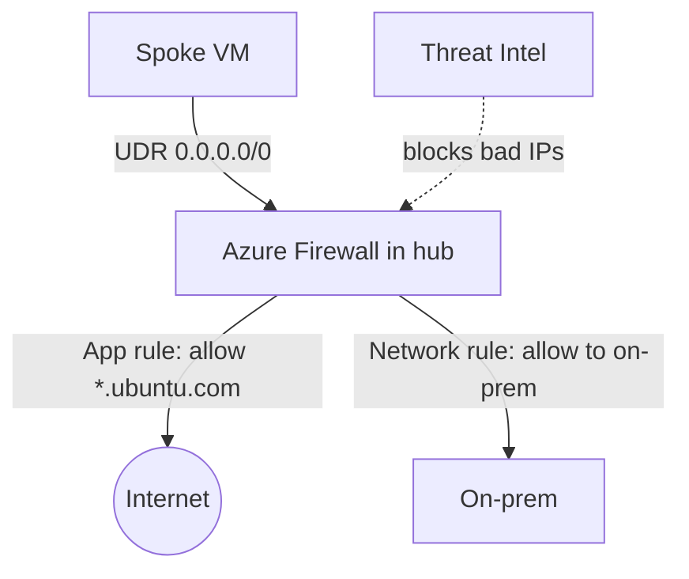
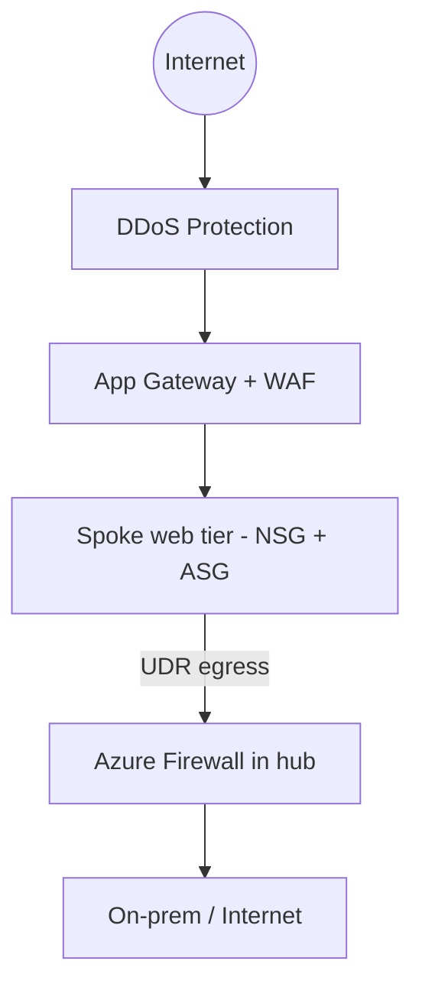

# Part I — Network Security

> Section goal: Secure the network itself — **NSGs, ASGs, Azure Firewall, Web Application Firewall (WAF)** and **DDoS Protection**. Know what operates at which layer and when to use each. This is the bulk of the "Secure & Monitor" domain (~15–20%).

Covers index items **Group 4 (Apps & Security)**. We finally deploy the **Azure Firewall** that the UDRs from [Part E](Part-E-connectivity-routing.md) point to.

---

## 1. Defense in depth — layers of security

No single control secures a network. You **stack** controls so if one fails, others hold.

> **Analogy:** A castle has a **moat (DDoS), outer walls (firewall), guarded doors per room (NSGs), and ID badges (ASGs)**. An attacker must defeat every layer.



| Control | Layer | Scope | Job |
|---------|-------|-------|-----|
| **NSG** | 3–4 | Subnet / NIC | Allow/deny by IP, port, protocol |
| **ASG** | 3–4 | Logical VM groups | Simplify NSG rules by role |
| **Azure Firewall** | 3–7 | VNet (central) | Stateful filtering, FQDN, threat intel |
| **WAF** | 7 | App Gateway / Front Door | Block web attacks (OWASP) |
| **DDoS Protection** | 3–4 | VNet / public IPs | Absorb volumetric attacks |

---

## 2. Network Security Groups (NSGs) — the basic firewall

An **NSG** is a *set of allow/deny rules filtering traffic by source/destination IP, port and protocol,* attached to a **subnet** and/or a **NIC**.

- **Stateful** — *if you allow inbound, the response is automatically allowed out* (and vice-versa). **Analogy:** a doorman who remembers he let you in, so he lets you back out without re-checking.
- Rules have a **priority** (100–4096, **lower number = evaluated first**); first match wins.
- **Default rules** exist (e.g. allow VNet-to-VNet, allow Azure Load Balancer probe, deny all inbound from internet).



### Rule components
| Field | Example |
|-------|---------|
| Priority | 100 |
| Source / Destination | IP, CIDR, **Service Tag**, or **ASG** |
| Port & protocol | TCP 443 |
| Action | Allow / Deny |

- **Service Tag** — *a Microsoft-maintained label for a set of IPs* (e.g. `Internet`, `AzureLoadBalancer`, `Storage`, `Sql`). **Analogy:** a pre-printed address label that auto-updates. **Why it matters:** you write "Allow from `AzureLoadBalancer`" instead of chasing IP ranges.

> 🎯 **Exam gotcha:** NSGs are **stateful**, evaluated by **priority (lowest first, first match wins)**, and can attach to **subnet AND NIC** (both apply — inbound checks subnet then NIC; the effective result must allow at both). The **last default rule denies all inbound from the internet**. Use **Service Tags** instead of hard-coding IPs.

---

## 3. Application Security Groups (ASGs) — rules by role, not IP

An **ASG** lets you *group VMs by function (e.g. "web", "db") and write NSG rules against the group name* instead of IP addresses.

> **Analogy:** Instead of a guest list of individual names (IPs), you say "anyone wearing a **Staff** badge (ASG) may enter the server room." Add/remove people freely; the rule stands.



> 🎯 **Exam gotcha:** ASGs make NSG rules **dynamic and readable** — new VMs added to the ASG inherit the rules with no IP edits. Used **inside NSG rules** as source/destination. Both VMs must be in the **same VNet**.

---

## 4. Azure Firewall — the central, intelligent firewall

**Azure Firewall** is a *managed, stateful, cloud firewall* deployed in the hub's **AzureFirewallSubnet** (/26, from Part C). It does far more than NSGs.

### What it adds over NSGs
- **FQDN filtering** — allow/deny by **domain name** (e.g. allow `*.windowsupdate.com`), not just IP.
- **Application rules** (L7 FQDN), **Network rules** (L3–4 IP/port), **NAT rules** (inbound DNAT).
- **Threat intelligence** — auto-block known-malicious IPs/domains.
- **Centralised** — all spokes route through it via **UDRs** (Part E service chaining).
- **SKUs:** Basic, **Standard**, **Premium** (Premium adds TLS inspection, IDPS, URL filtering).



> 🎯 **Exam gotcha:** **NSG = basic L3/4 allow/deny by IP/port (free).** **Azure Firewall = central L3–7 with FQDN filtering, threat intel, DNAT, logging (paid).** They **complement** each other — use NSGs on subnets *and* route egress through Azure Firewall. **Premium SKU** = TLS inspection + IDPS. **Firewall Policy** is the reusable rules container (used by Firewall Manager / Secured Hub).

---

## 5. Web Application Firewall (WAF) — protect web apps (L7)

A **WAF** protects **HTTP/S apps** from common web exploits (SQL injection, cross-site scripting) using **OWASP** managed rule sets. It runs on **Application Gateway** (regional) or **Front Door** (global).

> **Analogy:** Azure Firewall is the **building's main security gate** (all traffic). A WAF is the **specialist inspector at the web counter** who knows the tricks fraudsters use on web forms specifically.

- Modes: **Detection** (log only) → **Prevention** (block).
- **OWASP Core Rule Set** + custom rules (rate limiting, geo-filtering).

> 🎯 **Exam gotcha:** **WAF = Layer 7, web-specific (OWASP), on App Gateway or Front Door.** It does **not** replace Azure Firewall (L3–7 general) or NSGs (L3–4). "Protect a web app from SQLi/XSS" → **WAF**. Run in **Prevention** mode to actually block.

---

## 6. DDoS Protection — absorb volumetric attacks

A **DDoS** (Distributed Denial of Service) attack floods you with traffic to knock you offline. **Azure DDoS Protection** detects and absorbs these.

| Tier | What you get |
|------|--------------|
| **DDoS Infrastructure (default)** | Always-on basic platform protection, free |
| **DDoS Network Protection / IP Protection** | Tuned to your resources, attack analytics, cost-protection guarantee, rapid-response support |

> 🎯 **Exam gotcha:** Basic platform DDoS is **always on and free**; the **paid tier** adds per-resource tuning, telemetry/alerts, cost protection and expert support. Protects **public IPs**. Pair with WAF for full L3–L7 coverage.

---

## 7. How the controls fit the running project



---

## 🛠️ Hands-on Lab — NSG + ASG, then deploy Azure Firewall

```powershell
# --- NSG + ASG on the spoke web tier ---
# 1. Create ASGs for web and db roles
az network asg create -g rg-az700-lab --name asg-web
az network asg create -g rg-az700-lab --name asg-db

# 2. Create an NSG and a rule allowing HTTPS from Internet to the web ASG
az network nsg create -g rg-az700-lab --name nsg-web
az network nsg rule create -g rg-az700-lab --nsg-name nsg-web --name allow-https `
  --priority 100 --access Allow --protocol Tcp --direction Inbound `
  --source-address-prefixes Internet --destination-port-ranges 443 `
  --destination-asgs asg-web

# 3. Attach the NSG to the spoke web subnet
az network vnet subnet update -g rg-az700-lab --vnet-name vnet-spoke1 `
  --name snet-web --network-security-group nsg-web

# --- Azure Firewall in the hub (note: billed hourly!) ---
# 4. Public IP + firewall into the existing AzureFirewallSubnet
az network public-ip create -g rg-az700-lab --name pip-afw --sku Standard --allocation-method Static
az network firewall create -g rg-az700-lab --name afw-hub --vnet-name vnet-hub
az network firewall ip-config create -g rg-az700-lab --firewall-name afw-hub `
  --name fw-ipconfig --public-ip-address pip-afw --vnet-name vnet-hub

# 5. Confirm the firewall private IP matches the UDR next hop (10.0.254.4) from Part E
az network firewall show -g rg-az700-lab -n afw-hub --query "ipConfigurations[0].privateIPAddress" -o tsv

# 6. Allow an outbound FQDN as an application rule (example)
az network firewall application-rule create -g rg-az700-lab --firewall-name afw-hub `
  --collection-name app-coll --name allow-ubuntu --priority 100 --action Allow `
  --protocols Http=80 Https=443 --target-fqdns "*.ubuntu.com" --source-addresses "10.1.0.0/16"
```

✅ **Lab goal:** NSG+ASG protecting the web tier, and an **Azure Firewall** in the hub whose private IP is the UDR target from Part E — completing **service chaining** so spoke egress is inspected and FQDN-filtered. **Delete the firewall** when done to stop charges (`az network firewall delete ...`).

---

## ⭐ Likely Exam Questions for This Section

**Q1. "NSG vs Azure Firewall — when use which?"**
> *Model answer:* NSGs are free, stateful L3/4 allow-deny rules on subnets/NICs for micro-segmentation. Azure Firewall is a central, managed L3–7 firewall with FQDN filtering, threat intel, DNAT and logging. Use both: NSGs for granular subnet rules, Firewall for centralised egress/inspection.

**Q2. "Are NSGs stateful, and how are rules evaluated?"**
> *Model answer:* Yes, stateful — return traffic is auto-allowed. Rules evaluate by priority, lowest number first, first match wins; default rules deny inbound internet.

**Q3. "What problem do ASGs solve?"**
> *Model answer:* They let you write NSG rules against logical groups (e.g. web, db) rather than IPs, so adding/removing VMs needs no rule changes. Both endpoints must be in the same VNet.

**Q4. "How do you filter outbound traffic by domain name?"**
> *Model answer:* Use **Azure Firewall application rules** with FQDN targets (e.g. allow *.windowsupdate.com); NSGs can't filter by FQDN.

**Q5. "Protect a web app from SQL injection and XSS — what do you use?"**
> *Model answer:* A **WAF** (OWASP rule set) on Application Gateway (regional) or Front Door (global), in Prevention mode.

**Q6. "What is a Service Tag and why use it?"**
> *Model answer:* A Microsoft-managed label for a group of IP ranges (e.g. Internet, Storage, AzureLoadBalancer). Using tags in NSG rules avoids manually maintaining changing IP lists.

**Q7. "Difference between Azure Firewall Standard and Premium?"**
> *Model answer:* Premium adds TLS inspection, IDPS (intrusion detection/prevention), and URL filtering on top of Standard's FQDN/network/NAT rules and threat intel.

**Q8. "What does the paid DDoS Protection tier add over the default?"**
> *Model answer:* Per-resource tuning, attack telemetry/alerts, cost-protection during attacks, and rapid-response expert support; the default infrastructure protection is always-on and free.

---

## 🧠 30-Second Memory Hooks
- **Defense in depth = moat (DDoS) → walls (Firewall/WAF) → room doors (NSG) → badges (ASG).**
- **NSG = stateful, priority lowest-first, IP/port, free.** Subnet + NIC.
- **ASG = rules by role, not IP.** Same VNet.
- **Azure Firewall = central L3–7, FQDN filtering, threat intel (paid). Premium = TLS+IDPS.**
- **WAF = L7 web (OWASP), on App Gateway/Front Door, Prevention mode.**
- **DDoS basic = free always-on; paid = tuned + analytics + cost protection.**
- **Service Tags > hard-coded IPs.**

---

*Next suggested section:* **Part J — Monitoring & Troubleshooting** (you've built and secured it — now observe and debug it with Network Watcher, flow logs, Connection Monitor and diagnostics).
