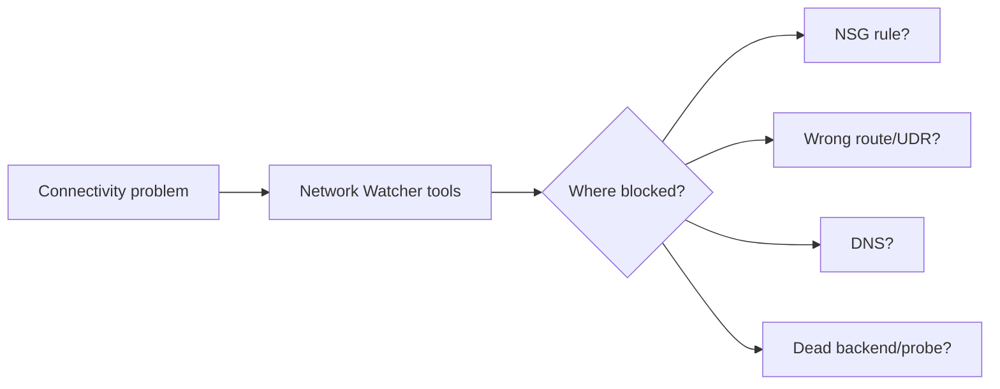
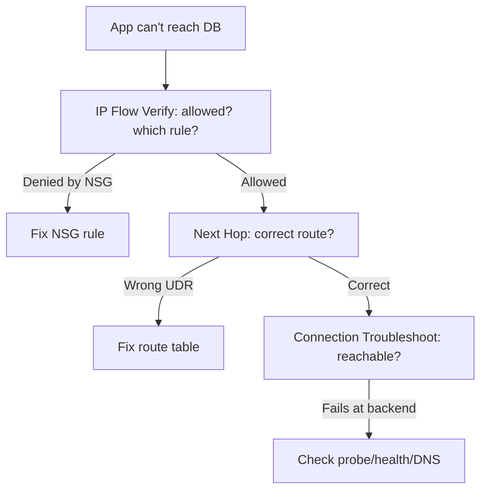
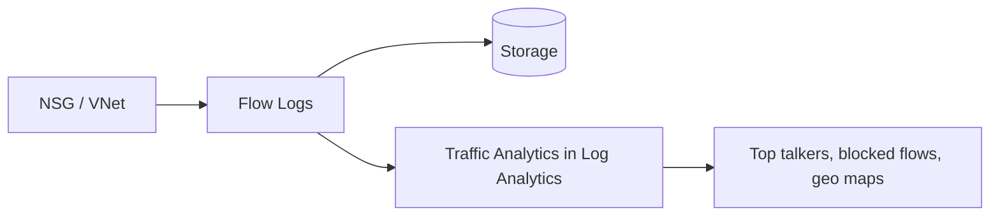
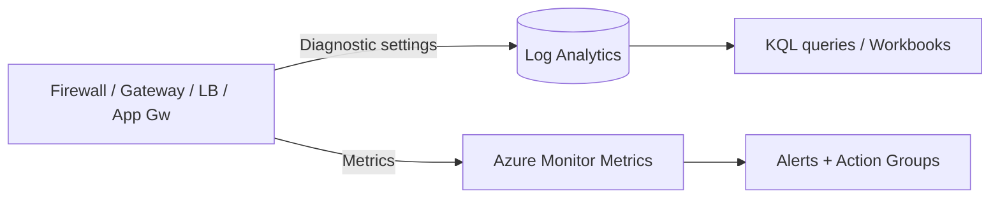
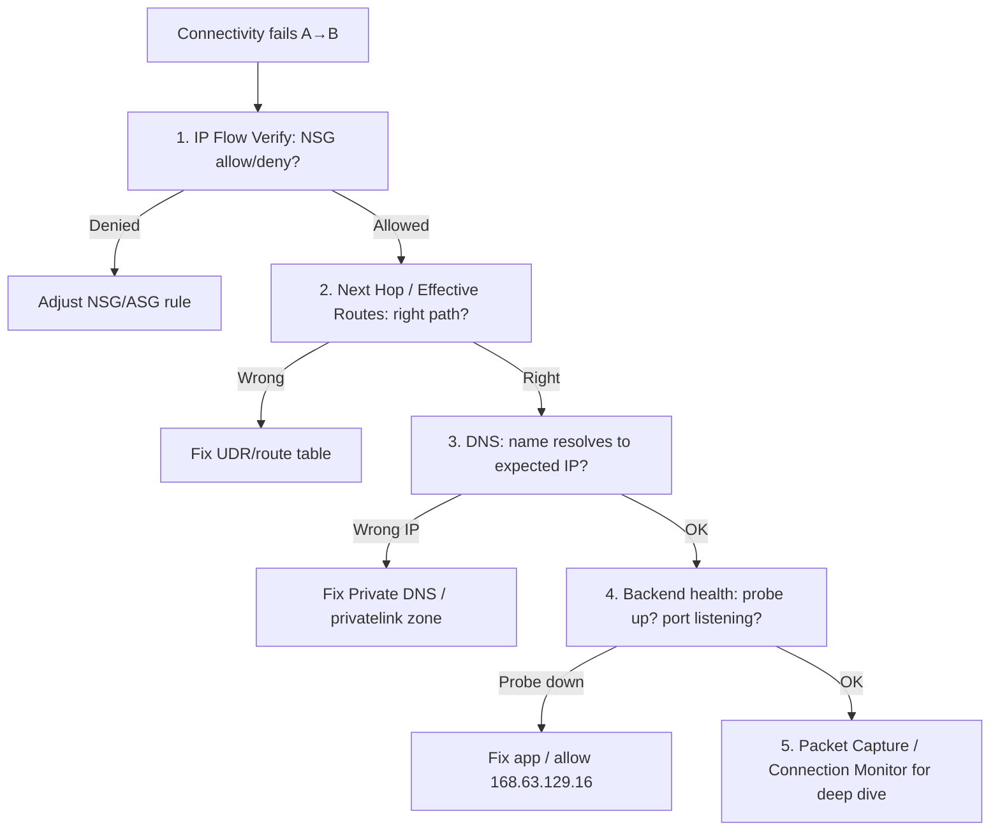

# Part J — Monitoring & Troubleshooting

> Section goal: Observe and debug Azure networks using **Network Watcher** and its tools (IP Flow Verify, NSG Diagnostics, Next Hop, Connection Troubleshoot/Monitor), **flow logs**, and **Azure Monitor**. Completes the "Secure & Monitor" domain (~15–20%) and the skill you'll use daily on real projects.

Covers index items **Group 4 (Apps & Security)**. Diagnoses everything built in Parts C–I.

---

## 1. Why monitoring matters

You can't fix what you can't see. When "the app can't reach the database," you need tools to pinpoint **where** traffic is blocked or dropped — an NSG? a UDR? DNS? a dead backend?

> **Analogy:** Network monitoring is the **CCTV + delivery-tracking** of your network. You can rewind to see where a parcel (packet) was stopped, which guard (NSG rule) turned it away, and which road (route) it took.



---

## 2. Network Watcher — the diagnostics toolbox

**Network Watcher** is a regional service bundling tools to **monitor, diagnose and log** network traffic. Know each tool by **what question it answers**.

| Tool | Question it answers |
|------|---------------------|
| **IP Flow Verify** | "Is this specific packet allowed or denied, and by which NSG rule?" |
| **NSG Diagnostics** | Newer, richer version of IP Flow Verify (shows the full rule evaluation) |
| **Next Hop** | "Where will traffic to this destination actually go?" (checks routing/UDRs) |
| **Connection Troubleshoot** | "Can A reach B right now?" (one-time test with latency + hops) |
| **Connection Monitor** | "Is A→B healthy *over time*?" (continuous monitoring + alerts) |
| **Effective Security Rules** | "What's the combined NSG result on this NIC?" |
| **Effective Routes** | "What routes actually apply to this NIC?" |
| **VPN Troubleshoot** | "Why is my VPN gateway/connection unhealthy?" |
| **Packet Capture** | "Capture actual packets for deep analysis" |
| **Topology** | "Draw my VNet's resources visually" |



> 🎯 **Exam gotcha:** Match the **tool to the symptom**:
> - "Which NSG rule blocked it?" → **IP Flow Verify / NSG Diagnostics**.
> - "Is traffic taking the wrong path?" → **Next Hop** / **Effective Routes**.
> - "Continuous reachability + alerting" → **Connection Monitor** (not the one-time *Connection Troubleshoot*).
> - "What NSG rules really apply to this NIC?" → **Effective Security Rules**.

---

## 3. NSG Flow Logs & VNet Flow Logs — recording traffic

**Flow logs** record *which connections were allowed/denied,* written to a storage account and analysable.

- **NSG Flow Logs** — per-NSG record of allowed/denied flows (legacy, being replaced).
- **VNet Flow Logs** — newer, at the **VNet** level (simpler, recommended).
- **Traffic Analytics** — *processes flow logs in Log Analytics into maps, top talkers, and security insights.* **Analogy:** turns raw CCTV footage into a readable "who went where" report.



> 🎯 **Exam gotcha:** Flow logs need a **storage account**; **Traffic Analytics** needs a **Log Analytics workspace**. **VNet Flow Logs** are the modern choice over NSG Flow Logs. Use them for "who is talking to whom / what got blocked over time."

---

## 4. Azure Monitor, metrics, logs & alerts

**Azure Monitor** is the platform-wide observability service. For networking:

- **Metrics** — *numeric time-series* (throughput, packet count, healthy host count, SNAT usage). Near-real-time, good for alerts.
- **Diagnostic settings** — *route resource logs/metrics to a Log Analytics workspace, storage, or Event Hub.* **Why it matters:** firewall logs, gateway logs, App Gateway/WAF logs all flow here.
- **Log Analytics + KQL** — *query logs with Kusto Query Language.* 
- **Alerts** — fire on a metric/log condition (e.g. "VPN tunnel down", "SNAT ports > 90%").



> 🎯 **Exam gotcha:** To **keep/analyse resource logs** you must enable **Diagnostic settings** pointing to a destination — logs aren't retained by default. **Metrics** drive alerts (e.g. gateway tunnel status, SNAT exhaustion). **Connection Monitor** integrates into Azure Monitor for end-to-end alerts.

---

## 5. A troubleshooting playbook (real-project gold)



> 💡 **Beginner tie-in:** Notice how every earlier Part shows up here — NSGs (I), routes (E), DNS (D/H), probes (G). Monitoring is where it all converges.

---

## 🛠️ Hands-on Lab — Diagnose the running project

```powershell
# 1. Ensure Network Watcher is enabled in your region (usually auto-enabled)
az network watcher configure -g rg-az700-lab --locations centralindia --enabled true

# 2. IP Flow Verify - would a packet to the web VM on 443 be allowed?
#    (Replace <nic-id> with a real NIC once you add a VM; shown for the workflow)
az network watcher test-ip-flow `
  --direction Inbound --protocol TCP --local 10.1.1.4:443 --remote 1.2.3.4:51000 `
  --vm <web-vm-name> --nic <nic-name> -g rg-az700-lab

# 3. Next Hop - where does spoke traffic to the internet go? (should be the firewall)
az network watcher show-next-hop -g rg-az700-lab `
  --vm <web-vm-name> --nic <nic-name> `
  --source-ip 10.1.1.4 --dest-ip 8.8.8.8

# 4. Enable VNet flow logs into a storage account + Traffic Analytics workspace
#    (Create a storage account + Log Analytics workspace first, then configure flow logs)
az monitor log-analytics workspace create -g rg-az700-lab -n law-az700

# 5. Turn on diagnostic settings for the firewall (send logs to Log Analytics)
$fwid = az network firewall show -g rg-az700-lab -n afw-hub --query id -o tsv
$wsid = az monitor log-analytics workspace show -g rg-az700-lab -n law-az700 --query id -o tsv
az monitor diagnostic-settings create --name diag-afw --resource $fwid `
  --workspace $wsid `
  --logs '[{"category":"AzureFirewallApplicationRule","enabled":true},{"category":"AzureFirewallNetworkRule","enabled":true}]'
```

✅ **Lab goal:** Network Watcher enabled; you understand **IP Flow Verify** (NSG checks) and **Next Hop** (route checks), and you've sent **Azure Firewall logs to Log Analytics** via diagnostic settings — the exact telemetry path the exam expects.

> 🧹 **Clean-up reminder:** When your whole project study is done, delete everything: `az group delete --name rg-az700-lab --yes --no-wait` (removes all charges).

---

## ⭐ Likely Exam Questions for This Section

**Q1. "Traffic to a VM is being dropped. How do you find which NSG rule is responsible?"**
> *Model answer:* Use **IP Flow Verify** (or **NSG Diagnostics**) in Network Watcher — it reports allow/deny and the exact rule. Cross-check with **Effective Security Rules** on the NIC.

**Q2. "How do you confirm traffic is taking the intended path through a firewall?"**
> *Model answer:* Use **Next Hop** and **Effective Routes** in Network Watcher to verify the route/UDR points to the firewall's private IP.

**Q3. "One-time reachability test vs continuous monitoring — which tools?"**
> *Model answer:* **Connection Troubleshoot** for a one-time test (latency, hops); **Connection Monitor** for continuous monitoring with alerting over time.

**Q4. "You want to know who's talking to whom and what's blocked over time. What do you enable?"**
> *Model answer:* **VNet (or NSG) Flow Logs** to a storage account, with **Traffic Analytics** in a Log Analytics workspace for visual insights.

**Q5. "Firewall logs aren't appearing in Log Analytics. Why?"**
> *Model answer:* **Diagnostic settings** weren't configured to send the resource's logs to the workspace; resource logs aren't retained by default.

**Q6. "Which IP must be reachable for health probes and Azure DNS to work?"**
> *Model answer:* **168.63.129.16** — blocking it breaks load-balancer probes and Azure-provided DNS.

**Q7. "What language queries Log Analytics?"**
> *Model answer:* **KQL** (Kusto Query Language).

**Q8. "How would you alert when a VPN tunnel goes down or SNAT ports near exhaustion?"**
> *Model answer:* Create **Azure Monitor metric alerts** (tunnel connectivity status, SNAT port usage) with action groups for notification.

---

## 🧠 30-Second Memory Hooks
- **Network Watcher = network CCTV + tracking.**
- **IP Flow Verify = "which NSG rule?"  Next Hop = "which route?"**
- **Connection Troubleshoot = one-time; Connection Monitor = always-on + alerts.**
- **Flow logs → storage; Traffic Analytics → Log Analytics.** VNet Flow Logs = modern.
- **No logs without Diagnostic settings.** Metrics drive alerts.
- **Playbook:** NSG → Route → DNS → Backend/Probe → Packet capture.
- **168.63.129.16 keeps probes + DNS alive.**

---

*Next suggested section:* **Part K — Design Scenarios & Architecture Patterns** (assemble everything into exam-style architectures — hub-and-spoke, secured hub, and the case-study layouts AZ-700 loves).
