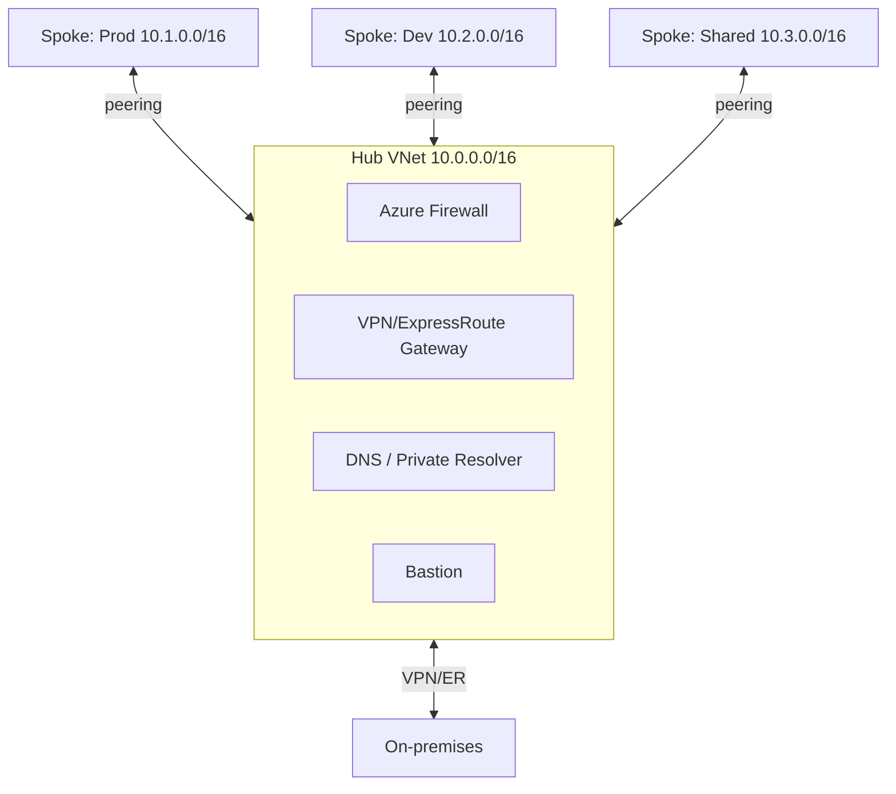
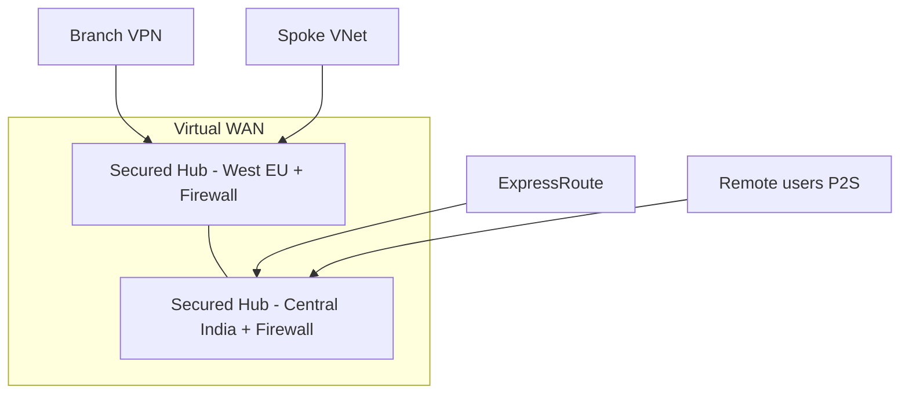
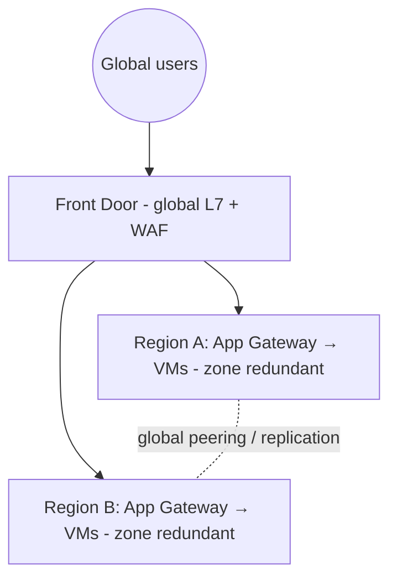
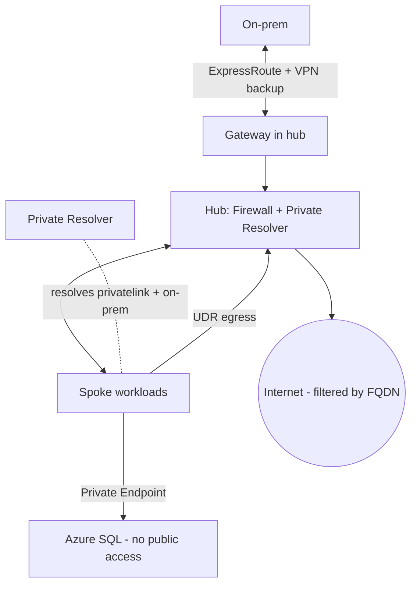

# Part K — Design Scenarios & Architecture Patterns

> Section goal: Assemble everything from Parts A–J into the **reference architectures AZ-700 tests** — hub-and-spoke, secured virtual hub, multi-region, and common case-study layouts — and learn to **reason about trade-offs** the way exam scenarios demand.

Covers index items **Group 5 (Drills)**. This is the synthesis Part: every earlier concept reappears as a building block.

---

## 1. Why patterns matter for the exam

AZ-700 is heavy on **scenario** questions: "Company X needs Y — which design?" You won't get far memorising facts in isolation; you need a few **reference patterns** in your head to pattern-match against.

> **Analogy:** A chef doesn't reinvent cooking each night — they know a handful of **base recipes** (stock, sauce, roast) and adapt. These architectures are your base recipes.

---

## 2. Pattern 1 — Hub-and-Spoke (the foundational design)

A **hub VNet** holds shared services (firewall, gateway, DNS, Bastion); **spoke VNets** hold workloads and connect only to the hub via peering. This is the design we built across the labs.



**Why it's used:**
- **Centralises** security (one firewall), connectivity (one gateway via gateway transit), and cost.
- **Isolates** workloads per spoke (blast-radius control, separate teams/subscriptions).
- **Scales** — add spokes without redesigning.

**The glue (recall from earlier Parts):**
| Need | Mechanism | Part |
|------|-----------|------|
| Spokes share the hub's gateway | Gateway transit + use remote gateways | E/F |
| Spoke egress via firewall | UDR `0.0.0.0/0` → firewall IP | E/I |
| Spoke-to-spoke | UDRs via hub firewall (peering non-transitive!) | E |
| Shared name resolution | Private DNS zones linked to all VNets | D |
| Private PaaS access | Private Endpoints + privatelink DNS | H |

> 🎯 **Exam gotcha:** Hub-and-spoke spoke-to-spoke traffic needs **UDRs through the hub firewall** because peering isn't transitive. The hub peerings need **allow forwarded traffic** and (for shared gateway) **allow gateway transit**.

---

## 3. Pattern 2 — Secured Virtual Hub (Virtual WAN + Azure Firewall)

When you have **many regions/branches** and want Azure to **manage routing**, use **Virtual WAN** with a **Secured Virtual Hub** (Azure Firewall built into the managed hub via Firewall Manager).



| Choose… | When |
|---------|------|
| **Manual hub-and-spoke** | Full control, fewer regions, custom routing/NVAs |
| **Virtual WAN secured hub** | Many branches/regions, want managed any-to-any + central firewall, less ops |

> 🎯 **Exam gotcha:** "**Many global branches, minimal management, any-to-any, central security**" → **Virtual WAN + Secured Hub**. "**Full control / specific NVA / single region**" → **manual hub-and-spoke**.

---

## 4. Pattern 3 — Multi-region high availability

Combine **global** front-ends with **regional** redundancy.



- **Global tier:** Front Door (HTTP, edge, WAF, fast failover) or Traffic Manager (DNS-based).
- **Regional tier:** App Gateway / Load Balancer across **availability zones**.
- **Data tier:** geo-replication + Private Endpoints.

> 🎯 **Exam gotcha:** Layer the load balancers — **Front Door (global) → App Gateway (regional) → Load Balancer (L4)**. Use **zone-redundant** SKUs within a region and **multi-region** for disaster recovery.

---

## 5. Pattern 4 — Secure hybrid with private PaaS

The "enterprise secure" layout the exam loves: on-prem connected privately, all PaaS access private, all egress inspected.



**Checklist of controls:** ExpressRoute (+VPN failover) · Azure Firewall egress with FQDN rules · NSGs/ASGs per subnet · Private Endpoints with privatelink DNS · Private Resolver for hybrid DNS · DDoS + WAF on public entry · Flow logs + diagnostics.

> 🎯 **Exam gotcha:** "No public exposure for data + on-prem must resolve Azure private names" = **Private Endpoints + Private DNS + Private Resolver** together. Missing the **Resolver/DNS forwarding** is the classic wrong answer.

---

## 6. Design decision quick-reference

| Requirement | Answer |
|-------------|--------|
| Connect 2 VNets, same/diff region, private | VNet peering (global if cross-region) |
| Spoke-to-spoke routing | UDR via hub firewall (peering non-transitive) |
| Cheap hybrid link | Site-to-Site VPN |
| High-bandwidth/private/SLA hybrid | ExpressRoute (+VPN backup for HA) |
| Many global branches, low ops | Virtual WAN (Secured Hub for security) |
| Global web app + edge + WAF | Front Door |
| Regional URL routing + WAF | Application Gateway |
| L4 TCP/UDP balancing | Azure Load Balancer (Standard) |
| Private PaaS, one resource, from on-prem | Private Endpoint + privatelink DNS |
| Lock PaaS to subnet, cloud-only, free | Service Endpoint |
| Central egress + FQDN filtering | Azure Firewall |
| Micro-segment subnets | NSG + ASG |
| Hybrid DNS, no DNS VMs | Azure DNS Private Resolver |
| Outbound internet, no inbound, scalable | NAT Gateway |

---

## 🛠️ Capstone — Your portfolio architecture

By now your `rg-az700-lab` contains a real **secure hub-and-spoke**: hub VNet with NAT Gateway, GatewaySubnet, AzureFirewallSubnet + firewall; a peered spoke with NSG/ASG and a UDR forcing egress through the firewall; Private DNS + a Private Endpoint to storage; an internal Load Balancer for the app tier; and diagnostics flowing to Log Analytics.

**Make it portfolio-ready:**
1. **Export the topology** (Network Watcher → Topology) and screenshot it.
2. **Export an ARM/Bicep template** of the resource group:
   ```powershell
   az group export --name rg-az700-lab > az700-hub-spoke.json
   ```
   This single file documents your whole design as **infrastructure-as-code** — great for a GitHub portfolio and for redeploying.
3. **Write a one-paragraph README** explaining the design choices (why hub-and-spoke, why Private Endpoints) — exactly the reasoning the exam rewards.

✅ **Capstone goal:** A documented, redeployable enterprise network you can show employers — and the mental model to answer any AZ-700 scenario question.

---

## ⭐ Likely Exam Questions for This Section

**Q1. "Describe hub-and-spoke and its main benefit."**
> *Model answer:* A central hub VNet hosts shared services (firewall, gateway, DNS); spokes hold workloads and peer to the hub. It centralises security/connectivity/cost while isolating workloads and scaling easily.

**Q2. "When choose Virtual WAN over manual hub-and-spoke?"**
> *Model answer:* For many branches/regions needing managed any-to-any connectivity with minimal operations; add a Secured Virtual Hub for centralised Azure Firewall. Manual hub-and-spoke suits fewer regions or custom NVA/routing control.

**Q3. "How do you achieve global HA for a web app?"**
> *Model answer:* Front Door (global L7 + WAF + fast failover) over regional deployments using zone-redundant App Gateways/Load Balancers, plus geo-replicated data with Private Endpoints.

**Q4. "On-prem must resolve Azure private endpoint names and Azure must resolve on-prem names. Design?"**
> *Model answer:* Private Endpoints with the correct privatelink Private DNS zones, plus Azure DNS Private Resolver (inbound + outbound endpoints and forwarding ruleset) for bidirectional hybrid resolution.

**Q5. "Why won't spoke-to-spoke traffic flow by default, and how do you fix it?"**
> *Model answer:* VNet peering is non-transitive. Add UDRs on each spoke routing the other spoke's range to the hub firewall, enable allow-forwarded-traffic on peerings, and configure the firewall to forward.

**Q6. "How do you make hybrid connectivity highly available?"**
> *Model answer:* ExpressRoute as primary with a Site-to-Site VPN as failover (or dual ExpressRoute circuits in different peering locations), plus zone-redundant gateways.

**Q7. "Where do you place Azure Firewall and the VPN gateway in hub-and-spoke?"**
> *Model answer:* In the hub VNet — the firewall in AzureFirewallSubnet (/26) and the gateway in GatewaySubnet (/27), shared by spokes via UDRs and gateway transit.

---

## 🧠 30-Second Memory Hooks
- **Hub = shared services (firewall, gateway, DNS); spokes = workloads.** Glue = peering + UDR + gateway transit + private DNS.
- **Spoke-to-spoke = UDR via hub firewall** (peering non-transitive).
- **Many branches, low ops = Virtual WAN; control = manual hub-spoke.**
- **Global HA stack: Front Door → App Gateway → Load Balancer; zone-redundant + multi-region.**
- **Secure enterprise = ExpressRoute(+VPN) + Firewall egress + Private Endpoints + Private Resolver + WAF/DDoS.**
- **`az group export` = your design as code.**

---

*Next suggested section:* **Part L — Miscellaneous & Deeper Topics** (the "extra edge" — IPv6/dual-stack, encryption in transit, cost optimisation, Bastion, and current Azure networking trends that show up as curveball questions).
