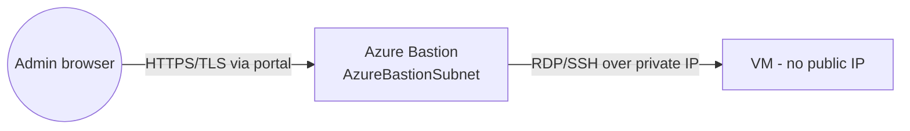

# Part L — Miscellaneous & Deeper Topics

> Section goal: The "extra edge" — adjacent and advanced topics that appear as curveball AZ-700 questions and matter in real projects: **IPv6/dual-stack, Azure Bastion, encryption in transit, cost optimisation, Route Server, NVAs, gateway specifics, and current trends.**

Covers index items **Group 5 (Drills)**. Fills the gaps around the core domains.

---

## 1. IPv6 & dual-stack VNets

From Part A: **IPv6** is the newer, much larger addressing scheme (`2001:db8::1`). Azure supports **dual-stack** VNets — subnets carrying **both IPv4 and IPv6**.

- Add an IPv6 address space/prefix alongside IPv4 on the VNet and subnet.
- Standard Load Balancer and Public IPs support IPv6.
- **Why it matters:** internet-facing services needing IPv6 clients; some compliance requirements.

> 🎯 **Exam gotcha:** Azure VNets are **dual-stack** (IPv4 **and** IPv6 together) — you don't run IPv6-only. Requires **Standard** SKU public IPs/Load Balancers.

---

## 2. Azure Bastion — secure VM access without public IPs

**Azure Bastion** is a *managed service giving secure RDP/SSH to VMs straight from the Azure portal over TLS,* so VMs need **no public IP** and you don't expose 3389/22 to the internet.

> **Analogy:** Instead of every room having a door to the street (public IP), there's **one guarded reception (Bastion)** through which all visitors are escorted.

- Deploys into **AzureBastionSubnet** (/26, from Part C).
- Eliminates exposing management ports — big security win.

> 🎯 **Exam gotcha:** "Securely RDP/SSH to VMs **without public IPs / without opening 3389-22**" → **Azure Bastion** in **AzureBastionSubnet (/26)**.

---

## 3. Network Virtual Appliances (NVAs)

An **NVA** is a *third-party firewall/router/WAN appliance (e.g. Palo Alto, Fortinet) run as a VM* in Azure. Used when you need vendor-specific features Azure Firewall lacks, or to keep an existing security stack.

- Sits in the hub; spokes route to it via **UDRs** (like Azure Firewall).
- **Azure Route Server** (Part E) lets the NVA exchange routes via BGP, avoiding manual UDRs.
- Needs **IP forwarding** enabled on its NIC.

> 🎯 **Exam gotcha:** Choosing **NVA vs Azure Firewall**: NVA = vendor features/existing licenses/full control but you manage HA/patching; Azure Firewall = managed, less ops. **Enable IP forwarding** on NVA NICs or traffic won't pass.

---

## 4. Encryption in transit

| Mechanism | Where | Notes |
|-----------|-------|-------|
| **TLS/HTTPS** | App layer (L7) | Terminate at App Gateway/Front Door |
| **IPsec** | VPN tunnels | S2S/P2S encryption built-in |
| **MACsec** | ExpressRoute Direct | Encrypts the physical circuit |
| **VNet encryption** | Between VMs in VNet/peering | Newer platform feature on supported SKUs |

> 🎯 **Exam gotcha:** **ExpressRoute is not encrypted by default** (Part F) — add **IPsec over ExpressRoute** or **MACsec (ExpressRoute Direct)** when encryption is mandated. VPN is IPsec-encrypted inherently.

---

## 5. Cost optimisation (networking bills add up)

| Cost driver | Optimisation |
|-------------|--------------|
| **Inter-region / internet egress** | Keep traffic in-region; use private peering; egress is charged, ingress usually free |
| **VNet peering data** | Charged both directions; consolidate where sensible |
| **Gateways/Firewall hourly** | Right-size SKUs; share via hub; deallocate lab resources |
| **Private Endpoints** | Hourly + data — use Service Endpoints where private IP isn't required |
| **Public IPs** | Release unused; Standard static still bills when idle |

> 🎯 **Exam gotcha:** **Data egress (outbound to internet/other regions) is billed; ingress is generally free.** Keeping traffic **regional and private** (peering/backbone) reduces cost. Hub-and-spoke **shares** expensive gateways/firewall to save money.

---

## 6. Gateway & ExpressRoute deeper specifics

- **VPN gateway generations/SKUs** set throughput (VpnGw1–5) and tunnel counts; **AZ SKUs** add zone redundancy.
- **ExpressRoute SKUs:** **Local** (cheap, to nearby regions, unlimited data), **Standard** (within geopolitical region), **Premium** (global, more routes/VNets).
- **ExpressRoute Direct** — connect directly into Microsoft's network at 10/100 Gbps (large enterprises).
- **FastPath** — bypass the gateway for the data path (lower latency).

> 🎯 **Exam gotcha:** ExpressRoute **Premium** = global connectivity + higher route/VNet limits; **Local** = unlimited data to nearby regions at lower cost. **Metered vs Unlimited** data plans affect cost.

---

## 7. Azure networking & PaaS integration extras

- **VNet integration (App Service)** — lets a web app reach **into** a VNet (outbound) for private backend access.
- **Private Endpoint vs VNet integration:** PE = others reach the app privately (inbound); VNet integration = the app reaches the VNet (outbound).
- **Service endpoints policies** — restrict which storage accounts a service-endpoint subnet can reach (anti-exfiltration).

> 🎯 **Exam gotcha:** **App Service VNet integration = outbound** (app → VNet). **Private Endpoint = inbound** (clients → app privately). Don't confuse the directions.

---

## 8. Current trends / "extra edge"

- **Virtual WAN** is Microsoft's strategic direction for large/global networks.
- **Private Endpoints** are now the recommended default over Service Endpoints for sensitive PaaS.
- **Azure DNS Private Resolver** replaces DIY DNS-forwarder VMs.
- **Azure Firewall Premium** (TLS inspection, IDPS) for regulated workloads.
- **Zero Trust networking** — assume breach; verify explicitly; least-privilege segmentation (NSG/ASG/PE/Bastion all support this).

> 💡 **Beginner tie-in:** Notice the pattern — Microsoft keeps **replacing self-managed VMs with managed services** (Resolver, Firewall, vWAN, Bastion). When unsure on the exam, the **managed-service answer** is usually correct.

---

## ⭐ Likely Exam Questions for This Section

**Q1. "How do you give admins RDP/SSH access without public IPs on VMs?"**
> *Model answer:* Deploy **Azure Bastion** in AzureBastionSubnet (/26); admins connect over TLS via the portal, so no VM public IPs or open 3389/22.

**Q2. "Does Azure support IPv6-only VNets?"**
> *Model answer:* No — Azure supports **dual-stack** (IPv4 + IPv6) using Standard SKU public IPs/Load Balancers.

**Q3. "When choose an NVA over Azure Firewall?"**
> *Model answer:* When you need vendor-specific features, existing licenses, or full control; you accept managing HA/patching. Enable IP forwarding on its NICs and route spokes to it via UDRs (or BGP via Route Server).

**Q4. "ExpressRoute encryption options?"**
> *Model answer:* It's unencrypted by default; add IPsec over ExpressRoute or use MACsec with ExpressRoute Direct.

**Q5. "Which traffic direction is billed in Azure networking?"**
> *Model answer:* Outbound/egress (to internet or other regions) is charged; ingress is generally free. Keep traffic regional/private to cut costs.

**Q6. "App Service VNet integration vs Private Endpoint?"**
> *Model answer:* VNet integration is outbound (the app reaches resources in the VNet); a Private Endpoint is inbound (clients reach the app privately via a private IP).

**Q7. "What does ExpressRoute Premium add?"**
> *Model answer:* Global connectivity beyond the local geopolitical region and higher limits on routes and connected VNets.

---

## 🧠 30-Second Memory Hooks
- **Bastion = guarded reception; no VM public IPs; AzureBastionSubnet /26.**
- **Azure = dual-stack IPv6, never IPv6-only.**
- **NVA = bring-your-own firewall; needs IP forwarding; route via UDR/Route Server.**
- **ExpressRoute = unencrypted by default; add IPsec/MACsec.**
- **Egress is billed; ingress free. Keep it regional + private.**
- **App Service: VNet integration = outbound; Private Endpoint = inbound.**
- **When unsure → pick the managed service.**

---

*Next suggested section:* **Part M — Exam Question Bank** (100+ questions across all domains with answers and cross-references, plus a self-quiz tracker to find your weak spots).
