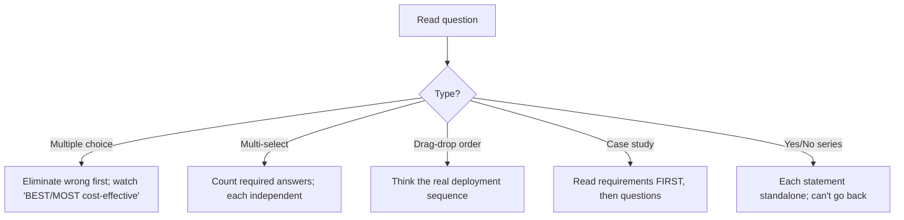

# Part N — Exam-Day Strategy & Cheat Sheet

> Section goal: Convert knowledge into a **passing score**. How AZ-700 is structured and scored, how to attack case studies and drag-drop questions, time management, a master **decision table**, and a **one-page night-before cheat sheet**.

Covers index items **Group 5 (Drills)**. The final Part — read it the week before, and again the night before.

---

## 1. How AZ-700 is structured

**AZ-700: Designing and Implementing Microsoft Azure Networking Solutions.**

| Aspect | Detail |
|--------|--------|
| **Questions** | ~40–60 |
| **Time** | ~100–120 minutes |
| **Pass score** | **700 / 1000** (scaled, not a simple %) |
| **Question types** | Multiple choice, multiple-select, **drag-and-drop (ordering)**, **case studies**, hot-area, build-list, occasionally yes/no series |
| **Cost** | Region-dependent |

### Skills measured (approximate weighting)
| Domain | Weight | Your Parts |
|--------|--------|-----------|
| Design & implement core networking (VNets, IP, routing) | **20–25%** | C, E |
| Design & implement routing | 15–20% | E, F |
| Design & implement hybrid (VPN/ER) | 15–20% | F |
| Secure & monitor networks | 15–20% | I, J |
| Design & implement application delivery (LB) | 10–15% | G |
| Design & implement private access | 10–15% | H, D |

> 🎯 **Strategy:** Core networking + routing ≈ **35–45%** of marks. If short on time, **over-prepare Parts C, E, F** — they're the biggest scoring blocks.

---

## 2. Question-type tactics

- **Watch qualifier words:** *BEST, MOST cost-effective, LEAST privilege, with MINIMAL administrative effort.* Two answers may both "work"; pick the one matching the qualifier (often the **managed service** or **least-privilege** option).
- **Drag-and-drop ordering:** mentally **deploy it** — e.g. create VNet → subnet → public IP → gateway → connection. Order follows real dependencies.
- **Case studies:** read the **requirements and constraints first**, jot the key facts (regions, budget, compliance, existing on-prem), then answer. Requirements directly map to product picks (use the decision table below).
- **Yes/No series:** each is independent; **you usually can't return** — answer carefully and move on.
- **Never leave blanks** — no negative marking; flag-and-review uncertain ones.

> 🎯 **Exam gotcha:** When two options both technically work, the qualifier decides: *"minimal administration"* → managed service (Firewall over NVA, Private Resolver over DNS VMs, vWAN over manual); *"least privilege"* → scoped RBAC (Network Contributor on the RG); *"most cost-effective"* → VPN over ExpressRoute, Service Endpoint over Private Endpoint (when private IP isn't required).

---

## 3. Time management

| Phase | Time | Action |
|-------|------|--------|
| First pass | ~60% | Answer all you know fast; **flag** the hard ones |
| Case studies | budget ~3–4 min each | Read requirements once, answer its cluster |
| Review pass | remaining | Revisit flagged; trust first instinct unless misread |
| Final | last 2 min | Ensure **nothing blank** |

> 💡 Don't sink 8 minutes into one question — flag and move. A flagged guess beats running out of time.

---

## 4. Master decision table (the one page that wins marks)

| Requirement keyword | Answer |
|---------------------|--------|
| Connect 2 VNets privately | VNet peering (global if cross-region) |
| Spoke-to-spoke | UDR via hub firewall (peering non-transitive) |
| Outbound internet, scalable, no inbound | NAT Gateway |
| Cheap hybrid link | Site-to-Site VPN |
| Private, high-BW, SLA hybrid | ExpressRoute (+VPN failover) |
| Connect remote individual users | Point-to-Site VPN |
| Many global branches, low ops | Virtual WAN (Secured Hub = +Firewall) |
| Connect 2 on-prem sites via Azure | ExpressRoute Global Reach |
| Global web app + CDN + WAF + fast failover | Front Door |
| Route to nearest/healthy region via DNS | Traffic Manager (Performance/Priority/Geographic) |
| Regional URL/host routing + WAF | Application Gateway |
| L4 TCP/UDP balancing | Azure Load Balancer (Standard) |
| Private PaaS, specific resource, from on-prem | Private Endpoint + privatelink DNS |
| Lock PaaS to subnet, cloud-only, free | Service Endpoint |
| Filter egress by FQDN, threat intel | Azure Firewall (Premium = TLS/IDPS) |
| Web attack (SQLi/XSS) protection | WAF (Prevention mode) |
| Volumetric attack protection + analytics | DDoS Network/IP Protection |
| Micro-segment subnets by role | NSG + ASG |
| Hybrid DNS, no DNS VMs | Azure DNS Private Resolver |
| RDP/SSH without public IPs | Azure Bastion (AzureBastionSubnet /26) |
| Which NSG rule blocked traffic? | IP Flow Verify / NSG Diagnostics |
| Verify routing path | Next Hop / Effective Routes |
| Continuous reachability + alerts | Connection Monitor |
| Dynamic routes with an NVA | Azure Route Server |
| Vendor firewall/full control | NVA (enable IP forwarding) |
| HA gateway | Active-active + zone-redundant AZ SKU |
| Minimal admin effort | Pick the **managed service** |
| Least privilege networking | Network Contributor scoped to RG |
| Most cost-effective | Regional/private traffic; cheaper SKU/option |

---

## 5. Numbers & magic facts to memorise

| Fact | Value |
|------|-------|
| Reserved IPs per subnet | **5** (/24 → 251 usable) |
| Smallest subnet | **/29** (recommend /28+) |
| GatewaySubnet | **/27** recommended |
| AzureFirewallSubnet | **/26** minimum |
| AzureBastionSubnet | **/26** |
| RouteServerSubnet | **/27** |
| Magic DNS/probe IP | **168.63.129.16** |
| Pass score | **700/1000** |
| Route priority | most-specific → **UDR > BGP > system** |
| NSG rule order | priority **lowest number first**, first match wins |
| Private ranges | **10/8, 172.16/12, 192.168/16** |

---

## 6. Behavioral & Closing (if interviewing for a role)

### STAR method
**STAR** = *Situation, Task, Action, Result* — a structure for answering "tell me about a time…" questions.

| Letter | What to say |
|--------|-------------|
| **S**ituation | The context/problem |
| **T**ask | Your responsibility |
| **A**ction | What **you** specifically did |
| **R**esult | Measurable outcome |

### Background → competency translation
| Your study/lab experience | Competency it proves |
|---------------------------|----------------------|
| Built hub-and-spoke in CLI | VNet design, peering, routing |
| Configured Private Endpoint + DNS | Private access, troubleshooting |
| Deployed firewall + UDR egress | Security architecture |
| Set up flow logs/diagnostics | Monitoring & ops |
| Exported ARM template | Infrastructure-as-code |

### Three ready STAR stories (adapt to your real experience)
1. **Troubleshooting:** *S* — app couldn't reach DB; *T* — restore connectivity; *A* — used IP Flow Verify (NSG), Next Hop (route), found a missing privatelink DNS record; *R* — fixed DNS, restored access, documented the playbook.
2. **Design:** *S* — multi-region app with compliance; *T* — design resilient network; *A* — Front Door + zonal App Gateways + Private Endpoints + ExpressRoute(+VPN); *R* — met RTO and data-residency goals.
3. **Cost optimisation:** *S* — high networking bill; *T* — reduce spend; *A* — consolidated to hub-and-spoke shared gateway/firewall, kept traffic regional, swapped some PEs for Service Endpoints; *R* — cut egress costs measurably.

### "Why" answers
- **Why cloud networking?** — passion for connectivity + security; you proved it by building a full architecture hands-on.
- **Why this company?** — match their cloud journey/scale.
- **Why you?** — fundamentals + hands-on labs + a documented portfolio architecture.

### Questions to ask the interviewer
- "What's your current Azure network topology — hub-and-spoke or Virtual WAN?"
- "How do you handle hybrid connectivity and DNS today?"
- "What's the biggest networking challenge the team faces?"

---

## 7. 📄 One-page NIGHT-BEFORE cheat sheet

> Read this last. Don't cram new topics — consolidate.

**Subnets:** 5 reserved (/24=251). Smallest /29. Magic names: Gateway /27, AzureFirewall /26, Bastion /26, RouteServer /27.
**Magic IP:** 168.63.129.16 (DNS + probes). Never block.
**Private ranges:** 10/8, 172.16/12, 192.168/16. Never overlap.
**Routing:** most-specific wins; tie → UDR > BGP > system. None = drop. Peering NOT transitive.
**Load balancing quadrant:** LB=L4 regional · App Gw=L7 regional · Traffic Manager=DNS global · Front Door=L7 global. WAF on App Gw + Front Door.
**Hybrid:** S2S=site, P2S=device, ExpressRoute=private (unencrypted), vWAN=managed mesh. Global Reach links on-prem sites. HA = active-active + AZ SKU. Gateway transit + use remote gateways.
**Private access:** Service Endpoint = public IP, subnet-trust, no DNS, free, cloud-only. Private Endpoint = private IP, specific resource, needs privatelink DNS, works from on-prem.
**Security:** NSG (stateful, priority lowest-first) + ASG (by role). Azure Firewall (L3–7, FQDN, threat intel; Premium=TLS/IDPS). WAF (OWASP, Prevention). DDoS (volumetric).
**DNS:** privatelink.* zone makes PE work. Private Resolver = hybrid DNS, no VMs (inbound+outbound).
**Monitoring:** IP Flow Verify→NSG; Next Hop→route; Connection Monitor→over time; Flow Logs+Traffic Analytics; Diagnostic settings or no logs.
**Misc:** NAT Gateway = scalable outbound-only. Bastion = no public IPs. Egress billed, ingress free. Standard SKU everywhere.
**Exam:** 700/1000. Read case-study requirements first. Qualifiers: minimal admin→managed; least privilege→scoped RBAC; cost→cheaper option. Never leave blanks.

**Mindset:** Trust your prep. Eliminate wrong answers. Map keywords → decision table. Flag-and-move. You built this network with your own hands — you know it. 💪

---

## ⭐ Likely Exam-Strategy Questions (meta)

**Q1. "What's the AZ-700 passing score?"** → *700 out of 1000 (scaled).*
**Q2. "Two answers both work — how to choose?"** → *Match the qualifier: minimal admin → managed service; least privilege → scoped RBAC; most cost-effective → cheaper option.*
**Q3. "How to approach a case study?"** → *Read requirements/constraints first, note key facts, map each to the decision table, then answer the cluster.*
**Q4. "Should you leave hard questions blank?"** → *No — no negative marking; flag, guess, and review.*
**Q5. "Which domains carry the most marks?"** → *Core networking + routing (~35–45%); prioritise Parts C, E, F.*

---

## 🧠 30-Second Memory Hooks
- **Pass = 700/1000.** Core+routing = biggest blocks → master C/E/F.
- **Requirements first, then questions** (case studies).
- **Qualifier decides ties:** managed / least-privilege / cheapest.
- **Flag-and-move; never blank.**
- **You built it by hand — recall, don't panic.**

---

🎓 **You've completed the guide!** Return to the [master index](../Azure%20Networking%20%28AZ-700%29%20-%20Study%20Guide.md) to track revision. Drill **Part M** out loud until all ✅, rebuild the **Part K capstone** once from memory, and you're ready to book the exam.

> **Honest readiness check:** Reading these Parts builds the knowledge. Real readiness also needs (1) answering Part M **out loud** at 80%+, (2) **rebuilding the lab** from memory, and (3) timed practice tests. Do those three and you'll walk in confident.
